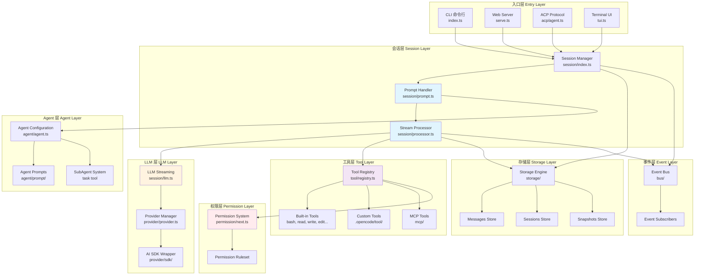
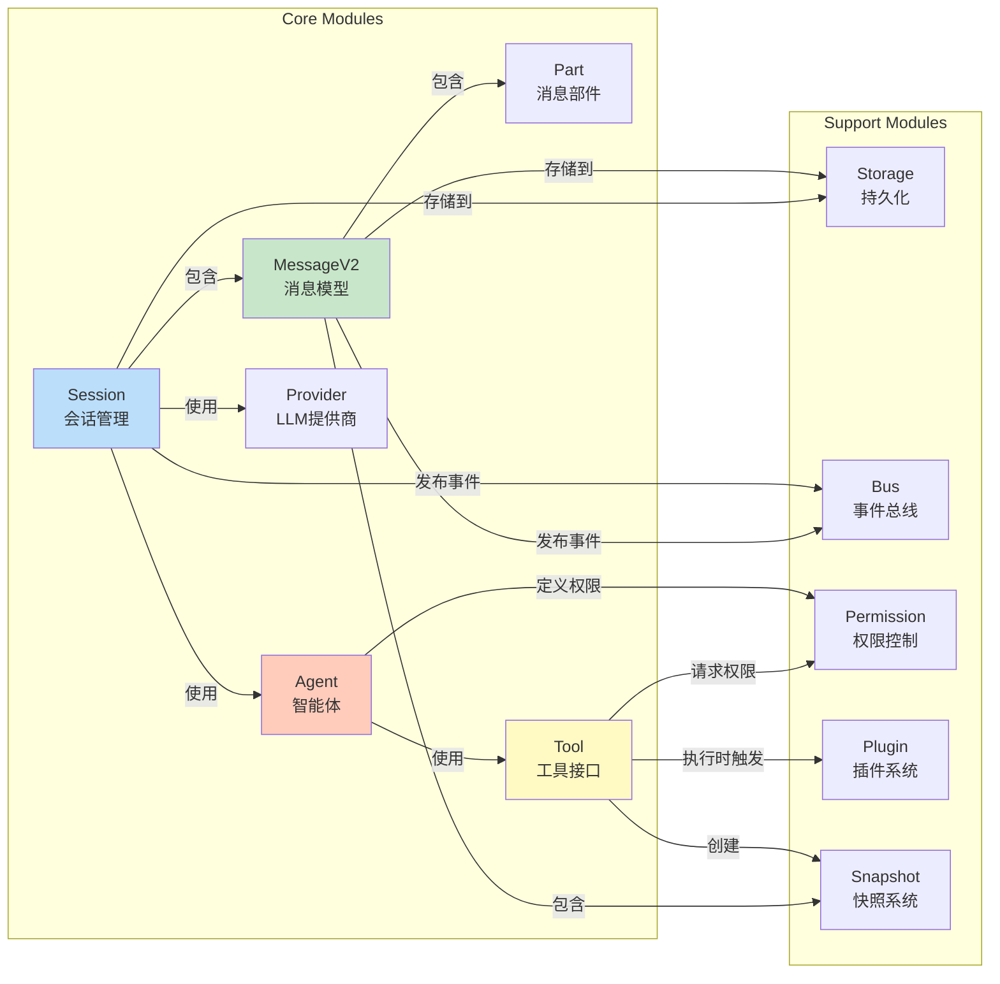
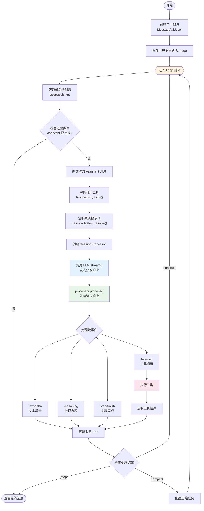
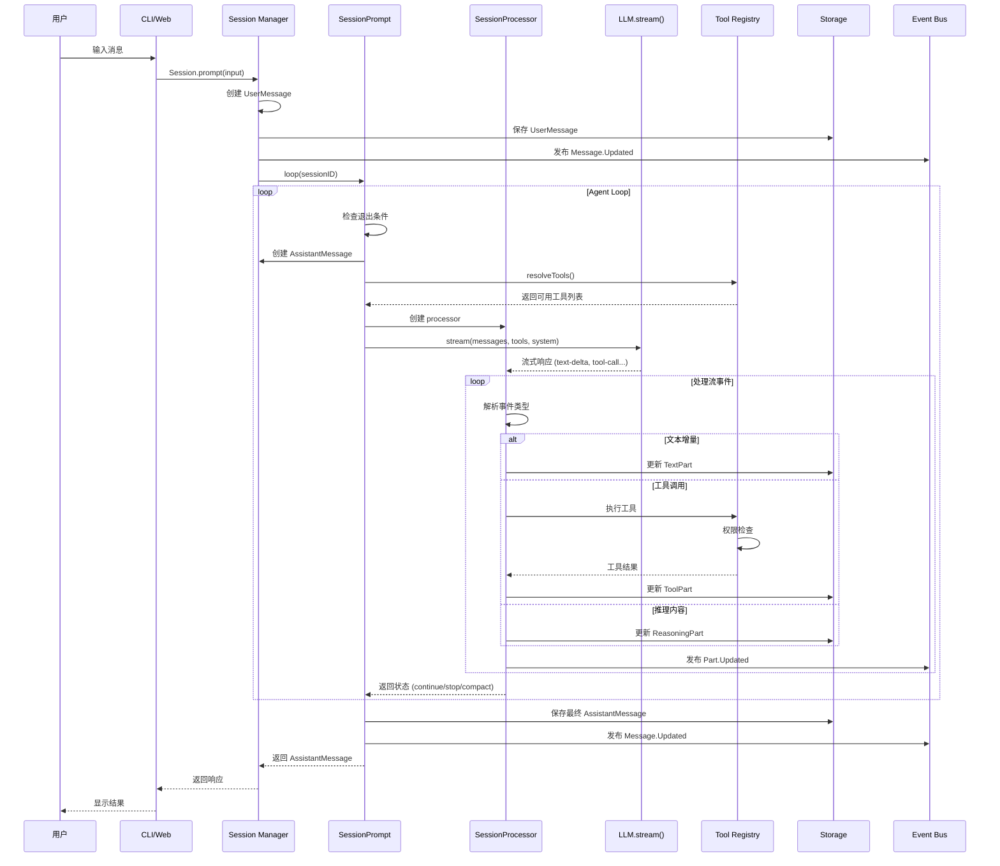
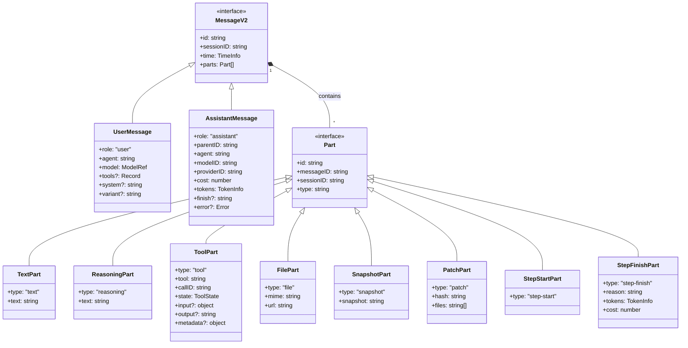
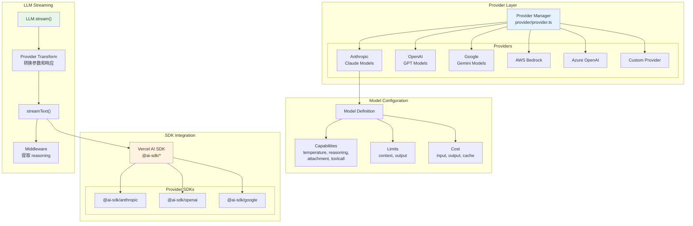
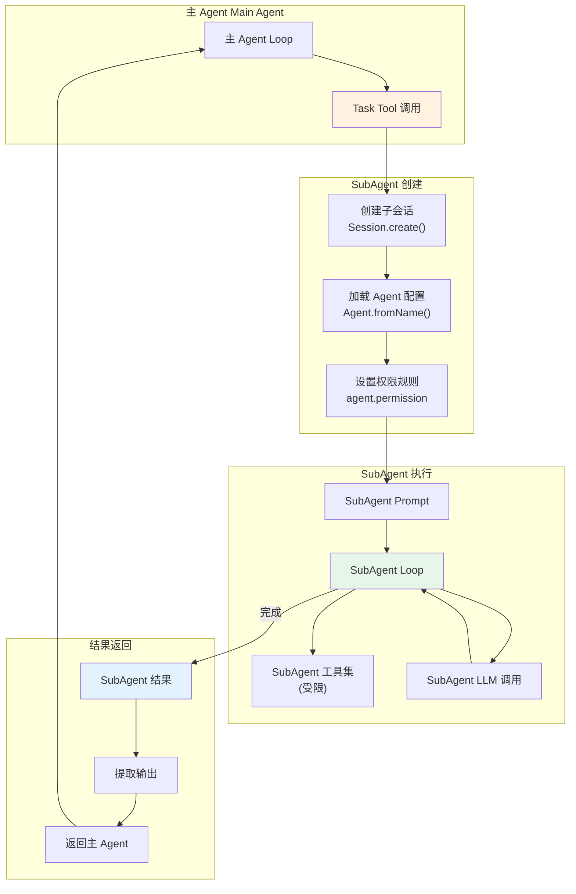
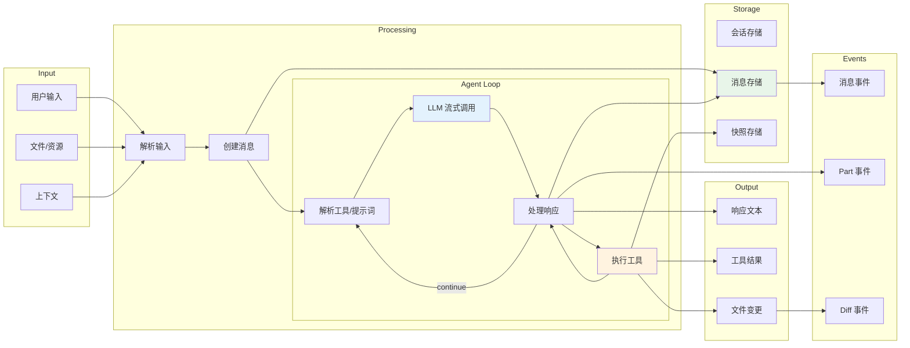

# OpenCode 架构图文档

本文档通过流程图、时序图和关系图全面展示 OpenCode Agent Loop 的架构设计。

## 目录

1. [整体架构概览](#1-整体架构概览)
2. [核心模块关系图](#2-核心模块关系图)
3. [Agent Loop 主流程图](#3-agent-loop-主流程图)
4. [消息处理时序图](#4-消息处理时序图)
5. [工具执行流程图](#5-工具执行流程图)
6. [权限系统流程图](#6-权限系统流程图)
7. [消息与部件类型关系图](#7-消息与部件类型关系图)
8. [Provider 与 Model 架构图](#8-provider-与-model-架构图)

---

## 1. 整体架构概览

---

## 2. 核心模块关系图

---

## 3. Agent Loop 主流程图

---

## 4. 消息处理时序图

---

## 5. 工具执行流程图

```mermaid
flowchart TB
    subgraph "工具注册 Tool Registration"
        RegStart([ToolRegistry.tools]) --> LoadBuiltin["加载内置工具<br/>bash, read, write, edit..."]
        LoadBuiltin --> LoadCustom["加载自定义工具<br/>.opencode/tool/*.ts"]
        LoadCustom --> LoadMCP["加载 MCP 工具"]
        LoadMCP --> FilterCaps["过滤 Provider 能力"]
        FilterCaps --> FilterPerm["过滤 Agent 权限"]
        FilterPerm --> ReturnTools["返回可用工具列表"]
    end

    subgraph "工具执行 Tool Execution"
        ToolCall([接收 tool-call 事件]) --> CreatePart["创建 ToolPart<br/>state: pending"]
        CreatePart --> InitTool["初始化工具<br/>Tool.init()"]

        InitTool --> ValidateArgs["验证参数<br/>Zod Schema"]
        ValidateArgs --> ValidResult{"验证结果"}

        ValidResult -->|失败| FormatError["格式化错误信息"]
        FormatError --> ErrorPart["更新 ToolPart<br/>state: error"]

        ValidResult -->|成功| CheckPerm["检查权限<br/>PermissionNext.ask()"]

        CheckPerm --> PermResult{"权限结果"}

        PermResult -->|deny| RejectPart["更新 ToolPart<br/>state: error<br/>RejectedError"]

        PermResult -->|ask| WaitUser["等待用户确认"]
        WaitUser --> UserDecision{"用户决定"}
        UserDecision -->|拒绝| RejectPart
        UserDecision -->|允许| RunTool

        PermResult -->|allow| RunTool["执行工具<br/>tool.execute()"]

        RunTool --> UpdateRunning["更新 ToolPart<br/>state: running"]
        UpdateRunning --> Execute["执行具体操作"]

        Execute --> HookBefore["Plugin Hook<br/>tool.execute.before"]
        HookBefore --> ActualExec["实际执行"]
        ActualExec --> HookAfter["Plugin Hook<br/>tool.execute.after"]

        HookAfter --> ExecResult{"执行结果"}

        ExecResult -->|成功| CompletePart["更新 ToolPart<br/>state: completed"]
        ExecResult -->|失败| ErrorPartExec["更新 ToolPart<br/>state: error"]

        CompletePart --> ReturnResult["返回工具结果<br/>给 LLM"]
        ErrorPartExec --> ReturnResult
    end

    style ToolCall fill:#fff3e0
    style CheckPerm fill:#ffebee
    style RunTool fill:#e8f5e9
    style ReturnResult fill:#e3f2fd
```

---

## 6. 权限系统流程图

```mermaid
flowchart TB
    subgraph "权限定义 Permission Definition"
        AgentDef["Agent 定义<br/>permission: Ruleset"]
        SessionDef["Session 级别<br/>permission: Ruleset"]

        Ruleset["Ruleset 规则集<br/>[{permission, action, pattern}]"]

        AgentDef --> Ruleset
        SessionDef --> Ruleset
    end

    subgraph "权限检查 Permission Check"
        ToolExec([工具执行请求]) --> AskPerm["PermissionNext.ask()"]

        AskPerm --> BuildReq["构建权限请求<br/>permission, patterns, metadata"]
        BuildReq --> EvalRules["评估规则集"]

        EvalRules --> MatchRule{"匹配规则"}

        MatchRule -->|无匹配| DefaultAsk["默认: ask"]
        MatchRule -->|匹配 allow| AllowResult["action: allow"]
        MatchRule -->|匹配 deny| DenyResult["action: deny"]
        MatchRule -->|匹配 ask| AskResult["action: ask"]

        DefaultAsk --> AskResult

        AllowResult --> Continue([继续执行])

        DenyResult --> Reject["抛出 RejectedError"]
        Reject --> BlockExec([阻止执行])

        AskResult --> PromptUser["提示用户确认"]
        PromptUser --> UserChoice{"用户选择"}

        UserChoice -->|允许| SaveAllow["保存允许规则"]
        SaveAllow --> Continue

        UserChoice -->|拒绝| SaveDeny["保存拒绝规则"]
        SaveDeny --> BlockExec

        UserChoice -->|始终允许| SaveAlways["保存永久规则"]
        SaveAlways --> Continue
    end

    subgraph "权限规则示例 Example Rules"
        Example1["bash: allow, pattern: *"]
        Example2["write: ask, pattern: src/**"]
        Example3["write: deny, pattern: node_modules/**"]
    end

    style AskPerm fill:#fff3e0
    style PromptUser fill:#e3f2fd
    style Continue fill:#e8f5e9
    style BlockExec fill:#ffebee
```

---

## 7. 消息与部件类型关系图

---

## 8. Provider 与 Model 架构图

---

## 9. SubAgent (Task) 执行流程图

---

## 10. 数据流总览图

---

## 11. 关键代码文件索引

| 文件路径 | 职责描述 |
|---------|---------|
| `packages/opencode/src/session/prompt.ts` | Agent Loop 主入口，orchestration |
| `packages/opencode/src/session/processor.ts` | 流处理和工具执行 |
| `packages/opencode/src/session/message-v2.ts` | 消息和 Part 类型定义 |
| `packages/opencode/src/session/llm.ts` | LLM 流式调用封装 |
| `packages/opencode/src/session/index.ts` | 会话管理 |
| `packages/opencode/src/tool/tool.ts` | 工具接口定义 |
| `packages/opencode/src/tool/registry.ts` | 工具注册和解析 |
| `packages/opencode/src/agent/agent.ts` | Agent 配置定义 |
| `packages/opencode/src/provider/provider.ts` | Provider 管理 |
| `packages/opencode/src/permission/next.ts` | 权限系统 |
| `packages/opencode/src/storage/` | 持久化存储 |
| `packages/opencode/src/bus/` | 事件总线 |

---

## 12. 架构设计原则

### 12.1 消息驱动架构
- 所有状态变更通过事件总线广播
- 使用异步生成器实现流式处理
- 消息 Part 增量更新

### 12.2 插件化设计
- Tool Hooks 系统（before/after）
- 自定义工具注册
- Provider 扩展机制

### 12.3 权限优先
- 细粒度权限规则集
- 工具调用时权限评估
- 用户审批流程

### 12.4 模块化工具系统
- 统一的 Tool 接口抽象
- Zod Schema 参数验证
- 元数据/上下文传递

### 12.5 状态隔离
- 每会话独立的 AbortController
- 消息父子关系追踪
- 会话级权限管理
