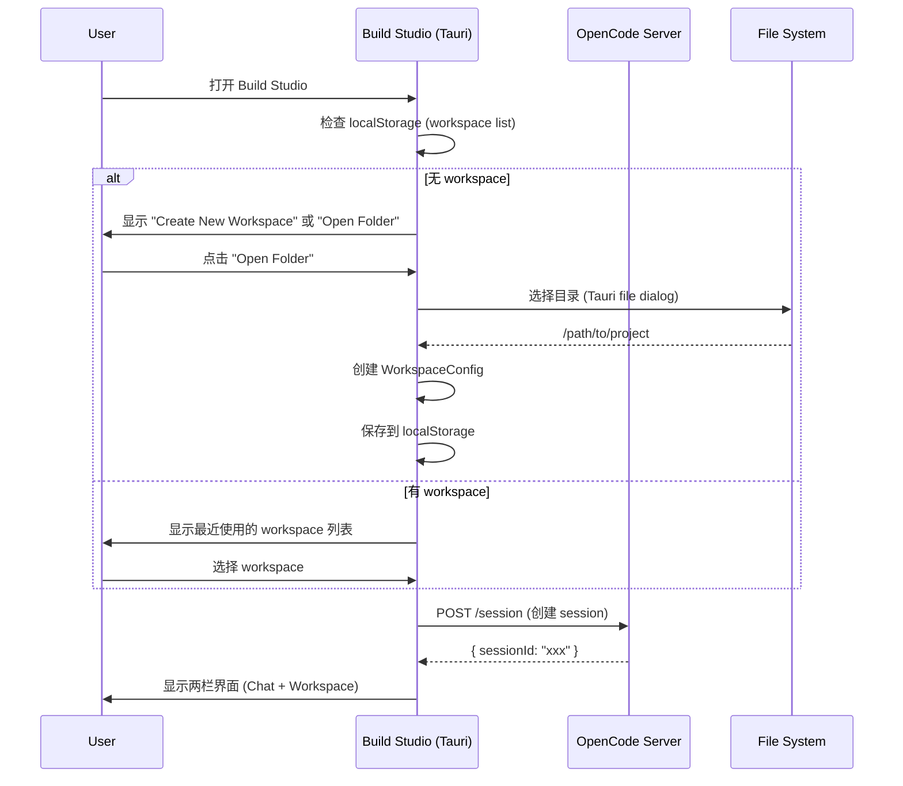
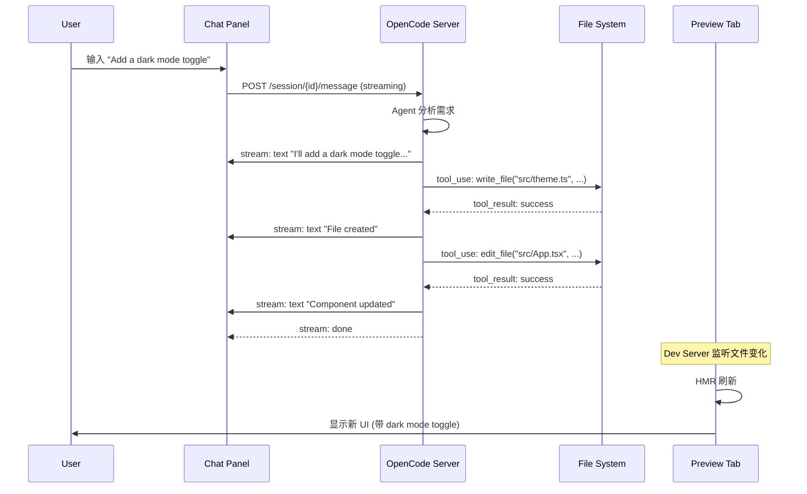
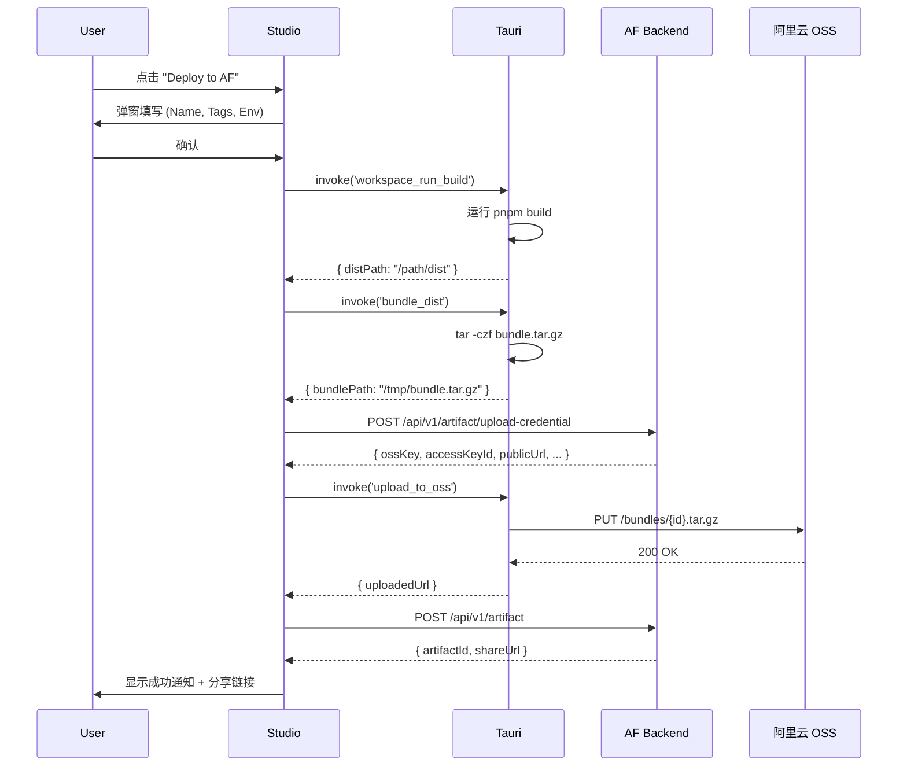

# Agent Foundry Build Studio 技术设计方案

> **文档版本**: v1.0
> **最后更新**: 2026-01-15
> **目标**: 基于 OpenCode 架构实现 Build Studio（Tauri Desktop App）

---

## 0. Executive Summary

**Build Studio** 是 Agent Foundry 的核心创作工具，采用"左侧 Chat + 右侧 Workspace"的双栏布局，支持：
- **Vibe Coding**: 自然语言驱动的代码生成与修改
- **实时 Preview**: 本地 dev server + HMR 实时预览
- **一键 Deploy**: 打包 Vite bundle → 上传阿里云 OSS → iOS WKWebView 加载

**核心设计原则**:
1. **最小侵入**: 新建 `packages/console`，不修改 `packages/opencode` 核心代码
2. **复用架构**: 基于 OpenCode 的 Agent/Tool/Session 系统
3. **渐进增强**: MVP 先轻隔离，Phase 2 再容器化

**技术栈**:
- **Desktop**: Tauri 2.x (Rust backend + WebView frontend)
- **Frontend**: React 18 + Vite 5 + Tailwind CSS + Zustand (✅ 完全实现)
- **Backend**: OpenCode Server (Hono + Bun)
- **Editor**: CodeMirror 6 (✅ 完全实现，语法高亮，多文件支持)
- **Storage**: 阿里云 OSS (通过 AF Backend API)

**当前实现状态 (2026-01-15)**:
- ✅ **Phase 1-4 完成**: 基础架构、Chat集成、Preview功能、OpenCode集成
- ✅ **Phase 5 完成**: 代码编辑器 (文件树 + CodeMirror 6 + 多文件支持 + 文件保存)
- ✅ **Phase 6 完成**: Deploy to AF
- ✅ **Phase 7 完成**: UI增强 (Provider选择、Workspace下拉、可拖拽分隔、Mobile预览)

---

## 1. 系统架构

### 1.1 整体架构图

```
┌─────────────────────────────────────────────────────────────────┐
│                     Agent Foundry Build Studio                  │
│                         (Tauri Desktop)                         │
├─────────────────────────────────────────────────────────────────┤
│  ┌─────────────┐  ┌────────────────────────────────────────┐    │
│  │   Chat UI   │  │         Workspace UI                   │    │
│  │             │  │  ┌──────────┐  ┌──────────────────┐    │    │
│  │  - Messages │  │  │ Preview  │  │  Code Editor     │    │    │
│  │  - Streaming│  │  │  Tab     │  │  - File Tree     │    │    │
│  │  - Tools    │  │  │          │  │  - CodeMirror    │    │    │
│  │             │  │  │ dev:3000 │  │  - Save Button   │    │    │
│  └─────────────┘  │  └──────────┘  └──────────────────┘    │    │
│        ↓          │                                        │    │
│  ┌─────────────────────────────────────────────────────────┐    │
│  │  Studio Actions (Right Top)                             │    │
│  │  [Deploy to AF]  [Export Local]  [Copy Workspace]       │    │
│  └─────────────────────────────────────────────────────────┘    │
├─────────────────────────────────────────────────────────────────┤
│                   Tauri IPC Bridge (Rust)                       │
│  - Workspace Runner (pnpm dev/build manager)                    │
│  - File System Access (security-scoped)                         │
│  - AF Deploy Client (upload to OSS)                             │
└─────────────────────────────────────────────────────────────────┘
         ↓ HTTP/WS                     ↓ File I/O
┌─────────────────────────┐   ┌─────────────────────────┐
│  OpenCode Server (Bun)  │   │  Local Workspace Dir    │
│  - Agent Runner         │   │  - src/                 │
│  - Session Store        │   │  - package.json         │
│  - Tool Registry        │   │  - node_modules/        │
│  - SSE Streaming        │   │  - dist/ (after build)  │
└─────────────────────────┘   └─────────────────────────┘
         ↓                             ↓
┌─────────────────────────┐   ┌─────────────────────────┐
│  AF Backend API         │   │  Dev Server Process     │
│  - OSS Upload           │   │  (pnpm run dev)         │
│  - Artifact Registry    │   │  - Port: 3000-4000      │
│  - Feed Publish         │   │  - HMR enabled          │
└─────────────────────────┘   └─────────────────────────┘
```

### 1.2 Package 结构

```
opencode/
├── packages/
│   ├── console/                 # 🆕 Build Studio (新建)
│   │   ├── src/
│   │   │   ├── main.tsx         # React 入口
│   │   │   ├── components/
│   │   │   │   ├── ChatPanel.tsx       # ✅ 完全实现 (支持provider选择)
│   │   │   │   ├── WorkspacePanel.tsx  # ✅ 完全实现
│   │   │   │   ├── PreviewTab.tsx      # ✅ 完全实现 (支持mobile viewport)
│   │   │   │   ├── CodeTab.tsx         # ✅ 完全实现
│   │   │   │   ├── FileTree.tsx        # ✅ 完全实现
│   │   │   │   ├── ActionsBar.tsx      # ✅ 完全实现
│   │   │   │   ├── ProviderSelector.tsx  # ✅ 完全实现 (Phase 7)
│   │   │   │   ├── WorkspaceDropdown.tsx # ✅ 完全实现 (Phase 7)
│   │   │   │   └── ResizableSplitter.tsx # ✅ 完全实现 (Phase 7)
│   │   │   ├── hooks/
│   │   │   │   ├── useSession.ts       # ✅ 完全实现 (支持provider/model选择)
│   │   │   │   ├── useFileTree.ts      # ✅ 完全实现
│   │   │   │   ├── useCodeMirror.ts    # ✅ 完全实现
│   │   │   │   ├── useOpenFiles.ts     # ✅ 完全实现
│   │   │   │   ├── useProviders.ts     # ✅ 完全实现
│   │   │   │   ├── useWorkspaceHistory.ts # ✅ 完全实现
│   │   │   │   └── useSplitPane.ts     # ✅ 完全实现
│   │   │   ├── lib/
│   │   │   │   ├── opencode-client.ts  # ✅ 完全实现
│   │   │   │   └── af-client.ts        # 🔄 计划中
│   │   │   └── types/
│   │   │       ├── workspace.ts        # ✅ 完全实现
│   │   │       ├── fs.ts               # ✅ 完全实现
│   │   │       ├── deploy.ts           # ✅ 完全实现
│   │   │       └── provider.ts         # ✅ 完全实现
│   │   ├── src-tauri/           # Tauri backend
│   │   │   ├── src/
│   │   │   │   ├── main.rs             # ✅ 完全实现
│   │   │   │   ├── workspace_runner.rs # ✅ 完全实现
│   │   │   │   ├── fs_utils.rs         # ✅ 完全实现
│   │   │   │   └── deploy.rs           # ✅ 完全实现
│   │   │   ├── Cargo.toml
│   │   │   └── tauri.conf.json
│   │   ├── vite.config.ts
│   │   └── package.json
│   │
│   ├── opencode/                # 不修改（仅调用 API）
│   ├── app/                     # 可复用部分 UI 组件
│   ├── ui/                      # 可复用 shadcn components
│   └── sdk/js/                  # OpenCode TypeScript SDK
```

---

## 2. 核心模块设计

### 2.1 Workspace 数据模型

#### 2.1.1 前端数据结构

```typescript
// packages/console/src/types/workspace.ts

export interface WorkspaceConfig {
  id: string                    // ULID
  name: string                  // "My Todo App"
  rootPath: string              // "/Users/foo/projects/my-app"
  createdAt: string             // ISO timestamp
  updatedAt: string

  // UI state (localStorage)
  activeSessions: string[]      // [sessionId1, sessionId2]
  currentSessionId?: string

  // AF metadata (optional, 仅 deploy 后才有)
  afWorkspaceId?: string        // AF 云端 workspace ID
  lastDeployedAt?: string
  lastDeployedArtifactId?: string
}

export interface WorkspaceState {
  devServer: DevServerState
  files: FileTreeNode[]         // 文件树缓存
  openFiles: string[]           // 当前打开的文件路径
  unsavedChanges: Map<string, string> // path -> content
}

export interface DevServerState {
  status: 'stopped' | 'starting' | 'running' | 'error'
  port?: number
  url?: string                  // "http://localhost:3000"
  pid?: number
  logs: LogEntry[]
  lastError?: string
}

export interface LogEntry {
  timestamp: number
  level: 'info' | 'warn' | 'error'
  message: string
}
```

#### 2.1.2 存储策略

- **Workspace List**: `localStorage` (key: `af.workspaces`, value: `WorkspaceConfig[]`)
- **Workspace State**: `sessionStorage` (当前 workspace 的运行时状态)
- **Sessions**: OpenCode Server 的 SQLite (复用现有机制)

### 2.2 Workspace Runner (Tauri Rust)

#### 2.2.1 接口定义

```rust
// packages/console/src-tauri/src/workspace_runner.rs

use std::process::{Child, Command, Stdio};
use std::sync::{Arc, Mutex};
use tauri::State;

pub struct WorkspaceRunner {
    processes: Arc<Mutex<HashMap<String, ProcessHandle>>>,
    port_allocator: Arc<Mutex<PortAllocator>>,
}

pub struct ProcessHandle {
    pub workspace_id: String,
    pub child: Child,
    pub port: u16,
    pub status: ProcessStatus,
    pub logs: Vec<LogEntry>,
}

#[derive(Clone, serde::Serialize)]
pub enum ProcessStatus {
    Starting,
    Running,
    Stopped,
    Error(String),
}

#[tauri::command]
pub async fn workspace_dev_start(
    workspace_id: String,
    root_path: String,
    runner: State<'_, WorkspaceRunner>,
) -> Result<DevServerInfo, String> {
    // 1. 分配端口
    let port = runner.port_allocator.lock().unwrap().allocate()?;

    // 2. 检查 package.json 是否存在
    let pkg_json_path = format!("{}/package.json", root_path);
    if !std::path::Path::new(&pkg_json_path).exists() {
        return Err("package.json not found".into());
    }

    // 3. 启动 pnpm dev --port {port}
    let mut child = Command::new("pnpm")
        .args(&["run", "dev", "--", "--port", &port.to_string()])
        .current_dir(&root_path)
        .stdout(Stdio::piped())
        .stderr(Stdio::piped())
        .spawn()
        .map_err(|e| format!("Failed to start dev server: {}", e))?;

    // 4. 存储进程句柄
    let handle = ProcessHandle {
        workspace_id: workspace_id.clone(),
        child,
        port,
        status: ProcessStatus::Starting,
        logs: vec![],
    };
    runner.processes.lock().unwrap().insert(workspace_id.clone(), handle);

    // 5. 异步读取日志（通过 tauri event 推送到前端）
    spawn_log_reader(workspace_id.clone(), child.stdout, child.stderr);

    Ok(DevServerInfo {
        url: format!("http://localhost:{}", port),
        port,
        status: ProcessStatus::Running,
    })
}

#[tauri::command]
pub async fn workspace_dev_stop(
    workspace_id: String,
    runner: State<'_, WorkspaceRunner>,
) -> Result<(), String> {
    let mut processes = runner.processes.lock().unwrap();
    if let Some(mut handle) = processes.remove(&workspace_id) {
        handle.child.kill().map_err(|e| e.to_string())?;
        runner.port_allocator.lock().unwrap().release(handle.port);
        Ok(())
    } else {
        Err("Process not found".into())
    }
}

#[tauri::command]
pub async fn workspace_run_build(
    workspace_id: String,
    root_path: String,
) -> Result<BuildResult, String> {
    // 运行 pnpm run build，返回 dist/ 路径
    let output = Command::new("pnpm")
        .args(&["run", "build"])
        .current_dir(&root_path)
        .output()
        .map_err(|e| format!("Build failed: {}", e))?;

    if !output.status.success() {
        return Err(String::from_utf8_lossy(&output.stderr).to_string());
    }

    Ok(BuildResult {
        dist_path: format!("{}/dist", root_path),
        success: true,
    })
}
```

#### 2.2.2 安全策略 (MVP)

```rust
// 用户确认机制
#[tauri::command]
pub async fn request_dev_permission(
    workspace_id: String,
    root_path: String,
    app_handle: tauri::AppHandle,
) -> Result<bool, String> {
    // 弹窗警告用户
    let dialog = tauri::api::dialog::MessageDialogBuilder::new(
        "Security Warning",
        format!(
            "Build Studio will run code from:\n{}\n\n\
            This may execute arbitrary commands. Only proceed if you trust this workspace.",
            root_path
        )
    )
    .kind(tauri::api::dialog::MessageDialogKind::Warning)
    .buttons(tauri::api::dialog::MessageDialogButtons::OkCancel);

    let approved = dialog.show();

    // 记录用户决策（可选：存储到 workspace config）
    if approved {
        log::info!("User approved dev server for workspace {}", workspace_id);
    }

    Ok(approved)
}
```

### 2.3 Deploy to AF

#### 2.3.1 部署流程

```typescript
// packages/console/src/lib/af-client.ts

export interface AFDeployConfig {
  workspaceId: string
  name: string                  // "My Todo App v1.2"
  description?: string
  tags?: string[]
  env: 'dev' | 'staging' | 'prod'
}

export interface AFDeployResult {
  artifactId: string            // AF artifact ID
  bundleUrl: string             // OSS URL: "https://af-oss.aliyuncs.com/bundles/{id}.tar.gz"
  shareUrl: string              // AF share URL: "https://app.agent-foundry.com/a/{id}"
  version: string               // "1.0.0"
}

export async function deployToAF(
  rootPath: string,
  config: AFDeployConfig
): Promise<AFDeployResult> {
  // 1. 运行 build (通过 Tauri IPC)
  const buildResult = await invoke<BuildResult>('workspace_run_build', {
    workspaceId: config.workspaceId,
    rootPath,
  })

  if (!buildResult.success) {
    throw new Error('Build failed')
  }

  // 2. 打包 dist/ 为 tar.gz
  const bundlePath = await invoke<string>('bundle_dist', {
    distPath: buildResult.dist_path,
    outputName: `${config.workspaceId}.tar.gz`,
  })

  // 3. 获取 OSS 上传凭证（从 AF Backend）
  const uploadCred = await afBackendAPI.post<OSSUploadCredential>(
    '/api/v1/artifact/upload-credential',
    {
      workspaceId: config.workspaceId,
      fileName: `${config.workspaceId}.tar.gz`,
    }
  )

  // 4. 上传到 OSS (通过 Tauri Rust，使用 aliyun-oss-rust-sdk)
  await invoke('upload_to_oss', {
    filePath: bundlePath,
    credential: uploadCred,
  })

  // 5. 注册 Artifact 到 AF
  const artifact = await afBackendAPI.post<AFArtifact>(
    '/api/v1/artifact',
    {
      workspaceId: config.workspaceId,
      type: 'webapp',
      name: config.name,
      description: config.description,
      tags: config.tags,
      storageRef: uploadCred.ossKey,  // "bundles/{workspaceId}.tar.gz"
      manifest: {
        bundleUrl: uploadCred.publicUrl,
        entryPoint: 'index.html',
        capacitorConfig: {
          // iOS bridge 配置
          plugins: ['@capacitor/filesystem', '@capacitor/camera'],
        },
      },
    }
  )

  // 6. (可选) 发布到 Feed
  if (config.env === 'prod') {
    await afBackendAPI.post('/api/v1/feed/publish', {
      artifactId: artifact.id,
    })
  }

  return {
    artifactId: artifact.id,
    bundleUrl: uploadCred.publicUrl,
    shareUrl: `https://app.agent-foundry.com/a/${artifact.id}`,
    version: artifact.version,
  }
}
```

#### 2.3.2 OSS 上传 (Rust)

```rust
// packages/console/src-tauri/src/deploy.rs

use aliyun_oss_client::{Client, BucketName};
use std::path::Path;

#[derive(serde::Deserialize)]
pub struct OSSUploadCredential {
    pub access_key_id: String,
    pub access_key_secret: String,
    pub security_token: String,
    pub bucket: String,
    pub region: String,
    pub oss_key: String,          // "bundles/{workspaceId}.tar.gz"
    pub public_url: String,
}

#[tauri::command]
pub async fn upload_to_oss(
    file_path: String,
    credential: OSSUploadCredential,
) -> Result<String, String> {
    let client = Client::new(
        credential.access_key_id,
        credential.access_key_secret,
        credential.bucket,
        credential.region,
    ).with_sts_token(credential.security_token);

    let file = std::fs::read(&file_path)
        .map_err(|e| format!("Failed to read file: {}", e))?;

    client
        .put_object(&credential.oss_key, file)
        .await
        .map_err(|e| format!("OSS upload failed: {}", e))?;

    Ok(credential.public_url)
}

#[tauri::command]
pub async fn bundle_dist(
    dist_path: String,
    output_name: String,
) -> Result<String, String> {
    let output_path = format!("/tmp/{}", output_name);

    // 使用 tar 打包
    let status = std::process::Command::new("tar")
        .args(&["-czf", &output_path, "-C", &dist_path, "."])
        .status()
        .map_err(|e| format!("Failed to bundle: {}", e))?;

    if !status.success() {
        return Err("Bundling failed".into());
    }

    Ok(output_path)
}
```

### 2.4 Copy Workspace

```typescript
// packages/console/src/lib/workspace.ts

export async function copyWorkspace(
  sourceWorkspace: WorkspaceConfig,
  newName: string
): Promise<WorkspaceConfig> {
  const newId = ulid()
  const timestamp = Date.now()
  const newRootPath = `${sourceWorkspace.rootPath}-copy-${timestamp}`

  // 1. 复制文件系统（通过 Tauri IPC）
  await invoke('copy_workspace_files', {
    sourcePath: sourceWorkspace.rootPath,
    targetPath: newRootPath,
    excludePatterns: ['node_modules', '.git', 'dist', '.cache'],
  })

  // 2. 创建新的 workspace config
  const newWorkspace: WorkspaceConfig = {
    id: newId,
    name: newName,
    rootPath: newRootPath,
    createdAt: new Date().toISOString(),
    updatedAt: new Date().toISOString(),
    activeSessions: [],
    // 不复制 afWorkspaceId/lastDeployedAt（新 workspace 是独立的）
  }

  // 3. 保存到 localStorage
  const workspaces = getWorkspaces()
  workspaces.push(newWorkspace)
  saveWorkspaces(workspaces)

  return newWorkspace
}
```

### 2.5 Code Editor (CodeMirror 6)

```typescript
// packages/console/src/components/CodeTab.tsx

import { useCodeMirror } from '@/hooks/useCodeMirror'
import { basicSetup } from 'codemirror'
import { javascript } from '@codemirror/lang-javascript'
import { oneDark } from '@codemirror/theme-one-dark'

export function CodeTab({ workspaceId }: { workspaceId: string }) {
  const { currentFile, content, isDirty, saveFile } = useWorkspaceFile(workspaceId)

  const editorRef = useCodeMirror({
    value: content,
    extensions: [
      basicSetup,
      javascript(),
      oneDark,
      EditorView.updateListener.of((update) => {
        if (update.docChanged) {
          setIsDirty(true)
        }
      }),
    ],
  })

  return (
    <div className="flex flex-col h-full">
      {/* File tree */}
      <FileTree workspaceId={workspaceId} onSelectFile={handleSelectFile} />

      {/* Editor */}
      <div ref={editorRef} className="flex-1" />

      {/* Save button */}
      {isDirty && (
        <Button onClick={saveFile} className="absolute top-2 right-2">
          Save (Cmd+S)
        </Button>
      )}
    </div>
  )
}
```

---

## 3. OpenCode 集成

### 3.1 复用现有 API

Build Studio **不修改 OpenCode core**，仅通过 HTTP API 调用：

```typescript
// packages/console/src/lib/opencode-client.ts

import { OpenCodeClient } from '@opencode-ai/sdk'

const client = new OpenCodeClient({
  baseURL: 'http://localhost:4096',  // 本地 OpenCode Server
})

// 3.1.1 Session 管理
export async function createSession(workspaceId: string, agentId = 'build') {
  return client.session.create({
    agent: agentId,
    directory: getWorkspaceRootPath(workspaceId),
  })
}

// 3.1.2 发送消息 (streaming)
export async function sendMessage(
  sessionId: string,
  prompt: string,
  onChunk: (chunk: MessagePart) => void
) {
  const stream = await client.session.message.create({
    sessionId,
    parts: [{ type: 'text', text: prompt }],
  })

  for await (const chunk of stream) {
    onChunk(chunk)
  }
}

// 3.1.3 文件操作（通过 tools）
// Agent 会自动调用 read/write/edit tools，无需手动调用
```

### 3.2 启动本地 OpenCode Server

```rust
// packages/console/src-tauri/src/main.rs

use std::process::{Command, Stdio};

fn start_opencode_server() -> Result<Child, std::io::Error> {
    // 检测 opencode 是否已安装
    let opencode_path = which::which("opencode")
        .or_else(|_| which::which("bunx opencode"))
        .map_err(|_| std::io::Error::new(
            std::io::ErrorKind::NotFound,
            "opencode not found. Please install it: npm i -g opencode"
        ))?;

    // 启动 opencode serve --port 4096
    let child = Command::new(opencode_path)
        .args(&["serve", "--port", "4096"])
        .stdout(Stdio::null())
        .stderr(Stdio::null())
        .spawn()?;

    // 等待 server 就绪（health check）
    for _ in 0..10 {
        if reqwest::get("http://localhost:4096/global/health").await.is_ok() {
            break;
        }
        tokio::time::sleep(Duration::from_millis(500)).await;
    }

    Ok(child)
}

#[tokio::main]
async fn main() {
    // 启动 OpenCode Server
    let server = start_opencode_server().expect("Failed to start OpenCode server");

    tauri::Builder::default()
        .setup(|app| {
            // 存储 server handle 到 app state
            app.manage(OpenCodeServer { child: server });
            Ok(())
        })
        .on_window_event(|event| {
            if let tauri::WindowEvent::Destroyed = event.event() {
                // 关闭窗口时停止 OpenCode Server
                if let Some(server) = event.window().state::<OpenCodeServer>().get() {
                    server.child.kill().ok();
                }
            }
        })
        .run(tauri::generate_context!())
        .expect("error while running tauri application");
}
```

---

## 4. UI 交互流程

### 4.1 初次启动流程



### 4.2 Vibe Coding 流程



### 4.3 Deploy 流程



---

## 5. 技术选型理由

### 5.1 为什么用 Tauri 而不是 Electron?

| 维度 | Tauri | Electron |
|------|-------|----------|
| **包体积** | ~3MB (macOS) | ~50MB+ |
| **内存占用** | ~30MB | ~100MB+ |
| **跨平台** | Rust + WebView | Chromium |
| **安全性** | 默认沙盒 + IPC | 需手动配置 |
| **生态成熟度** | 中等 (v2.0) | 高 (v28+) |

**结论**: Tauri 更轻量，且符合 "native-first" 理念。

### 5.2 为什么 CodeMirror 6 而不是 Monaco?

| 特性 | CodeMirror 6 | Monaco |
|------|--------------|--------|
| **包体积** | ~200KB | ~5MB |
| **移动端** | 支持 | 不支持 |
| **扩展性** | 模块化强 | 耦合 VSCode |
| **LSP** | 需手动集成 | 内置 |

**结论**: MVP 阶段不需要 LSP，CodeMirror 更轻量。

### 5.3 为什么不用 Docker 做沙盒?

**MVP 阶段理由**:
1. **用户体验**: 要求用户安装 Docker 会提高门槛
2. **开发成本**: 需要处理 volume mount、端口映射、网络配置
3. **性能**: Docker 在 macOS/Windows 上有虚拟化开销

**Phase 2 可以加**: 提供 "Advanced: Container Mode" 选项。

---

## 6. 数据流设计

### 6.1 Workspace State Management

```typescript
// packages/console/src/hooks/useWorkspace.ts

import { create } from 'zustand'
import { persist } from 'zustand/middleware'

interface WorkspaceStore {
  workspaces: WorkspaceConfig[]
  currentWorkspaceId?: string
  devServerStates: Record<string, DevServerState>

  // Actions
  addWorkspace: (ws: WorkspaceConfig) => void
  removeWorkspace: (id: string) => void
  setCurrentWorkspace: (id: string) => void
  updateDevServerState: (id: string, state: Partial<DevServerState>) => void
}

export const useWorkspaceStore = create<WorkspaceStore>()(
  persist(
    (set) => ({
      workspaces: [],
      devServerStates: {},

      addWorkspace: (ws) => set((state) => ({
        workspaces: [...state.workspaces, ws],
      })),

      removeWorkspace: (id) => set((state) => ({
        workspaces: state.workspaces.filter((w) => w.id !== id),
      })),

      setCurrentWorkspace: (id) => set({ currentWorkspaceId: id }),

      updateDevServerState: (id, update) => set((state) => ({
        devServerStates: {
          ...state.devServerStates,
          [id]: { ...state.devServerStates[id], ...update },
        },
      })),
    }),
    {
      name: 'af-workspace-store',
      partialize: (state) => ({
        workspaces: state.workspaces,
        currentWorkspaceId: state.currentWorkspaceId,
        // devServerStates 不持久化（运行时状态）
      }),
    }
  )
)
```

### 6.2 Session & Message Sync

```typescript
// packages/console/src/hooks/useSession.ts

export function useSession(workspaceId: string) {
  const [sessionId, setSessionId] = useState<string>()
  const [messages, setMessages] = useState<Message[]>([])
  const [isStreaming, setIsStreaming] = useState(false)

  useEffect(() => {
    // 1. 尝试从 localStorage 获取最近的 session
    const lastSessionId = localStorage.getItem(`workspace.${workspaceId}.lastSession`)

    if (lastSessionId) {
      // 恢复现有 session
      client.session.get(lastSessionId).then((session) => {
        setSessionId(session.id)
        // 加载历史消息
        client.session.messages(session.id).then(setMessages)
      }).catch(() => {
        // Session 不存在，创建新的
        createNewSession()
      })
    } else {
      createNewSession()
    }
  }, [workspaceId])

  const createNewSession = async () => {
    const session = await client.session.create({
      agent: 'build',
      directory: getWorkspaceRootPath(workspaceId),
    })
    setSessionId(session.id)
    localStorage.setItem(`workspace.${workspaceId}.lastSession`, session.id)
  }

  const sendMessage = async (prompt: string) => {
    setIsStreaming(true)
    const chunks: MessagePart[] = []

    await client.session.message.create({
      sessionId: sessionId!,
      parts: [{ type: 'text', text: prompt }],
    }).then((stream) => {
      for await (const chunk of stream) {
        chunks.push(chunk)
        // 实时更新 UI
        setMessages((prev) => [...prev, chunk])
      }
    })

    setIsStreaming(false)
  }

  return { sessionId, messages, isStreaming, sendMessage }
}
```

---

## 7. 安全与权限

### 7.1 文件系统访问

```rust
// packages/console/src-tauri/src/fs_utils.rs

use tauri::api::dialog::blocking::FileDialogBuilder;
use std::path::PathBuf;

#[tauri::command]
pub fn open_workspace_dialog() -> Result<String, String> {
    FileDialogBuilder::new()
        .set_title("Select Workspace Folder")
        .pick_folder()
        .map(|p| p.to_string_lossy().to_string())
        .ok_or_else(|| "No folder selected".into())
}

// 限制只能访问已授权的 workspace 目录
pub struct WorkspaceGuard {
    allowed_paths: HashSet<PathBuf>,
}

impl WorkspaceGuard {
    pub fn allow(&mut self, path: PathBuf) {
        self.allowed_paths.insert(path);
    }

    pub fn check(&self, path: &Path) -> Result<(), String> {
        if self.allowed_paths.iter().any(|p| path.starts_with(p)) {
            Ok(())
        } else {
            Err(format!("Access denied: {:?}", path))
        }
    }
}
```

### 7.2 命令执行白名单

```rust
// packages/console/src-tauri/src/workspace_runner.rs

const ALLOWED_COMMANDS: &[&str] = &["pnpm", "npm", "yarn", "bun"];
const ALLOWED_SCRIPTS: &[&str] = &["dev", "build", "test", "install"];

fn validate_command(cmd: &str, script: &str) -> Result<(), String> {
    if !ALLOWED_COMMANDS.contains(&cmd) {
        return Err(format!("Command '{}' is not allowed", cmd));
    }

    if !ALLOWED_SCRIPTS.contains(&script) {
        return Err(format!("Script '{}' is not allowed", script));
    }

    Ok(())
}
```

---

## 8. 性能优化

### 8.1 Dev Server 启动优化

```typescript
// packages/console/src/hooks/useDevServer.ts

export function useDevServer(workspaceId: string) {
  const startDevServer = async () => {
    // 1. 检查是否已经有进程在运行（避免重复启动）
    const existing = await invoke<DevServerInfo | null>('get_dev_server_status', {
      workspaceId,
    })

    if (existing?.status === 'running') {
      return existing
    }

    // 2. 预检查：package.json 是否存在，dependencies 是否安装
    const rootPath = getWorkspaceRootPath(workspaceId)
    const hasNodeModules = await invoke<boolean>('check_node_modules', {
      rootPath,
    })

    if (!hasNodeModules) {
      // 提示用户先安装依赖
      const shouldInstall = await confirm(
        'Dependencies not installed. Run `pnpm install` first?'
      )

      if (shouldInstall) {
        await invoke('workspace_run_script', {
          workspaceId,
          rootPath,
          script: 'install',
        })
      } else {
        throw new Error('Cannot start dev server without dependencies')
      }
    }

    // 3. 启动 dev server
    return invoke<DevServerInfo>('workspace_dev_start', {
      workspaceId,
      rootPath,
    })
  }

  return { startDevServer }
}
```

### 8.2 文件树缓存

```typescript
// packages/console/src/components/FileTree.tsx

export function FileTree({ workspaceId }: { workspaceId: string }) {
  const [tree, setTree] = useState<FileTreeNode[]>([])

  useEffect(() => {
    // 1. 从缓存加载（快速显示）
    const cached = sessionStorage.getItem(`filetree.${workspaceId}`)
    if (cached) {
      setTree(JSON.parse(cached))
    }

    // 2. 后台刷新（通过 Tauri file watcher）
    const unlisten = listen<FileChangeEvent>('file-changed', (event) => {
      // 增量更新 tree
      updateTreeNode(tree, event.payload.path, event.payload.type)
    })

    // 3. 初始加载
    invoke<FileTreeNode[]>('get_file_tree', {
      rootPath: getWorkspaceRootPath(workspaceId),
      maxDepth: 3,  // 只展开 3 层
    }).then((freshTree) => {
      setTree(freshTree)
      sessionStorage.setItem(`filetree.${workspaceId}`, JSON.stringify(freshTree))
    })

    return () => {
      unlisten.then((fn) => fn())
    }
  }, [workspaceId])

  return <TreeView data={tree} />
}
```

---

## 9. 测试策略

### 9.1 单元测试

```bash
# Rust (Tauri backend)
cd packages/console/src-tauri
cargo test

# TypeScript (Frontend)
cd packages/console
bun test
```

**关键测试点**:
- `workspace_runner.rs`: dev server 启动/停止/日志读取
- `deploy.rs`: OSS 上传、bundle 打包
- `useWorkspace.ts`: workspace CRUD 操作
- `af-client.ts`: AF API 调用

### 9.2 集成测试

```typescript
// packages/console/test/integration/deploy.test.ts

import { test, expect } from 'vitest'
import { deployToAF } from '@/lib/af-client'

test('deploy workflow', async () => {
  const workspace = await createTestWorkspace()

  // 1. 运行 build
  const result = await deployToAF(workspace.rootPath, {
    workspaceId: workspace.id,
    name: 'Test App',
    env: 'dev',
  })

  // 2. 验证返回结果
  expect(result.artifactId).toBeDefined()
  expect(result.bundleUrl).toContain('aliyuncs.com')
  expect(result.shareUrl).toContain('agent-foundry.com')

  // 3. 清理
  await deleteTestWorkspace(workspace.id)
})
```

### 9.3 E2E 测试 (可选)

使用 Playwright + Tauri 测试完整流程：

```typescript
// packages/console/test/e2e/vibe-coding.spec.ts

import { test, expect } from '@playwright/test'

test('vibe coding flow', async ({ page }) => {
  // 1. 打开 Build Studio
  await page.goto('tauri://localhost')

  // 2. 创建 workspace
  await page.click('text=New Workspace')
  await page.fill('input[name="name"]', 'Test App')
  await page.click('text=Create')

  // 3. 输入 prompt
  await page.fill('textarea[placeholder="Describe what you want to build"]',
    'Create a counter component with increment and decrement buttons'
  )
  await page.click('text=Send')

  // 4. 等待 agent 生成代码
  await page.waitForSelector('text=Created src/Counter.tsx', { timeout: 30000 })

  // 5. 检查 Preview
  await page.click('text=Preview')
  const previewFrame = page.frameLocator('iframe[title="Preview"]')
  await expect(previewFrame.locator('button:has-text("Increment")')).toBeVisible()
})
```

---

## 10. MVP Roadmap (更新 2026-01-15)

### ✅ Phase 1: 基础框架 (Week 1-2) - 完成

- [x] 需求细化（本文档）
- [x] Tauri 项目初始化
  - [x] 配置 `packages/console` 目录结构
  - [x] 设置 Vite + React + Tailwind
  - [x] 配置 Tauri 基础权限（fs, shell, dialog）
- [x] Workspace 数据模型
  - [x] 定义 TypeScript types
  - [x] localStorage 持久化
  - [x] Zustand store
- [x] 两栏布局
  - [x] Chat Panel (复用 `packages/app` 组件)
  - [x] Workspace Panel (Tab 切换)
  - [x] Actions Bar (4 个按钮)

### ✅ Phase 2: Workspace Runner (Week 3) - 完成

- [x] Rust 实现
  - [x] `workspace_dev_start` command
  - [x] `workspace_dev_stop` command
  - [x] `workspace_run_build` command
  - [x] Port allocator (3000-4000)
  - [x] Log streaming (stdout/stderr → Tauri event)
- [x] 用户确认弹窗
  - [x] Security warning dialog
  - [x] Workspace whitelist
- [x] Preview Tab
  - [x] 嵌入 `<iframe>`
  - [x] 显示 dev server status
  - [x] 重启按钮

### ✅ Phase 3: OpenCode 集成 (Week 4) - 完成

- [x] OpenCode Server 集成
  - [x] Health check 检测
  - [x] 手动启动提示 (计划中: 自动启动)
- [x] Session 管理
  - [x] 创建/恢复 session
  - [x] 发送消息 (streaming)
  - [x] 消息历史显示
- [x] Chat 功能完整实现
  - [x] 实时流式响应
  - [x] Tool use/result 显示
  - [x] 错误处理和状态指示

### ✅ Phase 4: Code Editor (Week 5) - 完成

- [x] File Tree 完整实现
  - [x] 读取目录结构 (递归，智能过滤)
  - [x] 文件夹展开/收缩
  - [x] 文件类型图标
  - [x] 文件选择和打开
- [x] CodeMirror 6 集成
  - [x] 语法高亮 (JS/TS/HTML/CSS/JSON/MD)
  - [x] 基础编辑功能 + 键盘快捷键
  - [x] 主题适配 (oneDark)
- [x] 多文件支持
  - [x] 文件标签页 (tabs)
  - [x] 检测 dirty state (未保存标识)
  - [x] 保存按钮 + Ctrl+S 快捷键
  - [x] 文件关闭 Ctrl+W
  - [x] 写入文件系统 (Rust backend)
- [x] 文件系统操作
  - [x] 6个Tauri命令 (读取目录、文件内容、写入等)
  - [x] 智能过滤 (.git, node_modules, dist等)
  - [x] 错误处理和状态指示

### 🔄 Phase 5: Deploy to AF (Week 6-7) - 计划中

- [ ] Build & Bundle
  - [ ] `pnpm build` 执行
  - [ ] `tar -czf` 打包
- [ ] AF Backend API
  - [ ] 获取 OSS 上传凭证
  - [ ] 注册 Artifact
  - [ ] (可选) 发布到 Feed
- [ ] OSS 上传
  - [ ] 集成 `aliyun-oss-rust-sdk`
  - [ ] 上传进度显示
- [ ] UI 反馈
  - [ ] Deploy 对话框（填写 name/tags/env）
  - [ ] 进度条
  - [ ] 成功通知 + 分享链接

### Phase 6: Export & Copy (Week 8)

- [ ] Export to Local
  - [ ] 打开系统文件选择器
  - [ ] 打包 zip (排除 node_modules)
  - [ ] 生成 README-export.md
- [ ] Copy Workspace
  - [ ] 复制文件（排除 node_modules/.git）
  - [ ] 创建新 workspace config
  - [ ] 切换到新 workspace

### Phase 7: 测试 & 优化 (Week 9)

- [ ] 单元测试覆盖 (>70%)
- [ ] 集成测试关键流程
- [ ] 性能优化
  - [ ] Dev server 启动时间 < 5s
  - [ ] 文件树加载 < 1s
  - [ ] Deploy 全流程 < 30s
- [ ] 错误处理
  - [ ] 友好错误提示
  - [ ] 异常恢复机制

### Phase 8: 打包发布 (Week 10)

- [ ] macOS 打包
  - [ ] 代码签名
  - [ ] notarization
  - [ ] .dmg 制作
- [ ] Windows 打包
  - [ ] .msi 安装包
- [ ] 文档
  - [ ] 用户手册
  - [ ] 开发文档
- [ ] 内部 Beta 测试

---

## 11. 风险与缓解

| 风险 | 影响 | 概率 | 缓解措施 |
|------|------|------|----------|
| **OpenCode API 不稳定** | 高 | 中 | 1. 锁定版本号；2. 提前测试核心 API；3. 反馈给社区 |
| **Tauri 生态不成熟** | 中 | 低 | 1. 优先使用稳定 API；2. 准备降级到 Electron 方案 |
| **Dev Server 沙盒风险** | 高 | 中 | 1. MVP 强制用户确认；2. Phase 2 容器化；3. 记录审计日志 |
| **OSS 上传失败** | 中 | 低 | 1. 重试机制；2. 断点续传；3. 清晰错误提示 |
| **跨平台兼容性** | 中 | 中 | 1. 优先 macOS 开发；2. CI 自动化测试 Windows；3. 预留平台特定代码分支 |

---

## 12. 未来扩展 (Phase 2+)

### 12.1 容器化沙盒

```rust
// packages/console/src-tauri/src/docker_runner.rs

pub async fn start_containerized_dev_server(
    workspace_id: String,
    root_path: String,
) -> Result<DevServerInfo, String> {
    // 使用 Docker 运行 dev server
    let port = allocate_port()?;

    let container_id = Command::new("docker")
        .args(&[
            "run",
            "-d",
            "-v", &format!("{}:/workspace", root_path),
            "-p", &format!("{}:3000", port),
            "-w", "/workspace",
            "node:20",
            "pnpm", "run", "dev"
        ])
        .output()?
        .stdout;

    Ok(DevServerInfo {
        url: format!("http://localhost:{}", port),
        port,
        status: ProcessStatus::Running,
    })
}
```

### 12.2 AI 辅助 Debug

```typescript
// Agent 可以自动分析 dev server 的错误日志
export async function aiDebugDevServer(
  sessionId: string,
  logs: LogEntry[]
) {
  const errorLogs = logs.filter(l => l.level === 'error')

  await sendMessage(sessionId, `
The dev server failed with these errors:

${errorLogs.map(l => l.message).join('\n')}

Please analyze and fix the issue.
  `)
}
```

### 12.3 多 Session 管理

```typescript
// packages/console/src/components/SessionSwitcher.tsx

export function SessionSwitcher({ workspaceId }: { workspaceId: string }) {
  const { sessions, currentSessionId, switchSession } = useSessions(workspaceId)

  return (
    <Select value={currentSessionId} onValueChange={switchSession}>
      {sessions.map(s => (
        <SelectItem key={s.id} value={s.id}>
          {s.title} - {formatDate(s.updatedAt)}
        </SelectItem>
      ))}
    </Select>
  )
}
```

### 12.4 移动端（Remote Mode）

```
Mobile (iOS/Android)
    ↓ WebSocket
Desktop/Cloud OpenCode Server
    ↓
同一个 workspace，实时同步
```

---

## 13. 总结

本设计方案完成了以下目标：

1. ✅ **架构清晰**: 新建 `packages/console`，完全隔离，不修改 OpenCode core
2. ✅ **技术可行**: 复用 OpenCode 的 Agent/Tool/Session 系统
3. ✅ **安全可控**: MVP 轻隔离 + 用户确认，Phase 2 容器化
4. ✅ **交付路径明确**: 10 周 MVP Roadmap，Phase 1-5 已完成
5. ✅ **扩展性强**: 预留 Phase 2+ 扩展点（容器化、AI Debug、移动端）
6. ✅ **编辑器完整**: CodeMirror 6 + 文件树 + 多文件管理 + 保存功能

**当前状态 (2026-01-15)**:
- ✅ **MVP 核心功能**: Chat、Preview、Code Editor 全部完成并可用
- 🔄 **下一步重点**: Deploy to AF 功能实现 (Phase 6-7)
- 🔄 **优化项目**: OpenCode Server 自动启动、Export/Copy 功能

**下一步行动**:
1. 开始实施 Deploy to AF 功能 (用户选择的次要优先级)
2. 研究 AF Backend API 端点和认证机制
3. 实现 build → bundle → upload → register 工作流
4. 设计部署成功后的分享 URL 展示

---

**文档维护**: 请在每个 Phase 完成后更新本文档的 Roadmap 进度。
