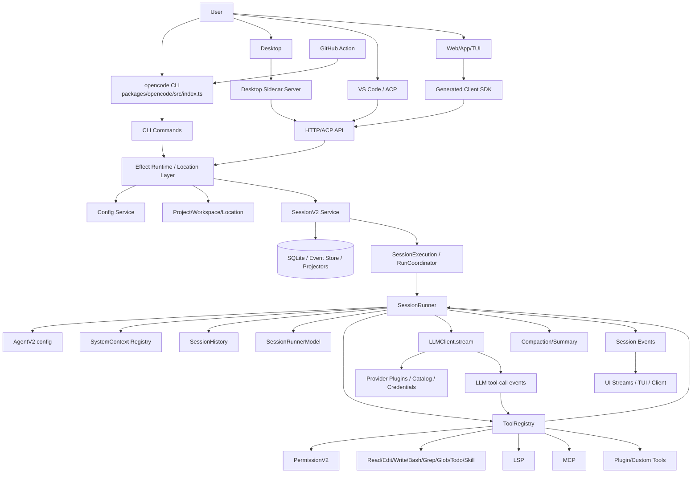
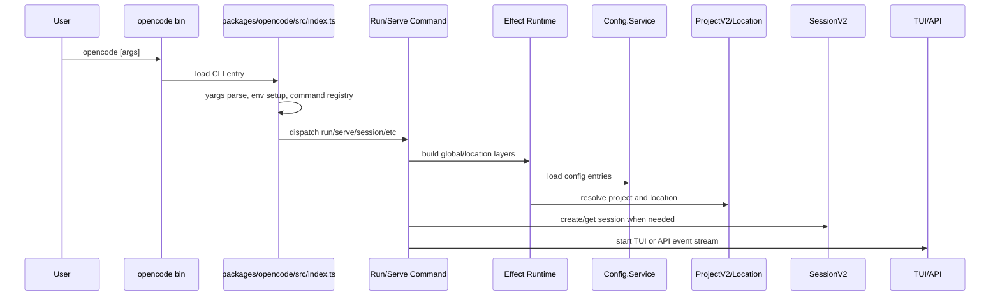
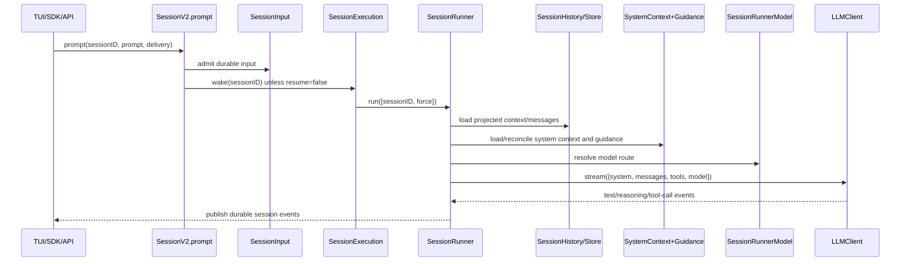
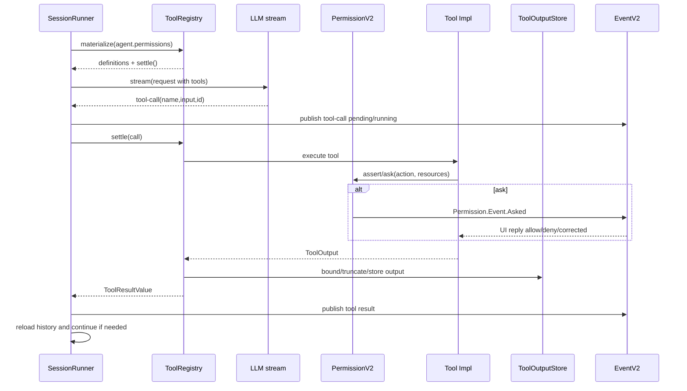
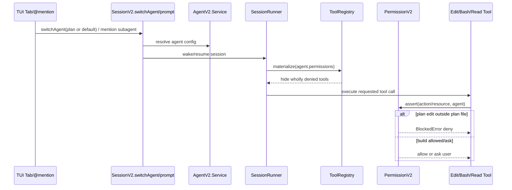
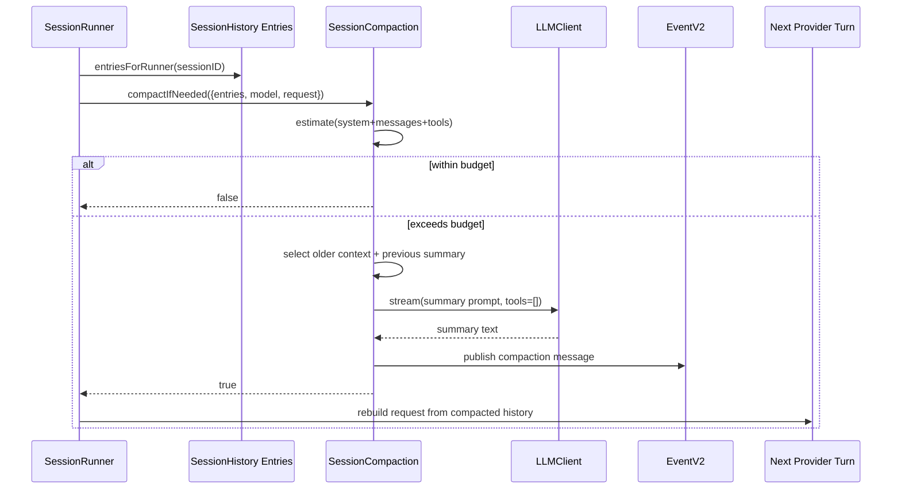
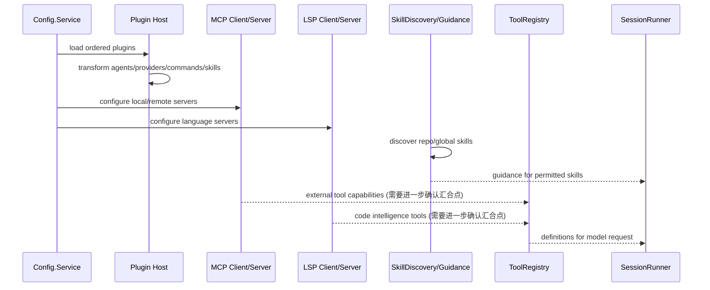
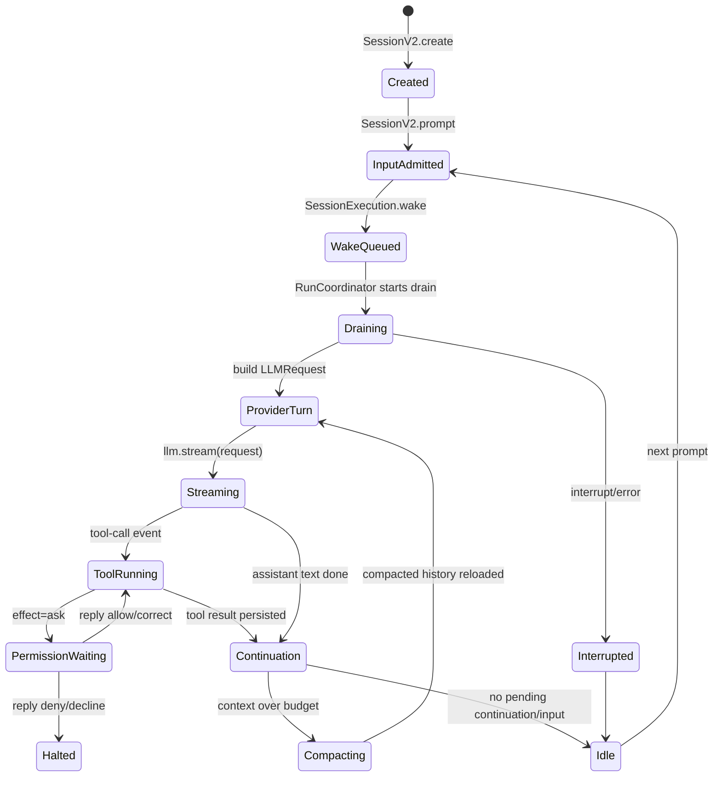
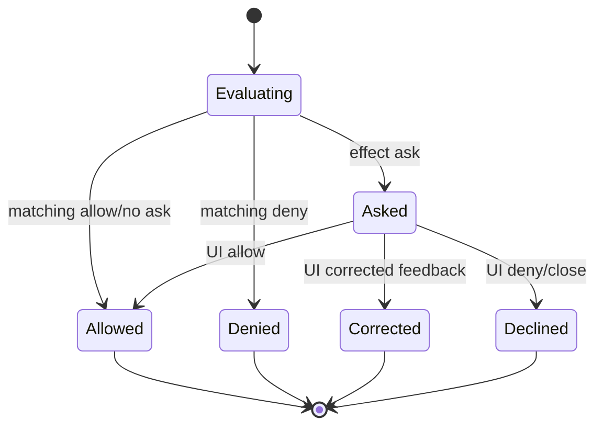

# OpenCode 架构设计分析：Code Wiki 风格源码导读

## 0. 文档元信息
- 分析仓库：`/workspace/opencode`
- 分析 commit：`2ae3fbc1954a6717d1ba324979ce6b1a3ef6e1d3`
- 生成时间：2026-07-09 UTC
- 分析范围：根目录 monorepo、`packages/core` v2 runtime、`packages/opencode` CLI/TUI/server 外壳、`packages/server`/`packages/client` API 层、`packages/tui`、`packages/desktop`、`sdks/vscode`、`github` action、`infra`、`specs`、`.opencode`。
- 主要源码证据：`package.json`、`turbo.json`、`packages/opencode/src/index.ts`、`packages/core/src/session.ts`、`packages/core/src/session/runner/llm.ts`、`packages/core/src/session/compaction.ts`、`packages/core/src/tool/registry.ts`、`packages/core/src/permission.ts`、`packages/core/src/plugin/agent.ts`、`packages/core/src/config.ts`、`packages/core/src/system-context/index.ts`、`packages/server/src/routes.ts`、`packages/client/src/index.ts`、`packages/desktop/src/main/index.ts`、`github/action.yml`。

## 1. 一句话理解 OpenCode
OpenCode 是一个 terminal-native、server/API 可嵌入、可扩展的 AI coding agent：用户界面通过 CLI/TUI/Desktop/IDE/SDK/API 发起 session prompt，核心 runtime 将 prompt 持久化为 session 输入，SessionRunner 组装 system context、history、agent 配置、model route 和 tool definitions，调用 LLM streaming，并在 tool call、权限请求、事件投影、上下文压缩之间循环推进任务。

## 2. 系统边界与核心问题
OpenCode 的系统边界不只是一个 CLI wrapper，而是由以下边界组成：

1. **交互边界**：CLI、TUI、Desktop、IDE/ACP、SDK、HTTP API server、GitHub action 都可以成为入口。CLI 命令集中注册在 `packages/opencode/src/index.ts`，server API 由 Effect `HttpApiBuilder` 暴露，client SDK 来自生成代码。
2. **运行时边界**：核心服务以 Effect `Context.Service`/`Layer` 组织，Location/Project/Workspace 将一次运行绑定到具体目录与可选 workspace。
3. **Agent 边界**：Agent 是带系统提示、模型偏好、权限 ruleset、mode 的执行角色。默认 build、plan、general、explore、compaction、title、summary 等 agent 在 `packages/core/src/plugin/agent.ts` 中注册或改写。
4. **模型边界**：Provider/Model 被抽象为 schema 与 route，SessionRunnerModel 根据 session/model/catalog/integration 解析具体 `@opencode-ai/llm` route，再由 `LLMClient.Service.stream(request)` 执行 provider turn。
5. **工具边界**：ToolRegistry 统一 materialize 工具定义，并把模型 tool call settle 成 typed result。内置工具、应用工具、插件注册工具、MCP 暴露工具都应汇入此边界。
6. **安全边界**：PermissionV2 基于 `action/resource/effect` ruleset 评估 `allow/ask/deny`，并通过 pending request 与 EventV2 通知 UI 询问用户。
7. **状态边界**：session、message、part/event/input/context epoch、permission saved、tool output 等持久化到 SQLite/Drizzle 表或事件流；UI 多数消费 projected state，而不是直接读 provider stream。

核心工程问题是：如何在本地文件系统中安全地让模型读写代码、执行命令、接入语言服务和外部工具，同时保持长任务可恢复、可观察、可扩展、可由多种 UI 复用。

## 3. 仓库结构总览

### 3.1 根目录和 monorepo
根目录是 Bun + Turbo monorepo。`package.json` 提供全局脚本，`turbo.json` 编排包级任务，`tsconfig.json` 统一 TS 配置，`bun.lock` 固定依赖。`AGENTS.md` 给出本仓库协作约束，`CONTEXT.md`/`CONTRIBUTING.md`/`SECURITY.md` 提供项目背景、贡献和安全入口。

### 3.2 主要目录
| 目录 | 角色 | 说明 |
| --- | --- | --- |
| `packages/core` | 核心运行时 | v2 session、runner、tool、permission、config、project、provider/model、plugin、skill、system context、database。|
| `packages/opencode` | 产品外壳/兼容层 | npm binary `opencode`、CLI 命令、TUI runtime、server routes、legacy/v1 模块、ACP、GitHub/GitLab 命令等。|
| `packages/server` | 可嵌入 HTTP API | Effect HttpApi route/handler/middleware，供 SDK/remote UI 使用。|
| `packages/client` | 生成式 HTTP client | `src/generated` 和 `src/generated-effect` 封装 server API。|
| `packages/tui` | terminal UI | OpenTUI/Solid 组件、TUI plugin API、通知和渲染能力。|
| `packages/desktop` | Electron/Tauri 风格桌面入口 | main/preload/renderer、sidecar server、WSL runtime、window/updater/onboarding。|
| `packages/app`/`packages/web`/`packages/ui` | Web/UI | Web app、共享 UI、docs/site 相关构建。|
| `packages/sdk-next`、`packages/sdk/js` | SDK | SDK-next 直接组合 core/server layer；legacy JS SDK 由 generate 流程产生。|
| `sdks/vscode` | IDE 集成 | VS Code extension。|
| `github` | CI/action 集成 | GitHub Action package，`action.yml` 和 `index.ts`。|
| `infra`、`nix`、`script`、`patches` | Infra/dev/release | 部署、环境、脚本、patch。|
| `specs` | 架构/协议规格 | storage 和 v2 session 规格，是源码旁的设计依据。|
| `.opencode` | 本仓库自身扩展 | 本仓库使用的 agents、commands、plugins、skills、themes、tools。|

### 3.3 package 分类
- **核心运行时**：`@opencode-ai/core`、`@opencode-ai/schema`、`@opencode-ai/llm`、`@opencode-ai/protocol`、`@opencode-ai/plugin`、`@opencode-ai/server`。
- **产品入口/UI**：`opencode`、`@opencode-ai/tui`、`@opencode-ai/desktop`、`@opencode-ai/app`、`@opencode-ai/web`、`@opencode-ai/session-ui`、`@opencode-ai/ui`。
- **SDK/集成**：`@opencode-ai/client`、`@opencode-ai/sdk-next`、legacy `packages/sdk/js`、`sdks/vscode`、`github`、`@opencode-ai/slack`。
- **构建/发布/辅助**：`packages/script`、`packages/httpapi-codegen`、`packages/containers`、`packages/stats`、`packages/console`、`infra`、`nix`。

## 4. 总体架构图

## 5. 分层架构解析

### 5.1 Interface Layer
**职责**：接收用户输入、展示流式事件、处理 permission/question 交互、适配不同宿主。

**关键文件/目录**：
- CLI：`packages/opencode/src/index.ts` 注册 yargs 命令，包括 `RunCommand`、`ServeCommand`、`McpCommand`、`GithubCommand`、`SessionCommand`。
- Run/TUI：`packages/opencode/src/cli/cmd/run.ts` 与 `packages/opencode/src/cli/cmd/run/*` 管理交互 runtime、footer、stream、permission、session replay。
- Server/API：`packages/server/src/routes.ts`、`packages/server/src/handlers/*.ts`；另有 `packages/opencode/src/server/routes/instance/httpapi/*` 作为产品内 HTTP API 实现。
- Client SDK：`packages/client/src/index.ts`、`packages/client/src/generated/*`、`packages/client/src/generated-effect/*`。
- Desktop：`packages/desktop/src/main/index.ts`、`packages/desktop/src/main/server.ts`、`packages/desktop/src/main/sidecar.ts`。
- IDE/ACP：`packages/opencode/src/acp/*`、`sdks/vscode/src/*`。
- GitHub：`github/action.yml`、`github/index.ts`。

**调用关系**：Interface 不直接执行 agent loop，而是调用 Session/Server API。CLI/TUI 既可以本进程启动 runtime，也可以连接 server。Desktop 通过 sidecar server 将 renderer 与 core runtime 解耦。

**优点**：同一 core 能服务 terminal、desktop、IDE、SDK；权限请求和事件流成为 UI 协议，而不是绑定特定 UI。

**限制**：`packages/opencode` 与 `packages/core` 并存 v1/v2 代码，入口层需要理解兼容路径；部分 instance httpapi 与 `packages/server` 的边界需要继续梳理。

### 5.2 Runtime Layer
**职责**：进程启动、命令分发、配置加载、Project/Location 解析、Session lifecycle、Effect layer 装配。

**关键文件/类型**：
- `packages/opencode/src/index.ts`：CLI bootstrap、全局 env、命令注册。
- `packages/core/src/config.ts`：`Config.Info`、`Config.Document`、`Config.Directory`、`Config.Service.entries()`。
- `packages/core/src/project.ts`：`ProjectV2.Service.resolve()`、project directory/VCS。
- `packages/core/src/location.ts`、`packages/core/src/location-services.ts`、`packages/core/src/location-service-map.ts`：将服务绑定到 location。
- `packages/core/src/effect/app-node.ts`、`app-node-builder.ts`、`layer-node.ts`：Effect node/layer 装配。
- `packages/core/src/session.ts`：`SessionV2.Service` facade。

**调用关系**：CLI/server 创建 runtime context；runtime 读取 config、解析 project/location；SessionV2 创建/读取 session，并通过 SessionExecution 唤醒 runner。

**优点**：Location-scoped service 使多 workspace/多目录并存成为可能；Effect Layer 明确依赖图。

**限制**：Effect service graph 学习成本高；新贡献者需要先理解 `makeLocationNode`/`makeGlobalNode`。

### 5.3 Agent Orchestration Layer
**职责**：定义 agent、选择 agent/model、执行 provider turn、处理 tool call、控制 step limit、primary/subagent/summary/compaction。

**关键文件/类型**：
- `packages/core/src/agent.ts`：AgentV2 schema/service。
- `packages/core/src/plugin/agent.ts`：内置 agent 默认配置、system prompt、mode、permissions。
- `packages/core/src/session/runner/index.ts`：`SessionRunner.Service.run({ sessionID, force })` 接口。
- `packages/core/src/session/runner/llm.ts`：runner 主循环：加载 session/context、materialize tools、构造 `LLMRequest`、`llm.stream(request)`、settle tools。
- `packages/core/src/session/runner/max-steps.ts`：step limit 达到后注入只读文本提示并禁用工具。
- `packages/core/src/session/execution.ts`、`execution/local.ts`、`run-coordinator.ts`：同 session drain/coalescing/interruption。

**调用关系**：SessionV2.prompt 只负责 durable admission，然后 SessionExecution 唤醒 Runner；Runner 每个 provider turn 读取投影历史和 context，选择 agent/model，执行模型和工具。

**优点**：将 durable prompt admission 与 provider execution 解耦，提高恢复和并发控制能力；primary/subagent 支持多角色协作。

**限制**：runner 文件承载大量 orchestration 逻辑； TODO 注释显示 provider retry、structured output、部分 runtime-context parity 仍有待完成。

### 5.4 Context Layer
**职责**：构造 system prompt、项目上下文、规则/AGENTS、reference guidance、skill guidance、历史消息、context epoch、summary/compaction。

**关键文件/类型**：
- `packages/core/src/system-context/index.ts`：`SystemContext.Source`、`initialize()`、`reconcile()`、`Snapshot`。
- `packages/core/src/system-context/registry.ts`、`builtins.ts`：context source 注册与内置源。
- `packages/core/src/session/context-epoch.ts`：context epoch 持久化。
- `packages/core/src/session/history.ts`：runner history selection。
- `packages/core/src/session/runner/to-llm-message.ts`：SessionMessage 到 LLM message 转换。
- `packages/core/src/session/compaction.ts`：`compactIfNeeded()`、`compactAfterOverflow()`、`buildPrompt()`。
- `packages/core/src/skill/guidance.ts`、`reference.ts`：skill/reference 注入。

**调用关系**：Runner 同时加载 `systemContext.load()`、`skillGuidance.load(agent)`、`referenceGuidance.load()`；构造 `system` 字段为 agent system + context baseline/update；history 被转换为模型消息。

**优点**：SystemContext 使用 typed source + durable snapshot，可以增量比较上下文变化，而非每轮无差别拼接。

**限制**：Context source 不可用时会阻塞初始化；source 的 baseline/update 文本质量会直接影响模型行为。

### 5.5 Tool Layer
**职责**：暴露可调用工具、生成 tool schema、执行工具、裁剪大输出、写回 tool result，并在工具内部或执行前后触发权限 gate。

**关键文件/类型**：
- `packages/core/src/tool/registry.ts`：`ToolRegistry.Service.materialize()`、`settle()`。
- `packages/core/src/tool/tool.ts`：tool 定义、permission action、schema/settle helpers。
- `packages/core/src/tool/application-tools.ts`、`builtins.ts`：应用工具集合。
- 内置工具：`read.ts`、`write.ts`、`edit.ts`、`apply-patch.ts`、`bash.ts`、`grep.ts`、`glob.ts`、`todowrite.ts`、`skill.ts`、`webfetch.ts`、`websearch.ts`。
- `packages/core/src/tool-output-store.ts`：大输出 bound/truncation。

**调用关系**：Runner 在非 max-step 情况下调用 `tools.materialize(agent.info?.permissions)` 生成 definitions；LLM stream 出现非 providerExecuted tool-call 后，runner 调用 materialization 的 `settle()`，将结果发布为 LLMEvent.toolResult 并进入下一轮。

**优点**：materialize 会根据权限整组隐藏被完全 deny 的工具，减少模型误调用；ToolOutputStore 把大输出转为可引用路径，避免 context 膨胀。

**限制**：权限粒度依赖每个 tool 声明的 action/resource；如果插件工具没有设计好 resource，安全性会下降。

### 5.6 Model Provider Layer
**职责**：统一 provider/model schema、配置、catalog、credentials、route 解析、流式调用与 provider 能力差异。

**关键文件/类型**：
- `packages/core/src/provider.ts`：`ProviderV2.ID/AISDK/Native/Api/Request/Info`。
- `packages/core/src/model.ts`：`ModelV2.Ref/Info/Api/Capabilities/Cost`、`parse()`。
- `packages/core/src/plugin/provider.ts`：聚合 Anthropic、OpenAI、Google、Groq、OpenRouter、GitHub Copilot、GitLab 等 provider plugins。
- `packages/core/src/session/runner/model.ts`：`SessionRunnerModel.resolve()`，处理未选模型、模型不可用、variant/API 不支持。
- `packages/core/src/aisdk.ts`、`packages/llm`：LLM abstraction/protocol adapters。

**调用关系**：Config/Catalog/Integration 提供 provider/model 元数据；SessionRunnerModel 将 session 的 model ref 解析为 LLM route；Runner 调用 `llm.stream(request)`。

**优点**：provider plugin 化，便于支持多云和私有兼容 API；模型能力、cost、limit 是 schema 化配置，可被 compaction 和 UI 使用。

**限制**：不同 provider 的 tool-calling/streaming/error 语义不完全一致，适配层复杂；fallback/retry 在 runner TODO 中仍显示不是完全完成的统一能力。

### 5.7 Policy / Permission / Safety Layer
**职责**：表达和执行 `allow/ask/deny`，区分 build/plan/subagent，处理用户确认、持久化允许规则、保护 env/external directories/写操作/bash。

**关键文件/类型**：
- `packages/core/src/permission.ts`：`PermissionV2.evaluate()`、`ask()`、`assert()`、`reply()`、`forSession()`。
- `packages/core/src/permission/saved.ts`：saved permissions。
- `packages/core/src/plugin/agent.ts`：默认 build/plan/subagent 权限 ruleset。
- `packages/server/src/handlers/permission.ts`：HTTP permission API。
- `packages/opencode/src/cli/cmd/run/permission.shared.ts`：TUI/CLI permission 交互。

**调用关系**：Tool 执行时调用 PermissionV2.assert/ask；如果 effect 为 ask，则 PermissionV2 发布 `Permission.Event.Asked`，UI 通过 API 回复，pending deferred 继续或失败。

**优点**：规则以 agent 为单位配置，plan agent 可以明确 deny edit；saved permission 允许用户对常用资源降噪。

**限制**：deny/ask 的正确性依赖 action/resource 命名规范；shell 命令的副作用很难完全静态判定。

### 5.8 Persistence / State Layer
**职责**：存储 session、message、part、input inbox、context epoch、events、permission saved、project、workspace、tool output、snapshot/revert。

**关键文件/类型**：
- `packages/core/src/session/sql.ts`：`SessionTable`、`MessageTable`、`PartTable`、`SessionInputTable`、`SessionContextEpochTable`。
- `packages/core/src/session.ts`：Session service API。
- `packages/core/src/session/input.ts`：durable input admission、projection、steer/queue promotion。
- `packages/core/src/session/projector.ts`、`store.ts`、`event.ts`：event projection/store。
- `packages/core/src/event.ts`、`event/sql.ts`：事件。
- `packages/core/src/database/*`：Drizzle schema/migrations/sqlite。
- `packages/core/src/snapshot.ts`、`session/revert.ts`：文件快照和回滚。

**调用关系**：SessionV2.create/prompt/switch/compact 发布 events 或写 inbox；projector 维护查询视图；runner 每轮重新加载 projected history。

**优点**：durable input inbox 和 event projection 让 prompt admission 与 execution 分离；中断、恢复、UI replay 更自然。

**限制**：投影一致性和迁移复杂度高；schema/migration 文件多，新人需要从 `session/sql.ts` 和 `database/schema.sql.ts` 入门。

### 5.9 Extension Layer
**职责**：通过 plugin、skill、command、MCP、LSP、custom agent/tool/provider/reference 扩展能力。

**关键文件/类型**：
- Plugin：`packages/core/src/plugin/internal.ts`、`host.ts`、`promise.ts`、`provider.ts`、`agent.ts`、`command.ts`、`skill.ts`。
- Config：`packages/core/src/config/plugin.ts`、`config/mcp.ts`、`config/lsp.ts`、`config/command.ts`、`config/agent.ts`。
- Skill：`packages/core/src/skill/discovery.ts`、`skill/guidance.ts`、`packages/core/src/tool/skill.ts`。
- LSP：相关入口在 `packages/opencode/src/lsp/*` 与 core config `packages/core/src/config/lsp.ts`。
- MCP：相关入口在 `packages/opencode/src/mcp/*` 与 core config `packages/core/src/config/mcp.ts`。
- Repo-local 扩展：`.opencode/agent`、`.opencode/command`、`.opencode/skills`、`.opencode/tool`。

**调用关系**：Config 读取插件/MCP/LSP/skills；Plugin host 改写 agent/provider/command/skill registry；tool registry 暴露扩展工具；skill guidance 影响 prompt，skill tool 触发具体 skill。

**优点**：扩展不是只能加 prompt，也能加 provider、agent、tool、command、reference；适合企业/团队内定制。

**限制**：扩展点多导致安全边界分散；MCP/LSP 生命周期在本次扫描中主要定位到 config 和 `packages/opencode/src/*`，core v2 与 legacy 路径的最终汇合点需要进一步确认。

### 5.10 Dev / Release / Infra Layer
**职责**：构建、测试、发布、SDK 生成、desktop/extension 打包、CI/CD、容器和部署。

**关键文件/目录**：`turbo.json`、`package.json`、`packages/script`、`packages/httpapi-codegen`、`packages/client`、`packages/desktop/package.json`、`sdks/vscode/package.json`、`github/script/*`、`.github/workflows`、`infra`、`nix`、`packages/containers`。

**调用关系**：Server HttpApi 变化后需要从 `packages/client` 运行 generate 生成 client；desktop/vscode/action 各自有 package 构建链路。

**优点**：API schema 生成 client，减少手写 SDK 漂移；monorepo 让多端共享 schema/runtime。

**限制**：生成文件与源码的边界必须严格遵守；本仓库提示禁止手改 `src/generated` 与 `src/generated-effect`。

## 6. 端到端执行流程

### 6.1 启动流程
用户运行 `opencode` 后，npm/bin 指向 `packages/opencode/bin/opencode`，进入 `packages/opencode/src/index.ts`。该文件用 yargs 解析参数，设置 `OPENCODE`/`AGENT` 等环境变量，注册 run/serve/mcp/github/session 等命令。run 命令进一步启动 TUI/runtime；serve 命令启动 API server；两者最终都会进入 Effect runtime 和 Location-scoped services。

### 6.2 用户 prompt 处理流程
用户在 TUI/SDK/API 输入 prompt 后，接口层调用 SessionV2.prompt。v2 设计关键点是先 durable admission：将 prompt 写入 `session_input` 或发布 admission 事件，再由 SessionExecution 唤醒本地 runner。Runner 不直接信任内存上下文，而是重新从 store/history 读取 projected messages，加载 system context、skill/reference guidance，解析 agent/model，构造 `LLMRequest` 并 stream。

### 6.3 Tool call 执行流程
Runner 在每个 provider turn 前调用 ToolRegistry.materialize。materialize 会合并 ApplicationTools 和本地注册工具，并按 agent permissions 隐藏被完全 deny 的工具。模型输出 tool-call 时，runner 先发布 tool call 事件，再用 settlement 执行；tool 内部按 action/resource 调用 PermissionV2.assert/ask；结果经 ToolOutputStore bound 后转成 LLM tool result，进入下一轮 provider turn。

### 6.4 Plan / Build agent 权限差异
默认 build agent 是 `AgentV2.defaultID`，mode 为 `primary`，在默认 ruleset 基础上允许 question 和进入 plan。plan agent 也是 primary，但描述为 “Disallows all edit tools”，显式 deny `edit:*`，只允许写 `.opencode/plans/*.md` 或全局 plans 目录。general/explore 是 subagent：general 可多步处理但 deny todowrite；explore 只允许 grep/glob/read/webfetch/websearch，deny 其他动作。

### 6.5 Context compaction / summary 流程
Runner 在构造 request 后调用 `SessionCompaction.compactIfNeeded`。它根据模型 context limit、output limit、config buffer 和估算 token 判断是否需要压缩；若请求超过预算，则选择历史 head 和 previous summary，构造 compaction prompt，用无工具的 LLM stream 生成 summary，并发布 compaction message/event。overflow 时 `compactAfterOverflow` 也可被 runner 捕获后重试一次。

### 6.6 MCP / LSP / Plugin / Skill 扩展流程
Config.Info 中有 `mcp`、`lsp`、`plugins`、`commands`、`agents`、`references`。Plugin host 和内置 plugins 可注册 provider/agent/command/skill；MCP 配置支持 local/remote server；LSP 配置定义语言服务启动参数；SkillDiscovery 扫描索引并由 SkillGuidance 将可用 skill 注入 agent context，Skill tool 让模型调用具体 skill。

## 7. 核心数据结构与状态机

| 概念 | 源码位置 | 主要字段/接口 | 生命周期 | 由谁创建 | 被谁消费 |
| -- | ---- | ------- | ---- | ---- | ---- |
| Session | `packages/core/src/session.ts`, `packages/core/src/session/schema.ts` | `id`, `projectID`, `directory`, `workspaceID`, `agent`, `model`, `tokens`, `time`; Service: `create/get/prompt/messages/context/resume/interrupt/compact` | 创建后持久存在，可 prompt、switch、compact、revert | CLI/API/SDK 调用 SessionV2 | Runner、UI、Server handlers |
| SessionInput | `packages/core/src/session/input.ts` | `admit`, `projectAdmitted`, `promoteSteers`, `promoteNextQueued`, `Delivery` | prompt admission 到 promoted/projected | SessionV2.prompt | SessionExecution/Runner/Projector |
| Message/Part | `packages/core/src/session/message.ts`, `packages/core/src/session/sql.ts` | user/assistant/tool/system/synthetic/compaction；parts 存工具、文本、reasoning | 随事件投影增长；compaction 可替换旧上下文 | Runner/Projector | UI、History、LLM converter |
| Event | `packages/core/src/event.ts`, `packages/core/src/session/event.ts` | durable session events、permission events、LLM events | 发布、投影、stream/replay | Session、Runner、Permission | UI、Store、Projectors |
| Agent | `packages/core/src/agent.ts`, `packages/core/src/plugin/agent.ts` | `id`, `mode`, `system`, `permissions`, `model`, hidden/description | config/plugin 初始化，可 session switch | Agent plugin/config | Runner、Permission、ToolRegistry |
| Tool | `packages/core/src/tool/tool.ts`, `packages/core/src/tool/registry.ts` | name、schema definition、permission action、settle result | 注册到 registry；每轮 materialize | Builtins/ApplicationTools/Plugins/MCP | LLM request、Runner settle |
| Permission | `packages/core/src/permission.ts` | `Rule {action, resource, effect}`, `ask/assert/reply/evaluate` | per request pending；saved allow 可持久化 | Tool/Runtime 请求 | UI/server reply、Tool execution |
| Provider | `packages/core/src/provider.ts`, `packages/core/src/plugin/provider.ts` | `Provider.Info`, `Api`, `AISDK/Native`, provider plugins | config/catalog/integration 加载 | Plugin/Catalog/Config | SessionRunnerModel/LLM route |
| Model | `packages/core/src/model.ts`, `packages/core/src/session/runner/model.ts` | `Model.Ref/Info`, `Capabilities`, `Cost`, `Limit`, variants | session/model selection 到 provider turn | Config/Catalog/User | Runner、Compaction、UI |
| Config | `packages/core/src/config.ts` | `model`, `agents`, `mcp`, `lsp`, `plugins`, `providers`, `commands`, `references`, `compaction` | 启动/location 时加载，watcher 可刷新 | Config.Service | Runtime、Plugin、Runner、Tools |
| Project/Location | `packages/core/src/project.ts`, `packages/core/src/location.ts` | project id、directory、VCS、workspace identity | 每个目录解析并缓存/持久化 | Runtime | Session、Permission saved、Location services |
| SystemContext | `packages/core/src/system-context/index.ts` | `Source`, `Snapshot`, `initialize`, `reconcile`, baseline/update | 每个 context epoch 初始化和增量更新 | Registry/Builtins | Runner/system prompt |
| Compaction | `packages/core/src/session/compaction.ts` | `compactIfNeeded`, `compactAfterOverflow`, `buildPrompt` | 长 session 中按预算触发 | Runner | History/LLM/Store |
| Skill | `packages/core/src/skill/discovery.ts`, `skill/guidance.ts`, `tool/skill.ts` | discover index、permission-filtered guidance、skill tool | config/global/repo 扫描，按 agent 权限暴露 | SkillDiscovery/Plugin | Runner/Tool/LLM |
| MCP/LSP | `packages/core/src/config/mcp.ts`, `config/lsp.ts`, `packages/opencode/src/mcp/*`, `packages/opencode/src/lsp/*` | server config、remote/local、language server config | 启动或按需连接 | Config/Runtime | Tools/Extension layer |

### Session/runner 状态机

### Permission 状态机

## 8. 关键源码文件索引
| 模块 | 文件/目录 | 作用 | 阅读优先级 |
| -- | ----- | -- | ----- |
| CLI bootstrap | `packages/opencode/src/index.ts` | yargs 参数解析、全局 env、命令注册 | P0 |
| Core session facade | `packages/core/src/session.ts` | SessionV2 service API 与 create/prompt/resume/compact | P0 |
| Runner interface | `packages/core/src/session/runner/index.ts` | Runner service contract | P0 |
| Runner implementation | `packages/core/src/session/runner/llm.ts` | agent loop、LLM request、stream、tool call settlement | P0 |
| Model resolution | `packages/core/src/session/runner/model.ts` | session model 到 LLM route | P0 |
| Tool registry | `packages/core/src/tool/registry.ts` | materialize tool definitions and settle calls | P0 |
| Permission | `packages/core/src/permission.ts` | ask/assert/evaluate/reply | P0 |
| Agent defaults | `packages/core/src/plugin/agent.ts` | build/plan/subagent/summary/compaction 默认配置 | P0 |
| Config | `packages/core/src/config.ts` | OpenCode config schema and loader | P0 |
| System context | `packages/core/src/system-context/index.ts` | typed context source, baseline, snapshot, reconcile | P0 |
| Compaction | `packages/core/src/session/compaction.ts` | context budget and summary compaction | P1 |
| Session input | `packages/core/src/session/input.ts` | durable prompt admission and queue/steer promotion | P1 |
| Session SQL | `packages/core/src/session/sql.ts` | session/message/input/context tables | P1 |
| Project/location | `packages/core/src/project.ts`, `packages/core/src/location*.ts` | project root, location-scoped service map | P1 |
| Provider plugins | `packages/core/src/plugin/provider.ts` | provider plugin aggregation | P1 |
| Model/provider schema | `packages/core/src/model.ts`, `packages/core/src/provider.ts` | model/provider schema exports | P1 |
| Server API | `packages/server/src/routes.ts`, `packages/server/src/handlers/*` | embedded HttpApi routes | P1 |
| Generated client | `packages/client/src/index.ts`, `packages/client/src/generated*` | TS client surface | P1 |
| TUI runtime | `packages/opencode/src/cli/cmd/run/*`, `packages/tui/src/*` | terminal UI and stream/permission handling | P1 |
| Desktop | `packages/desktop/src/main/*`, `packages/desktop/src/renderer/*` | desktop sidecar and UI | P2 |
| MCP | `packages/core/src/config/mcp.ts`, `packages/opencode/src/mcp/*` | MCP config and lifecycle | P2 |
| LSP | `packages/core/src/config/lsp.ts`, `packages/opencode/src/lsp/*` | language server config and client/server | P2 |
| Skill | `packages/core/src/skill/*`, `packages/core/src/tool/skill.ts` | skill discovery/guidance/tool invocation | P2 |
| GitHub action | `github/action.yml`, `github/index.ts` | CI integration entry | P2 |
| Specs | `specs/v2`, `specs/storage` | Design intent and storage/session specs | P2 |

## 9. 设计亮点
1. **terminal-native 但非 CLI-only**：CLI/TUI 是一等入口，但 core runtime、server API、client SDK、desktop、IDE 共用 session/runner/tool/permission 模型，避免每个端重复实现 agent。
2. **durable prompt admission**：SessionV2.prompt 先承认 durable input，再唤醒 runner；这比“用户输入直接进内存 loop”更适合恢复、重放和 UI 同步。
3. **primary agent / subagent 分层**：primary 管理主会话状态和权限模式，subagent 用于 explore/general 等隔离任务；这让并行探索、只读检索、摘要生成不用污染主 agent 权限。
4. **plan/build 权限隔离**：plan agent 显式 deny edit，只允许 plan 文件写入；build agent 才能执行更高权限修改，符合人类 code review 的“先计划再改动”工作流。
5. **LSP 补足 grep/search**：grep/glob 只能文本匹配，LSP 可以提供 diagnostics、符号、定义/引用等语义信息，适合大型代码库精确编辑。
6. **MCP/custom tool/plugin/skill 多层扩展**：MCP 接外部工具，plugin 改写 provider/agent/command/skill，skill 注入可复用流程，custom tool 提供本地能力；扩展层覆盖“能力、知识、流程、模型”四个维度。
7. **SystemContext snapshot/reconcile**：上下文不是一次性拼字符串，而是 typed source + durable snapshot，支持增量 update 和不可用阻塞，适合长 session。
8. **Compaction 作为 runtime 能力**：summary/compaction 不只是 UI 命令，而在 runner 中按模型 limit 自动触发，避免长任务 context 爆炸。
9. **Effect service graph**：服务依赖显式、可按 global/location 作用域组合，适合复杂 agent runtime 的可测试和可嵌入。

## 10. 架构风险与复杂性
1. **v1/v2 并存复杂度**：`packages/opencode` 与 `packages/core` 中都存在 session/tool/config 相关代码，新人容易误读 legacy 路径。
2. **权限资源命名风险**：权限安全取决于工具是否准确声明 action/resource；特别是 bash、external directory、插件工具容易形成逃逸面。
3. **Provider 差异**：多 provider 带来 streaming、tool call、error/retry、API variant 差异，统一 abstraction 需要持续维护。
4. **事件投影一致性**：durable events + projection 增强恢复能力，但也引入投影延迟、迁移和并发 race 的复杂度。
5. **扩展点安全**：plugin/MCP/skill/custom tool 能力强，但如果缺乏 sandbox、签名、来源策略，会扩大供应链和本地执行风险。
6. **Context 信息损失**：compaction 依赖模型总结，可能丢失细节；虽然 prompt 要求保留路径/约束，但仍需关键任务上做 checkpoint 或引用文件。
7. **Effect 学习曲线**：Context.Service/Layer/Effect.gen 对 TypeScript 贡献者有门槛。

## 11. 二次开发指南
| 目标 | 推荐入口 | 注意事项 |
| --- | --- | --- |
| 新增 CLI 命令 | `packages/opencode/src/index.ts`, `packages/opencode/src/cli/cmd/*` | 只在入口注册命令，业务逻辑尽量落到 core/service。|
| 新增/调整 Agent | `packages/core/src/plugin/agent.ts`, `packages/core/src/config/agent.ts` | 先设计 permissions，再设计 system prompt；避免给 subagent 过高权限。|
| 新增 Tool | `packages/core/src/tool/tool.ts`, `packages/core/src/tool/registry.ts`, `packages/core/src/tool/*` | 明确 schema、action/resource、输出裁剪；避免绕过 PermissionV2。|
| 调整权限策略 | `packages/core/src/permission.ts`, `packages/core/src/plugin/agent.ts` | 保持 plan/build 差异；对 bash/edit/write 加强资源粒度。|
| 接入新模型 provider | `packages/core/src/plugin/provider/*`, `packages/core/src/provider.ts`, `packages/core/src/model.ts` | 处理 tool calling、streaming、context/output limit、credential。|
| 改上下文策略 | `packages/core/src/system-context/*`, `packages/core/src/session/history.ts` | 维护 snapshot compatibility；source 不可用策略要明确。|
| 改 compaction | `packages/core/src/session/compaction.ts`, `packages/core/src/config/compaction.ts` | 关注 token 估算、summary 结构和信息丢失。|
| 改 API/SDK | `packages/server/src/*`, `packages/client/src/*` | Server HttpApi 变化后从 `packages/client` 运行 generate，不手改 generated。|
| Desktop/IDE 集成 | `packages/desktop/src/*`, `sdks/vscode/src/*`, `packages/opencode/src/acp/*` | 尽量复用 API/session，不复制 agent loop。|
| MCP/LSP/Skill | `packages/core/src/config/mcp.ts`, `config/lsp.ts`, `skill/*`, `packages/opencode/src/mcp/*`, `lsp/*` | 需要确认生命周期汇合点和权限边界。|

## 12. 新贡献者阅读路线
1. **先读入口，理解启动和命令分发**：`packages/opencode/src/index.ts`、`packages/opencode/src/cli/cmd/run.ts`、`packages/opencode/src/cli/cmd/serve.ts`。
2. **读配置和 project/location runtime**：`packages/core/src/config.ts`、`packages/core/src/project.ts`、`packages/core/src/location.ts`、`packages/core/src/location-services.ts`。
3. **读 session facade 和 durable input**：`packages/core/src/session.ts`、`packages/core/src/session/input.ts`、`packages/core/src/session/sql.ts`。
4. **读 agent loop**：`packages/core/src/session/runner/index.ts`、`packages/core/src/session/runner/llm.ts`、`packages/core/src/session/runner/to-llm-message.ts`。
5. **读 agent defaults 与权限**：`packages/core/src/plugin/agent.ts`、`packages/core/src/permission.ts`、`packages/core/src/permission/saved.ts`。
6. **读 tool registry 和核心工具**：`packages/core/src/tool/registry.ts`、`packages/core/src/tool/tool.ts`、`packages/core/src/tool/read.ts`、`edit.ts`、`write.ts`、`bash.ts`、`grep.ts`、`glob.ts`。
7. **读 provider/model**：`packages/core/src/session/runner/model.ts`、`packages/core/src/plugin/provider.ts`、`packages/core/src/provider.ts`、`packages/core/src/model.ts`。
8. **读 context/compaction**：`packages/core/src/system-context/index.ts`、`registry.ts`、`packages/core/src/session/compaction.ts`、`history.ts`。
9. **读 API/SDK/UI**：`packages/server/src/routes.ts`、`packages/server/src/handlers/session.ts`、`packages/client/src/index.ts`、`packages/opencode/src/cli/cmd/run/*`、`packages/tui/src/*`。
10. **最后读扩展**：`packages/core/src/plugin/*`、`packages/core/src/skill/*`、`packages/core/src/config/mcp.ts`、`config/lsp.ts`、`packages/opencode/src/mcp/*`、`packages/opencode/src/lsp/*`。

## 13. 需要进一步确认的问题
1. **MCP 工具如何最终汇入 core v2 ToolRegistry**：已检查 `packages/core/src/config/mcp.ts`、`packages/opencode/src/mcp/*`、`packages/core/src/tool/registry.ts`，但本轮未完整追踪 MCP client lifecycle 到具体 tool registration 的调用链。
2. **LSP 能力如何在 v2 tool 层暴露**：已检查 `packages/core/src/config/lsp.ts`、`packages/opencode/src/lsp/*` 和 core tool 目录；`packages/opencode/src/tool/lsp.ts` 与 `packages/core/src/tool/*` 之间的 v1/v2 边界需要进一步确认。
3. **Desktop sidecar 与 core/server 的精确启动链路**：已定位 `packages/desktop/src/main/index.ts`、`server.ts`、`sidecar.ts`，但未深入每个 IPC message 到 SessionV2 的映射。
4. **GitLab 集成入口**：provider 层和依赖中存在 GitLab provider/auth，CLI 有 GitHub command；GitLab CI/command 入口本轮未完全定位。
5. **Provider fallback/retry**：runner TODO 提到 provider retries 尚待完善；需要进一步读 `packages/llm` 和 provider adapters 确认每个 provider 当前 retry 行为。
6. **Skill 调用链细节**：已确认 discovery/guidance/tool 文件，但技能内容如何解析成 model-visible 操作和 tool result 的完整链路可进一步展开。

## 14. 总结
OpenCode 的关键设计不是“把模型接到 shell”，而是把 AI coding agent 拆成可组合的 interface、runtime、session、agent、context、tool、permission、provider、state、extension 层。它通过 durable session/event/input、Effect service graph、Location-scoped runtime、权限 ruleset、provider/tool abstraction 和 compaction，把 terminal-native agent 工程化为可恢复、可观察、可扩展的系统。

对二次开发者来说，最重要的路线是先理解 `SessionV2.prompt -> SessionExecution.wake -> SessionRunner.run -> llm.stream -> ToolRegistry.settle -> Event projection` 这条主链路；任何新 UI、agent、tool、provider、skill 或策略都应尽量接入这条链路，而不是另写一个内存 agent loop。
