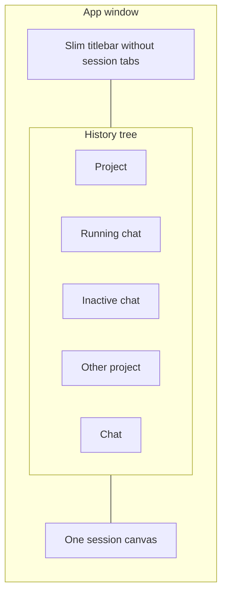

# Session History Tree - Plan

## Goal Capsule

- **Objective:** Replace the OpenCode desktop/web app's titlebar session tabs with a left tree of chat history grouped by project, so several chats can run while one conversation is on screen.
- **Product authority:** This Product Contract. Adjacent chrome (Home, split views, TUI) is not active scope.
- **Open blockers:** None. Remaining questions are deferred to planning.

---

## Product Contract

### Summary

Ship a project-grouped chat history tree as the app's session chrome.
The tree is history with running vs inactive status, not an open-tab strip.
Several chats can run at once; the canvas shows one.

### Problem Frame

The default app is built around a horizontal tab strip of "open" sessions.
That model does not match how people already think about this product: a list of chats under each project, some running, most idle.
Tabs also hide other projects' chats until you hunt for them, which fights parallel work across projects.
The leftover project icon rail on the old layout only shows one project's list at a time.

### Key Decisions

- Tree chrome, not a selected-project rail or a hover overlay.
  (session-settled: user-directed — chosen over rail+list and overlay tree: all projects' chats stay visible without switching the rail)
  Governs R1, R2.
- History with running/inactive status, not an open-tab set.
  (session-settled: user-directed — chosen over titlebar-equivalent open tabs: there is no close-the-tab concept)
  Governs R5, R6.
- One conversation on screen; parallel means concurrent runs, not split panes.
  (session-settled: user-directed — chosen over split canvas)
  Governs R7, R8.
- Ship the tree for everyone. No settings flag, and do not keep A/B/C as live options.
  (session-settled: user-directed — chosen over a three-variant enum and a current-vs-tree toggle)
  Governs R4.

### Actors

- A1. Person using the OpenCode desktop or web app, often with more than one project and more than one chat in flight.

### Requirements

**Chrome**

- R1. A persistent left tree lists chats nested under their project names, for every project that has chats in the list.
- R2. The titlebar does not list sessions, and the project icon rail is not part of this chrome.
- R3. Each project in the tree offers a way to start a new chat in that project without leaving the tree.
- R4. This tree is the session chrome. There is no settings control to restore titlebar tabs or to pick among the explored rail/overlay sketches.

**History and running work**

- R5. The tree is chat history. A row is a chat, not an "open tab" that the user must close to remove from the list.
- R6. A chat is either running or inactive. Inactive rows stay cheap enough that a long history remains usable.
- R7. Selecting a row shows that chat in the single session canvas.
- R8. Selecting another row does not stop chats that are still running.

**Parallel**

- R9. Only one conversation is visible at a time.

### Key Flows

- F1. Jump between two running chats
  - **Trigger:** A1 has two chats running in the same or different projects.
  - **Actors:** A1
  - **Steps:** A1 selects the other running row in the tree. The canvas shows that chat. The first chat keeps running.
  - **Covered by:** R1, R7, R8, R9
- F2. Open an inactive chat
  - **Trigger:** A1 selects a history row that is not running and may not be loaded.
  - **Actors:** A1
  - **Steps:** The canvas shows that chat. Other running chats continue.
  - **Covered by:** R5, R6, R7, R8
- F3. Start a new chat while another runs
  - **Trigger:** A1 starts a new chat from a project in the tree.
  - **Actors:** A1
  - **Steps:** A new row appears under that project. The canvas shows the new chat. Existing running chats continue.
  - **Covered by:** R3, R7, R8
- F4. Scan a long project history
  - **Trigger:** A project has more chats than fit on screen.
  - **Actors:** A1
  - **Steps:** A1 scrolls the tree. Off-screen inactive rows stay cheap per R6.
  - **Covered by:** R1, R5, R6

### Acceptance Examples

- AE1. Two running chats, one canvas
  - **Covers R7, R8, R9.**
  - **Given:** Chat A and chat B are both running.
  - **When:** A1 selects B in the tree.
  - **Then:** The canvas shows B, A is still running, and A remains in the tree as running.
- AE2. Inactive chat is still in the tree
  - **Covers R5, R6.**
  - **Given:** A chat finished and is not loaded.
  - **When:** A1 looks at its project in the tree.
  - **Then:** The chat is still listed, marked inactive, and selecting it shows it.
- AE3. Closing is not how a chat leaves the list
  - **Covers R2, R5.**
  - **Given:** A1 is looking at a chat.
  - **When:** A1 switches to another chat.
  - **Then:** The previous chat stays in the tree. There is no titlebar tab to close.
- AE4. New chat under the chosen project
  - **Covers R3, R1.**
  - **Given:** Projects P and Q are in the tree.
  - **When:** A1 starts a new chat from P.
  - **Then:** The new row is under P, not Q, and the canvas shows it.
- AE5. Other project's chats stay visible
  - **Covers R1, R8.**
  - **Given:** P has a running chat and Q has an inactive chat.
  - **When:** A1 is viewing P's chat.
  - **Then:** Q's chat remains listed under Q without switching a project rail.

### Scope Boundaries

**Deferred for later**

- Split canvas so two conversations are on screen at once.
- Shipping the rail+list or overlay-tree sketches as settings options.
- TUI session sidebar.

**Outside this product's identity**

- A settings flag to keep titlebar tabs. The tree is the chrome, not an experiment.
- Treating chats as browser tabs that vanish when "closed."

### Dependencies / Assumptions

- The change targets the current default desktop/web app chrome, not TUI.
- Mobile uses the same tree, collapsed until opened.
- Git workspaces, if shown, nest under their project in this tree rather than becoming a second grouping axis.
- Home remains a place to browse projects and chats; it is not replaced by the tree.
- Existing session delete/archive is how a row leaves the tree. Switching away from a chat does not remove it.
- The existing "New interface" layout toggle is a different, already-shipping concern. This work does not add a second layout flag.

### Outstanding Questions

**Deferred to Planning**

- How running vs inactive is shown (dot, label, section, filter).
- What remains in the slim titlebar besides window chrome (Home, search, status).
- What happens to persisted tab-strip state and to copy that currently describes the app as built around tabs.
- How far virtualization goes on first ship.

### Sources / Research

- Default v2 chrome is a titlebar session tab strip. In-app help still says the desktop app is built around tabs (`packages/app/src/i18n/en.ts`, `help.tabs.*`).
- Legacy layout already lists sessions under one selected project next to a 64px project rail (`packages/app/src/pages/layout/sidebar-shell.tsx`, `sidebar-project.tsx`).
- The tree content is that history list for every project at once, not the titlebar's open-tab store (`packages/app/src/context/tabs.tsx`).
- Directional chrome sketches compared tree vs rail+list vs overlay; tree was chosen. Scratch only, not a spec: the local visual probe at session time.
