# Dakota's themes in a session

Real screenshots of the same markdown-demo session in the local desktop app,
at 1280 × 960. Every theme is shown in light and dark mode.

| Theme | Light | Dark |
| --- | --- | --- |
| Elle | 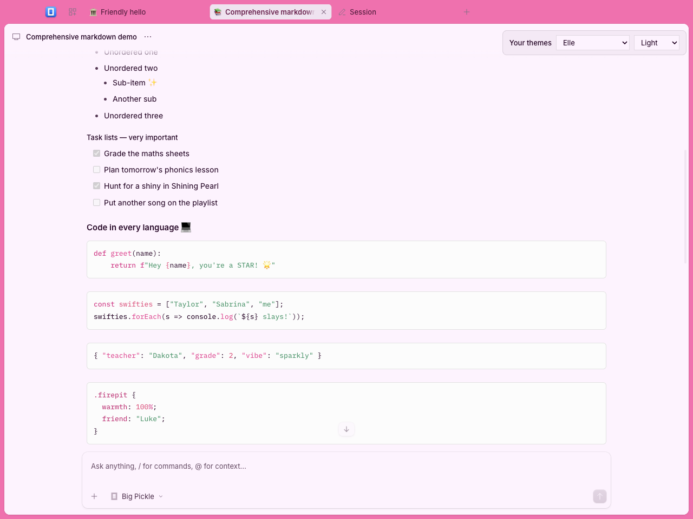 | 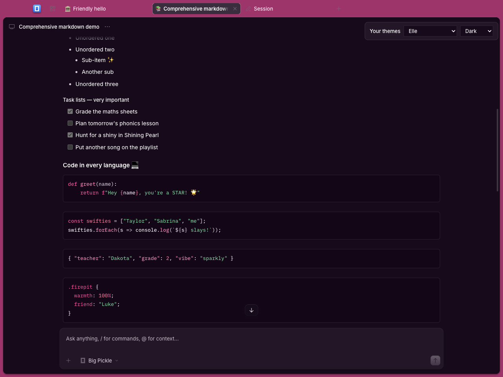 |
| Me Espresso | 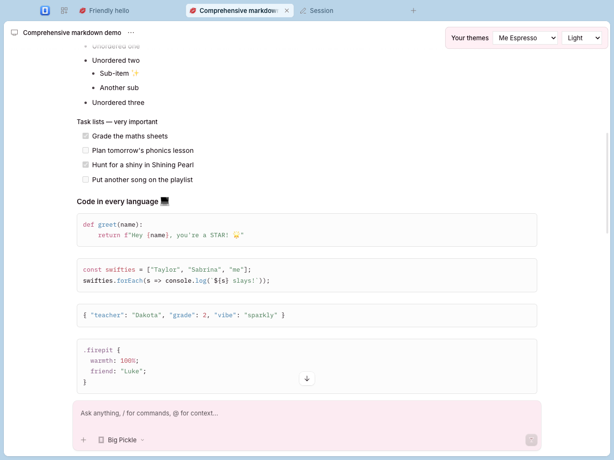 | 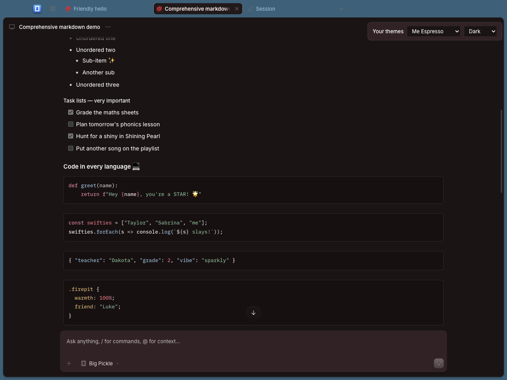 |
| Evelyn | 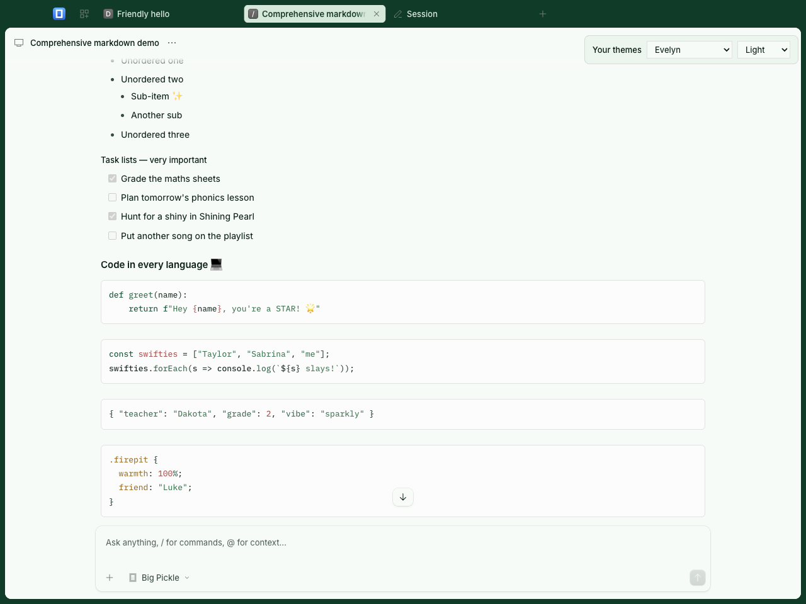 | 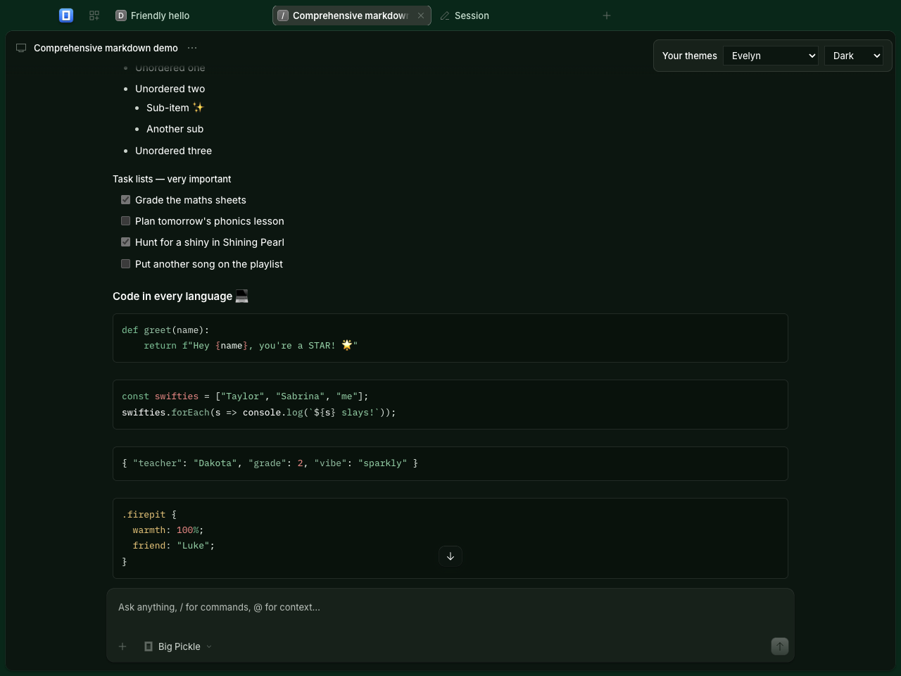 |
| Buttercream | 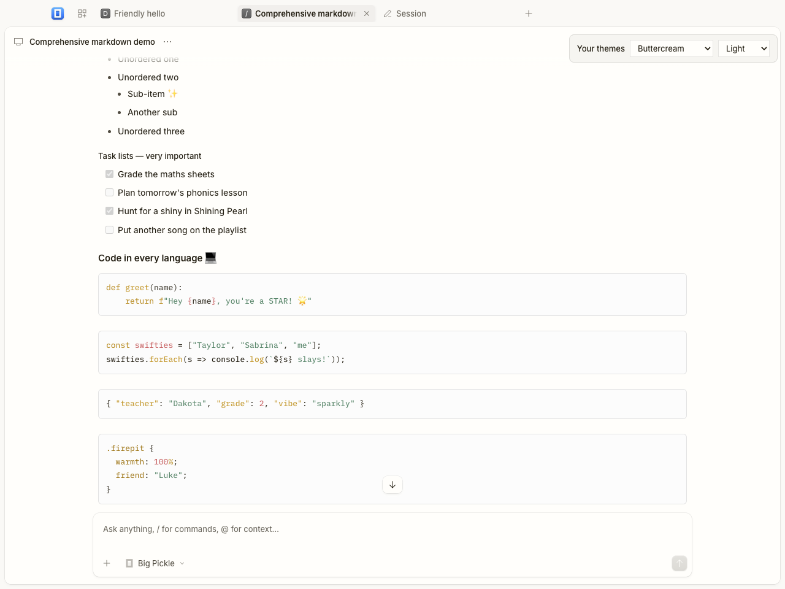 | 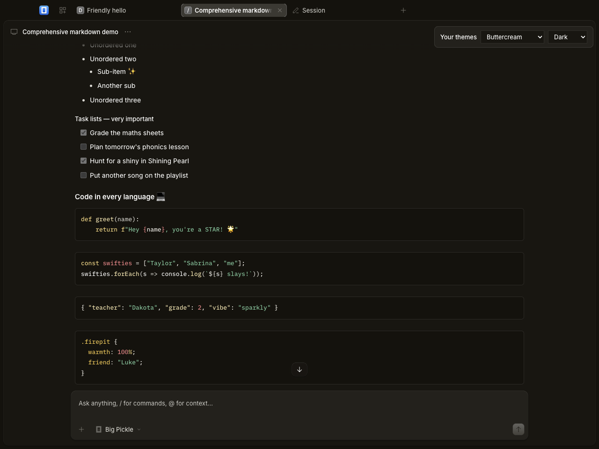 |
| Seafoam | 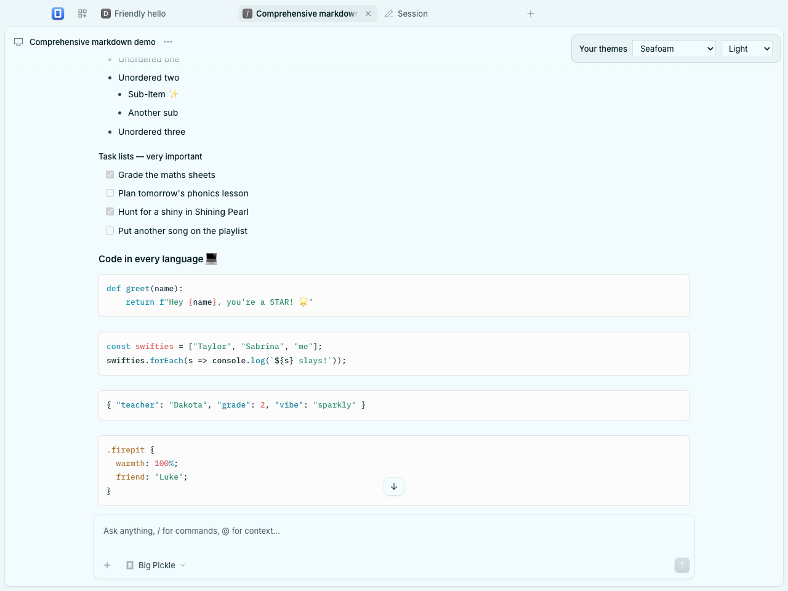 | 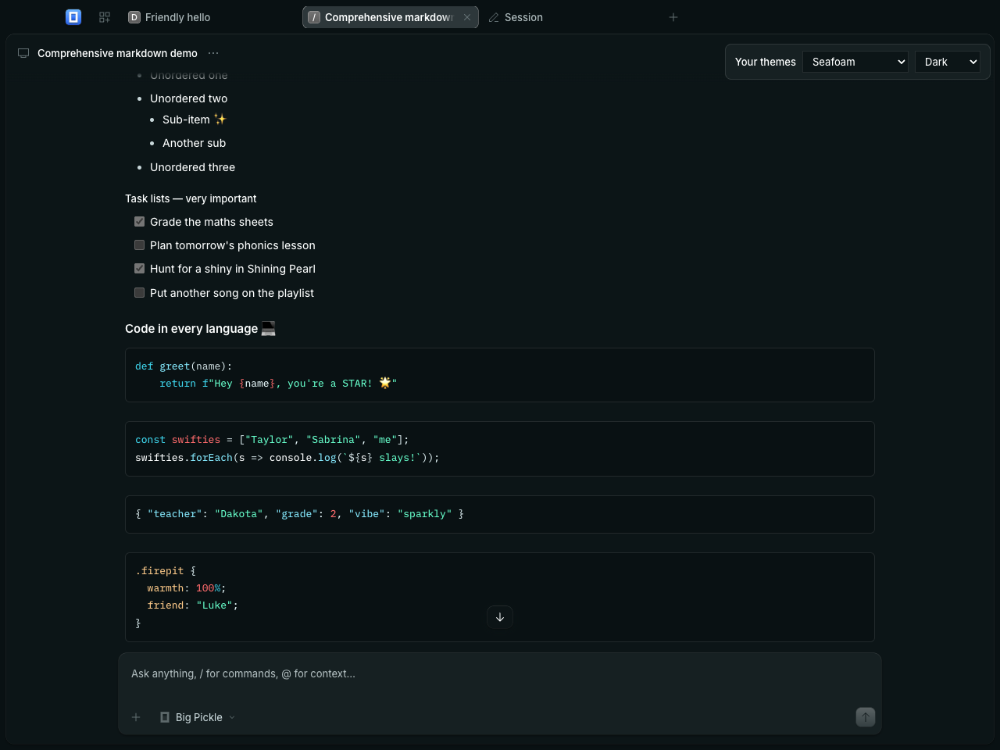 |
| Sunshine Citron | 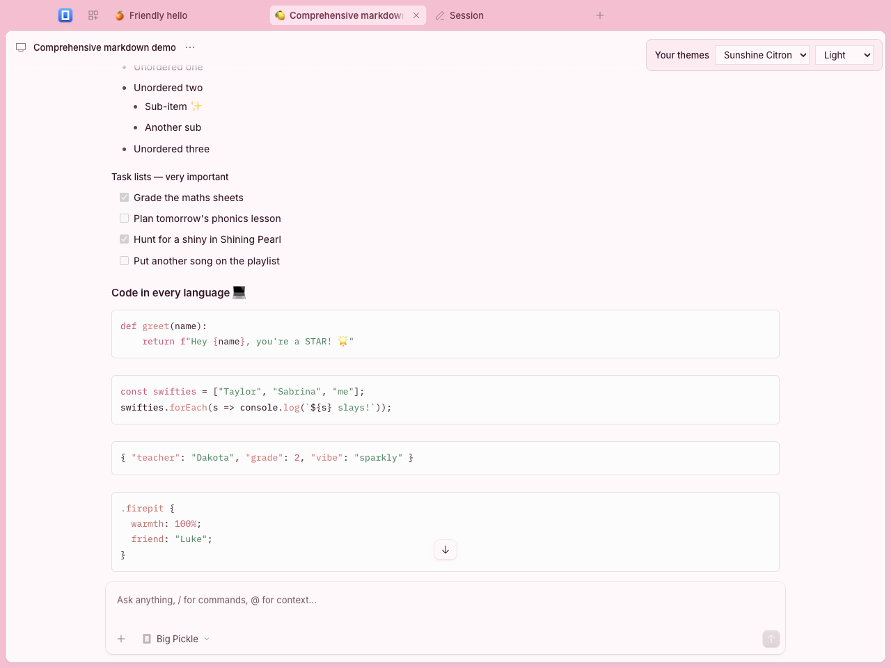 | 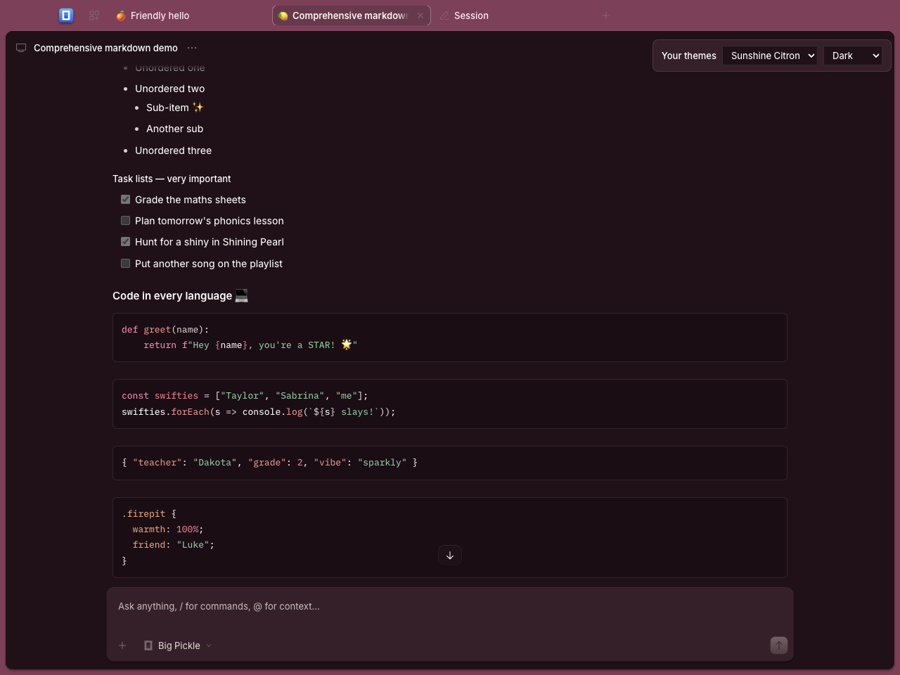 |
| Mermaid | 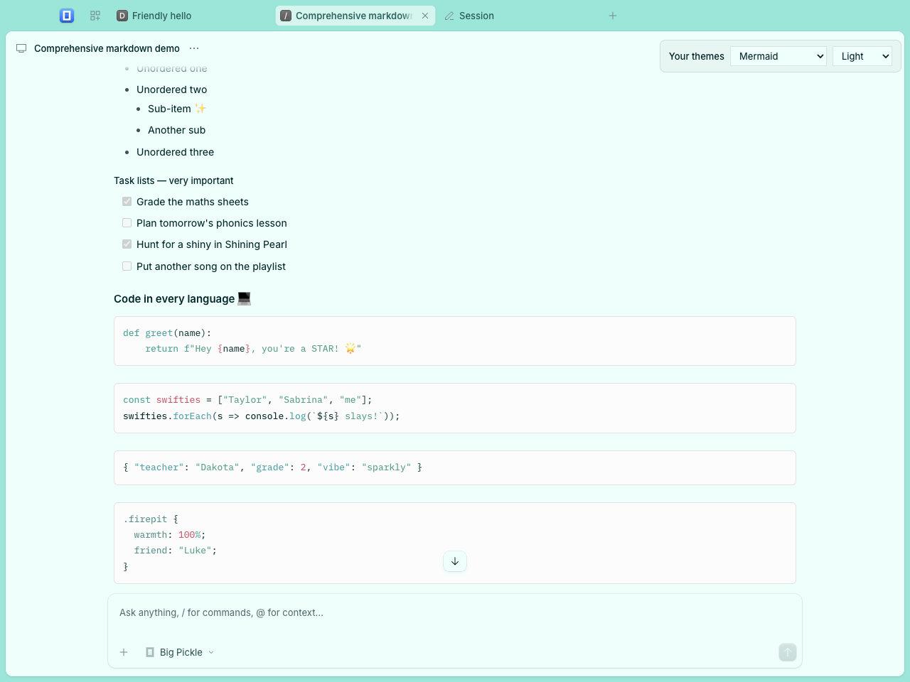 | 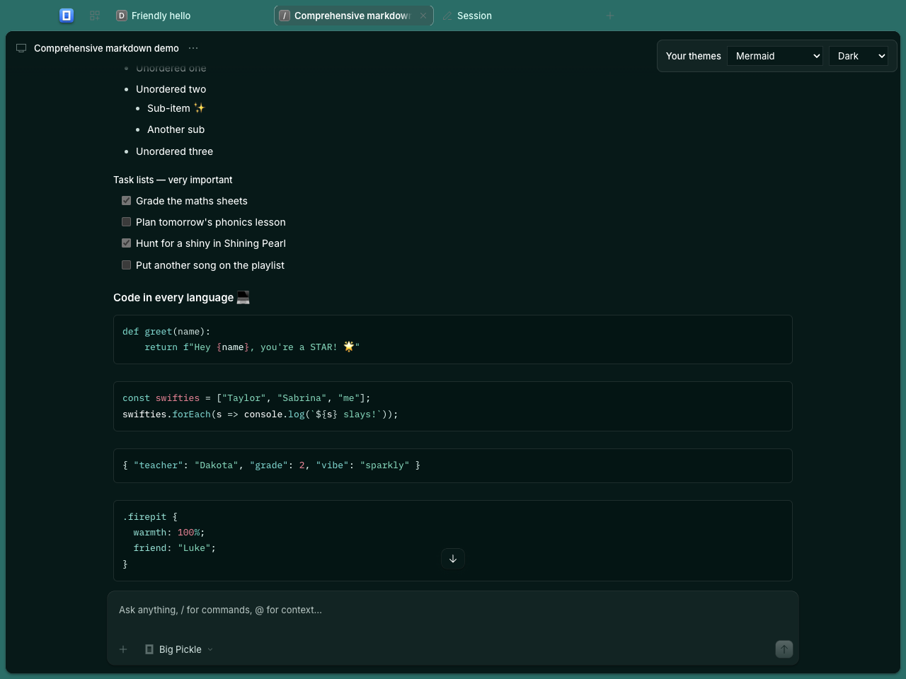 |
