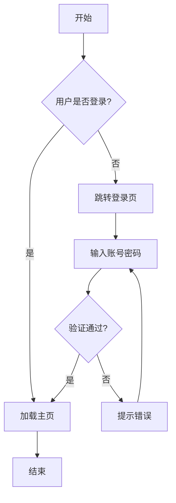
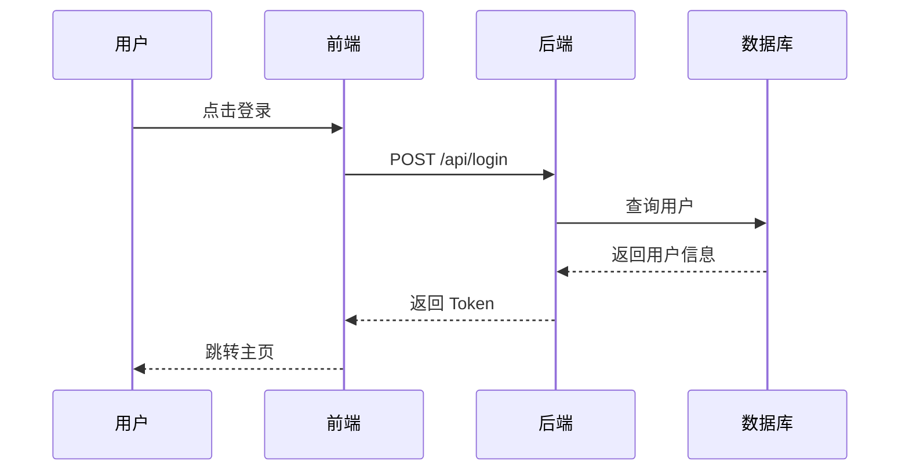
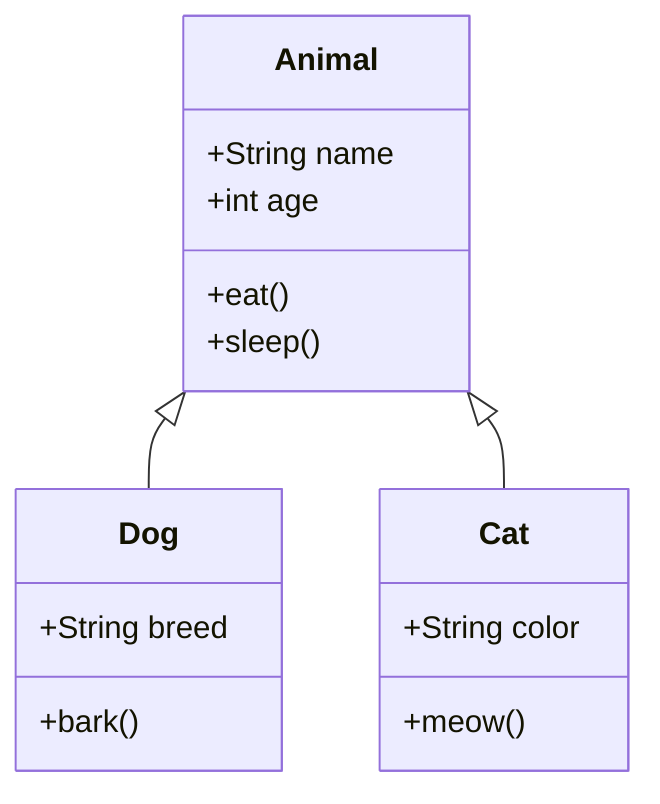
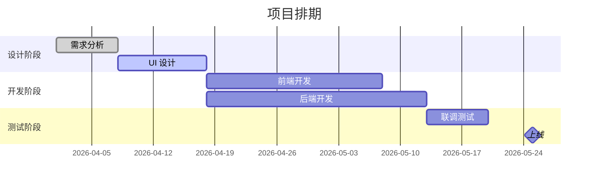
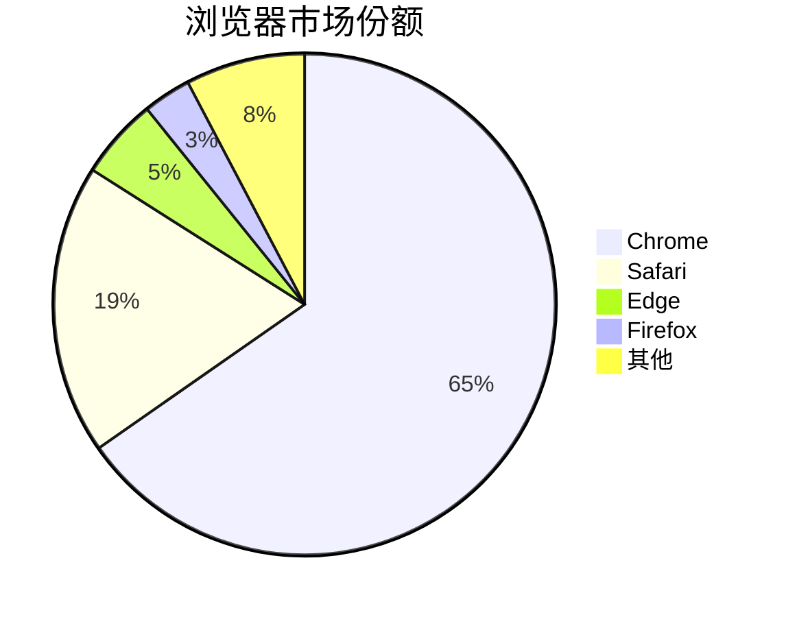
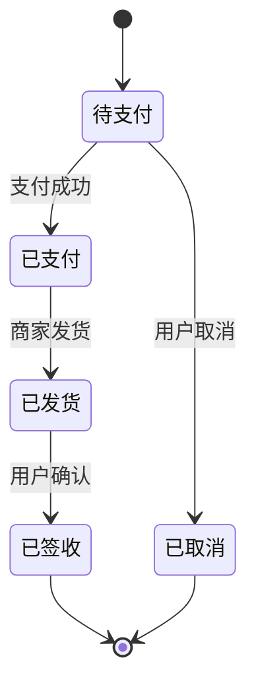

# Markdown 综合测试文档

> 这是一份用于测试各种 Markdown 渲染效果的综合文档，涵盖了 CommonMark、GFM（GitHub Flavored Markdown）以及 Mermaid 等扩展语法。

---

## 目录

- [Markdown 综合测试文档](#markdown-综合测试文档)
  - [目录](#目录)
  - [1. 标题层级](#1-标题层级)
  - [2. 文本样式](#2-文本样式)
  - [3. 列表](#3-列表)
  - [4. 引用](#4-引用)
  - [5. 代码](#5-代码)
  - [6. 表格](#6-表格)
  - [7. 链接与图片](#7-链接与图片)
  - [8. Mermaid 流程图](#8-mermaid-流程图)
  - [9. 数学公式](#9-数学公式)
  - [10. 脚注与定义列表](#10-脚注与定义列表)
  - [11. HTML 与其他扩展](#11-html-与其他扩展)
  - [12. 组合排版示例（实战风格）](#12-组合排版示例实战风格)

---

# 1. 标题层级

# H1 一级标题 The quick brown fox

## H2 二级标题 The quick brown fox

### H3 三级标题 The quick brown fox

#### H4 四级标题 The quick brown fox

##### H5 五级标题 The quick brown fox

###### H6 六级标题 The quick brown fox

---

## 2. 文本样式

这是一段普通文本，演示常见的行内样式：

- **加粗文本（Bold）**
- *斜体文本（Italic）*
- ***粗斜体（Bold + Italic）***
- ~~删除线（Strikethrough）~~
- <u>下划线（HTML 标签）</u>
- `行内代码（Inline code）`
- 上标：E = mc<sup>2</sup>
- 下标：H<sub>2</sub>O
- 高亮：==高亮文本==（部分渲染器支持）
- 键盘按键：<kbd>Ctrl</kbd> + <kbd>C</kbd>

行内混合示例：在 React 中使用 `useState` 来声明 **状态变量**，这是一个 *Hook*，详见[官方文档](https://react.dev)。

---

## 3. 列表

### 3.1 无序列表

- 第一层项目 A
  - 第二层项目 A-1
    - 第三层项目 A-1-a
    - 第三层项目 A-1-b
  - 第二层项目 A-2
- 第一层项目 B
- 第一层项目 C

### 3.2 有序列表

1. 准备食材
2. 清洗食材
   1. 蔬菜冲洗 3 遍
   2. 肉类焯水
3. 烹饪
4. 装盘

### 3.3 任务列表（GFM）

- [x] 撰写需求文档
- [x] 完成原型设计
- [ ] 前端开发
  - [x] 登录页
  - [ ] 控制台
  - [ ] 设置页
- [ ] 后端开发
- [ ] 联调测试

### 3.4 混合嵌套

1. **设计阶段**
   - 调研竞品
   - 用户访谈
2. **开发阶段**
   - [ ] 搭建脚手架
   - [ ] 编写核心模块
3. **上线阶段**

---

## 4. 引用

> 这是一段普通的引用文字。
>
> 引用可以包含多行，也可以嵌套：
>
> > 这是嵌套的二级引用。
> >
> > > 这是嵌套的三级引用。

> **提示**：GFM 还支持告警类引用（GitHub Alerts）：

> [!NOTE]
> 这是一条提示信息。

> [!TIP]
> 这是一条技巧建议。

> [!WARNING]
> 这是一条警告信息。

> [!CAUTION]
> 这是一条危险警示。

---

## 5. 代码

### 5.1 行内代码

请运行 `npm install` 安装依赖，然后执行 `npm run dev` 启动项目。

### 5.2 无语言代码块

```
plain text code block
没有语法高亮
保留原始格式与缩进
```

### 5.3 JavaScript 示例

```javascript
// 计算斐波那契数列
function fibonacci(n) {
  if (n <= 1) return n;
  let [a, b] = [0, 1];
  for (let i = 2; i <= n; i++) {
    [a, b] = [b, a + b];
  }
  return b;
}

console.log(fibonacci(10)); // 55
```

### 5.4 Python 示例

```python
from dataclasses import dataclass
from typing import List

@dataclass
class User:
    name: str
    age: int
    tags: List[str]

def filter_adults(users: List[User]) -> List[User]:
    return [u for u in users if u.age >= 18]

if __name__ == "__main__":
    users = [User("Alice", 17, ["student"]), User("Bob", 25, ["dev"])]
    print(filter_adults(users))
```

### 5.5 TypeScript + React

```tsx
import { useState, useEffect } from "react";

interface CounterProps {
  initial?: number;
}

export const Counter: React.FC<CounterProps> = ({ initial = 0 }) => {
  const [count, setCount] = useState(initial);

  useEffect(() => {
    document.title = `计数：${count}`;
  }, [count]);

  return (
    <button onClick={() => setCount((c) => c + 1)}>
      点击次数：{count}
    </button>
  );
};
```

### 5.6 SQL 示例

```sql
SELECT u.id, u.name, COUNT(o.id) AS order_count
FROM users u
LEFT JOIN orders o ON o.user_id = u.id
WHERE u.created_at >= '2025-01-01'
GROUP BY u.id, u.name
HAVING COUNT(o.id) > 5
ORDER BY order_count DESC
LIMIT 10;
```

### 5.7 Bash / Shell

```bash
#!/usr/bin/env bash
set -euo pipefail

for file in *.log; do
  echo "处理文件：$file"
  gzip "$file"
done
```

### 5.8 JSON 示例

```json
{
  "name": "markdown-test",
  "version": "1.0.0",
  "scripts": {
    "build": "vite build",
    "dev": "vite"
  },
  "dependencies": {
    "react": "^18.2.0"
  }
}
```

### 5.9 Diff 示例

```diff
  function greet(name) {
-   console.log("Hello " + name);
+   console.log(`Hello, ${name}!`);
  }
```

---

## 6. 表格

### 6.1 基础表格

| 编号 | 姓名 | 年龄 | 职业       |
| ---- | ---- | ---- | ---------- |
| 1    | 张三 | 28   | 前端工程师 |
| 2    | 李四 | 32   | 后端工程师 |
| 3    | 王五 | 25   | 设计师     |

### 6.2 对齐方式

| 左对齐       | 居中对齐      |   右对齐 |
| :----------- | :-----------: | -------: |
| Apple        |    红色       |   ￥3.50 |
| Banana       |    黄色       |   ￥1.20 |
| Watermelon   |    绿色       |  ￥18.80 |

### 6.3 包含格式的复杂表格

| 功能模块 | 状态 | 负责人 | 备注 |
| --- | --- | --- | --- |
| 用户登录 | ✅ 已完成 | **张三** | 支持 `OAuth2` 登录 |
| 商品列表 | 🚧 进行中 | *李四* | 预计 2026-05-15 完成 |
| 订单管理 | ❌ 未开始 | ~~王五~~ → 赵六 | 依赖[支付模块](#) |
| 数据报表 | ⚠️ 阻塞 | 钱七 | 等待 BI 提供口径 |

---

## 7. 链接与图片

### 7.1 链接

- 行内链接：[Anthropic 官网](https://www.anthropic.com)
- 带标题链接：[Claude](https://claude.ai "AI 助手")
- 自动链接：<https://github.com>
- 邮件链接：<hello@example.com>
- 引用式链接：参见 [GitHub][gh-link] 文档。

[gh-link]: https://github.com "GitHub Homepage"

### 7.2 图片

普通图片：


带链接的图片（点击图片跳转）：

[](https://example.com)

并排图片（HTML 实现）：

<p align="center">
  
  
  
</p>

---

## 8. Mermaid 流程图

### 8.1 流程图（Flowchart）



### 8.2 时序图（Sequence Diagram）



### 8.3 类图（Class Diagram）



### 8.4 甘特图（Gantt Chart）



### 8.5 饼图（Pie Chart）



### 8.6 状态图（State Diagram）



---

## 9. 数学公式

行内公式：当 $a \ne 0$ 时，方程 $ax^2 + bx + c = 0$ 有两个解。

块级公式：

$$
x = \frac{-b \pm \sqrt{b^2 - 4ac}}{2a}
$$

矩阵：

$$
A = \begin{bmatrix}
1 & 2 & 3 \\
4 & 5 & 6 \\
7 & 8 & 9
\end{bmatrix}
$$

求和与积分：

$$
\sum_{i=1}^{n} i = \frac{n(n+1)}{2} \quad,\quad \int_0^{\infty} e^{-x^2} dx = \frac{\sqrt{\pi}}{2}
$$

---

## 10. 脚注与定义列表

### 10.1 脚注

这是一段带有脚注的文字[^1]，再来一个脚注[^note]。

[^1]: 这是第一个脚注的内容。
[^note]: 这是带命名标识的脚注，可以包含 **格式化** 内容。

### 10.2 定义列表

Markdown
:   一种轻量级的标记语言，由 John Gruber 在 2004 年创建。

Mermaid
:   一种基于 JavaScript 的图表绘制工具，使用类似 Markdown 的语法。

GFM
:   GitHub Flavored Markdown，GitHub 在 CommonMark 基础上扩展的方言。

---

## 11. HTML 与其他扩展

### 11.1 折叠块（details）

<details>
<summary>点击展开 / 折叠详细信息</summary>

这里是隐藏的内容，可以包含任意 Markdown 元素：

- 列表项 1
- 列表项 2

```js
console.log("折叠块里的代码");
```

</details>

### 11.2 水平分割线（多种写法）

---

***

___

### 11.3 转义字符

\*这不是斜体\*，\`这不是行内代码\`，\#这不是标题。

### 11.4 表情符号（GFM Emoji）

:rocket: :tada: :sparkles: :white_check_mark: :warning: :bug: :book: :art:

### 11.5 颜色徽章（HTML）

<span style="background:#4CAF50;color:#fff;padding:2px 8px;border-radius:4px;">成功</span>
<span style="background:#FF9800;color:#fff;padding:2px 8px;border-radius:4px;">警告</span>
<span style="background:#F44336;color:#fff;padding:2px 8px;border-radius:4px;">失败</span>

### 11.6 居中文字（HTML）

<div align="center">

**这段文字居中显示**

*副标题：用于排版需要*

</div>

---

## 12. 组合排版示例（实战风格）

> 以下是一些在真实笔记中常见的"复合写法"——把多种 Markdown 元素套在一起使用，测试渲染器在嵌套场景下的表现。

### 12.1 长引用块 + 加粗 + 箭头列表 + 多段落

> 适用：复杂主题的"导读"或"前言"段落
> 核心思路：每一项决策都不是凭空产生的，而是**针对一个具体问题**——理解"为什么要这么做"，就不用死记硬背了
>
> **为什么是"问题导向"？**
>
> 面对的不是一张白纸，而是一个**情况复杂、内部差异巨大的现实环境**。如果只解决表面，不处理深层矛盾，就会出现：
>
> - 信息无法传达 → 上下脱节 → 组织名存实亡
> - 资源无法流通 → 各自为政 → 协作没有意义
> - 旧势力伺机而动 → 局势反复 → 努力白费
> - 思想混乱对立 → 人心不服 → 缺乏合法性
> - 这里可以继续补充更多分析
> - 这里可以继续补充更多分析
>
> **所以，每一项措施，本质上都是在解决暴露出来的具体矛盾。** 这就是"问题导向"的记忆法：不背"做了什么"，而是理解"为什么必须做"。


---

### 12.2 代码块写"问题清单"（中文 + 编号 + 箭头）

```
问题清单（决策者的烦恼）：

1. 旧势力盘根错节，随时反扑 → 谁来管理基层？
2. 各部门用语不统一，公文看不懂 → 政令怎么传达？
3. 各地结算口径不同，对账困难 → 资源怎么流通？
4. 度量与计费标准不统一 → 成本怎么核算？
5. **基础设施规格各异 → 物资怎么调度？**
6. _外部环境持续施压 → 边界怎么守？_
7. 这里
8. 这里
9. 思想混乱，议论纷纷 → 共识怎么建立？
```

> ⚠️ 注意：代码块内部的 `**加粗**` 和 `_斜体_` 不会被渲染，会原样显示——这是测试渲染器边界的重要场景。

---

### 12.3 标题 → 表格（单元格含粗斜体混排）

#### 12.3.1 措施一：建立统一标准

| 维度 | 内容 |
| --- | --- |
| **之前的问题** | **现状是各方自成体系**，_中央难以统一调度_，需要一个超越以往的协调机制 |
| **怎么做的** | 建立顶层制度，集中权力于核心节点。该节点统揽 *规划、执行、监督* 全流程 |
| **为什么管用** | "顶层设计"前所未有，既表明权威性，也确立了体系的核心——一切流程归核心节点 |

#### 12.3.2 措施二：分层授权与制衡

| 维度 | 内容 |
| --- | --- |
| **之前的问题** | 一个人管不了这么大规模，需要帮手。但又不能让帮手权力过大（不然就成了新的山头） |
| **怎么做的** | 设 **执行岗**（管落地）、**监督岗**（管纠偏）、**审计岗**（管复核），三者互相牵制，都对核心节点负责 |
| **为什么管用** | 三方分权，谁也无法独大，最终拍板的永远是核心节点。这就是"分层制衡"的精髓 |

> **辨析提醒：** 上面两个措施常被混淆。`措施一`解决的是 *"谁说了算"*，`措施二`解决的是 *"怎么落地不出事"*——前者是 **权威建立**，后者是 **风险控制**。

---

### 12.4 引用块内嵌套表格 + 列表

> **📜 史料对比小贴士：**
>
> 同一份证据可以从多个角度解读，不要被单一视角绑架：
>
> | 证据类型 | 优势 | 局限 |
> | --- | --- | --- |
> | 实物史料 | 直接、可信度高 | 信息量有限，需要解读 |
> | 文献史料 | 信息丰富、有上下文 | 可能带有立场偏见 |
> | 口述史料 | 鲜活、有细节 | 易受记忆与立场影响 |
>
> 综合判断时建议：
>
> 1. 先看实物
> 2. 再对照文献
> 3. 最后用口述史料补充细节
>
> 三者**交叉验证**才是稳妥的做法。

---

### 12.5 任务列表（含未填写的占位项）

笔记中常见"先列框架、内容待补"的写法：

- [x] 框架已搭建
- [x] 第一节已完成
- [ ] 第二节
  - [x] 小节 A
  - [ ] 小节 B
  - [ ] 小节 C
- [ ] 第三节
- [ ] 这里
- [ ] 这里

> 提示：标准 GFM 任务列表写法是 `- [ ] 项目`（中括号内**有一个空格**）。如果写成 `- [] 项目`（中括号为空），多数渲染器**不会**识别为任务列表，而是显示为普通文本——这是常见错误。

---

### 12.6 大型总览表（多列 + 分类 + 一句话记忆）

| 要解决的问题 | 对应措施 | 类别 | 一句话记忆 |
| --- | --- | --- | --- |
| 谁是最高决策者？ | 顶层制度 | 治理 | 权力归一 |
| 中央怎么运转？ | 三岗分立 | 治理 | 分工 + 制衡 |
| 基层谁来管？ | 派驻制 | 治理 | 派人不分地 |
| 沟通看不懂？ | 统一术语 | 文化 | 统一"语言" |
| 资源对不上？ | 统一计量 | 经济 | 统一"尺子" |
| 调度走不动？ | 统一规格 | 经济 | 统一"轨道" |
| 思想太杂乱？ | 统一共识 | 思想 | 凝聚人心 |
| 外部有威胁？ | 攻防体系 | 安全 | 攻守结合 |

---

### 12.7 速记口诀（代码块 + 中文韵脚）

```
顶层立，三岗分，基层派驻不世袭。
术语统，规格齐，计量标准全国一。
共识凝，外防固，内外兼修方稳定。
措施好，执行难，过急过苛终生乱。
```

---

### 12.8 标题 + 表格 + 引用 + 表格 的连续编排

#### 高频考点辨析

##### 辨析一：哪些是"良策"？哪些是"过度"？

| 良策（具有进步性） | 过度（造成代价） |
| --- | --- |
| 统一术语、统一计量、统一规格 | 用极端手段压制不同声音 |
| 建立分层治理、制衡机制 | 短期内动用过多人力造成民怨 |

> ✅ **关键区分：** 措施本身的进步性 ≠ 执行过程中的合理性。考试/复盘时要分别评价。

##### 辨析二：容易混淆的"证据"

| 证据 | 对应措施 | 常见干扰项 |
| --- | --- | --- |
| 标准化器具（实物） | 统一计量 | 别选成"统一货币" |
| 官方文书（文字载体） | 统一术语 | 别选成"立法统一" |
| 出土法律文书 | 派驻制下的统一执法 | 别选成"统一术语" |

> 💡 看到证据时，**先看物理特征再看内容**——载体（小篆/竹简）说明一类问题，内容（法律/颂词）说明另一类问题。

---

> 文档结束 — 如果上述所有元素都能正常渲染，说明你的 Markdown 渲染器支持完整。:tada: