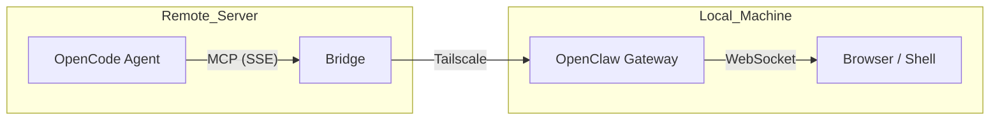

## Overview

Remote development on powerful servers (e.g., GPU clusters, resourceful cloud instances) often presents a challenge: the AI agent is "blind" to your local environment. It cannot see your local browser or access your local machine's utilities.

By using **OpenClaw** with the **openclaw-bridge-remote**, you can give your remote OpenCode agent "eyes and hands" on your local machine.

## Prerequisites

- **OpenCode** running on a remote server.
- **OpenClaw** installed on your local machine (MacBook, etc.).
- **Tailscale** or a similar VPN for secure connectivity between remote and local.

## Setup Guide

### 1. Install the Bridge on your Local Machine

On your local machine, run the one-liner installer:

```bash
curl -fsSL https://raw.githubusercontent.com/lucas-jo/openclaw-bridge-remote/main/install.sh | bash
```

This script will:
- Clone the bridge repository.
- Install dependencies.
- Configure your OpenClaw token.
- Generate a random `BRIDGE_API_KEY` for security.
- Optionally start the bridge in a background `tmux` session.

### 2. Configure OpenCode on the Remote Server

On your remote server, add the bridge to your `opencode.json` configuration (usually located at `~/.config/opencode/opencode.json`):

```json
{
  "mcpServers": {
    "openclaw-remote": {
      "type": "remote",
      "url": "http://<YOUR_LOCAL_IP>:3100/sse?apiKey=<YOUR_BRIDGE_API_KEY>"
    }
  }
}
```

<Tip>
Use `tailscale ip -4` on your local machine to get your secure internal IP.
</Tip>

## Capabilities

Once connected, your remote OpenCode agent can perform tasks on your local machine:

- **Browser Automation**: Navigate tabs, take screenshots, and scrape accessibility trees on your local browser.
- **Shell Execution**: Run local commands like `open`, `pbcopy`, or `say` directly from the remote session.
- **Hardware Access**: Control local hardware through OpenClaw nodes.

## Architecture



This hybrid approach allows you to develop with the full power of a remote server while maintaining the interactive loop of local development.
