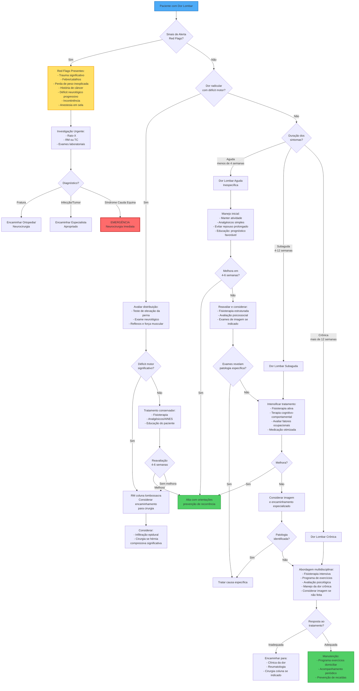

# Fluxograma de Diagnóstico de Dor Lombar

## Fluxograma Clínico para Avaliação de Dor Lombar

## Legenda

### Cores
- **Azul**: Ponto de entrada (Paciente)
- **Amarelo**: Sinais de alerta (Red Flags)
- **Vermelho**: Emergência médica
- **Verde**: Alta/Resultado positivo

### Principais Considerações

#### Red Flags (Sinais de Alerta)
Indicam possível patologia séria que requer investigação urgente:
- Trauma significativo (queda, acidente)
- Sintomas constitucionais (febre, calafrios, perda de peso)
- História de câncer
- Uso prolongado de corticosteroides
- Idade > 50 anos (primeira apresentação) ou < 20 anos
- Dor que piora ao deitar ou dor noturna intensa
- Déficit neurológico progressivo ou extenso
- Incontinência urinária ou fecal de início recente
- Anestesia em sela
- Deformidade estrutural

#### Síndrome Cauda Equina (Emergência)
Requer encaminhamento neurocirúrgico imediato:
- Retenção urinária aguda
- Incontinência fecal
- Anestesia em sela bilateral
- Déficit motor bilateral em membros inferiores

#### Classificação Temporal
- **Aguda**: < 4 semanas
- **Subaguda**: 4-12 semanas
- **Crônica**: > 12 semanas

#### Princípios de Tratamento
1. **Dor aguda**: Manter atividade, evitar repouso prolongado
2. **Dor subaguda**: Intensificar fisioterapia e abordar fatores psicossociais
3. **Dor crônica**: Abordagem multidisciplinar com foco em funcionalidade

#### Exames de Imagem
- **Não** indicados rotineiramente na dor lombar inespecífica aguda
- Considerar quando:
  - Red flags presentes
  - Déficit neurológico
  - Falta de melhora após 4-6 semanas de tratamento conservador
  - Antes de considerar intervenção invasiva

## Referências

Este fluxograma é baseado em diretrizes clínicas internacionais para manejo de dor lombar, incluindo recomendações de:
- American College of Physicians (ACP)
- National Institute for Health and Care Excellence (NICE)
- North American Spine Society (NASS)
