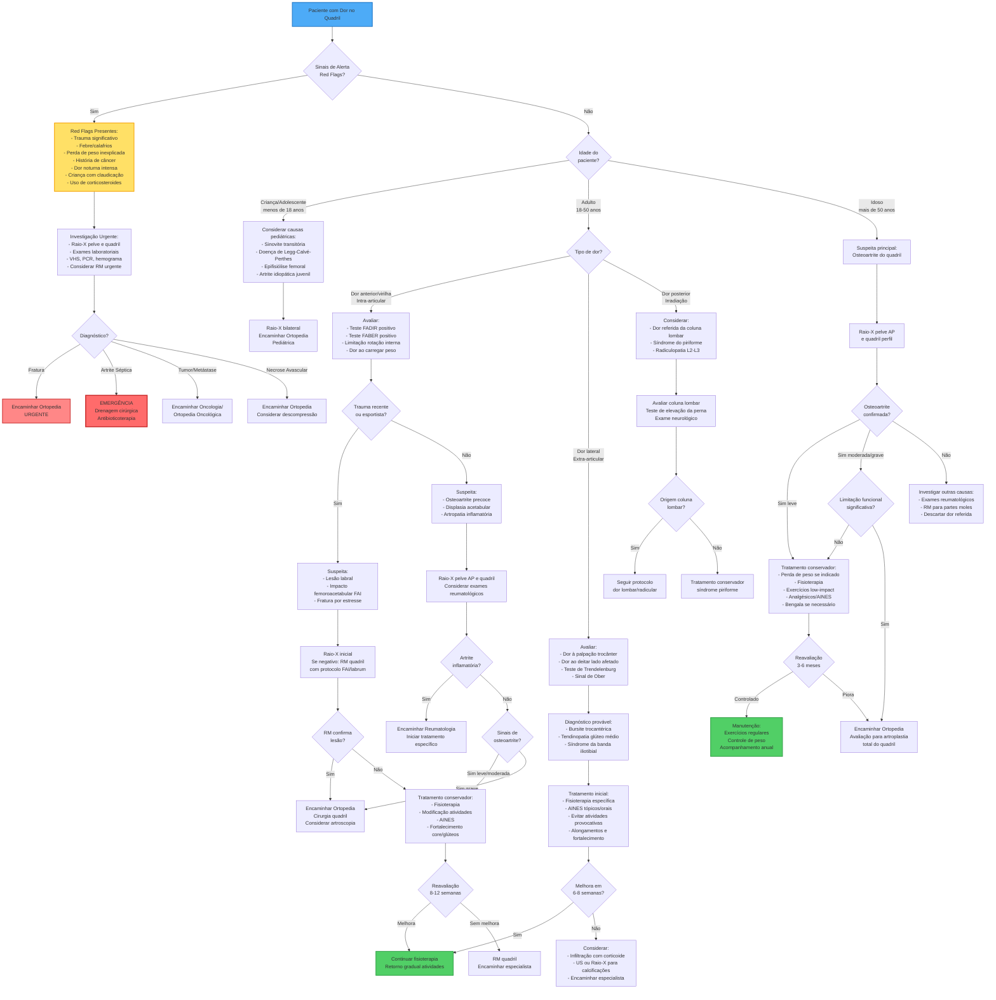

# Fluxograma de Diagnóstico de Dor no Quadril

## Fluxograma Clínico para Avaliação de Dor no Quadril

## Legenda

### Cores
- **Azul**: Ponto de entrada (Paciente)
- **Amarelo**: Sinais de alerta (Red Flags)
- **Vermelho escuro**: Emergência médica
- **Vermelho claro**: Urgência (fraturas)
- **Verde**: Alta/Controle adequado

### Principais Considerações

#### Red Flags (Sinais de Alerta)
Indicam possível patologia séria que requer investigação urgente:
- Trauma significativo (queda, acidente automobilístico)
- Sintomas constitucionais (febre, calafrios, perda de peso)
- História de câncer ou uso de corticosteroides
- Dor noturna intensa que acorda o paciente
- Criança/adolescente com claudicação e recusa de apoio
- Idade > 50 anos com início súbito sem trauma
- Fatores de risco para necrose avascular:
  - Uso de corticosteroides, álcool
  - Anemia falciforme
  - Trauma prévio, luxação
  - Quimioterapia, radioterapia

#### Artrite Séptica do Quadril (Emergência)
Requer drenagem cirúrgica urgente:
- Febre alta com dor intensa no quadril
- Incapacidade total de apoio
- Leucocitose significativa
- VHS e PCR muito elevados
- Mais comum em imunossuprimidos, diabéticos, usuários de drogas IV

#### Classificação por Localização da Dor

**Dor Anterior/Virilha (Intra-articular)**:
- Osteoartrite do quadril
- Impacto femoroacetabular (FAI)
- Lesão do labrum acetabular
- Artrite inflamatória
- Necrose avascular

**Dor Lateral (Extra-articular)**:
- Bursite trocantérica (bursite do grande trocânter)
- Tendinopatia do glúteo médio/mínimo
- Síndrome da banda iliotibial
- Fratura por estresse do colo femoral

**Dor Posterior**:
- Dor referida da coluna lombar (L2-L3)
- Síndrome do piriforme
- Sacroileíte
- Patologia da articulação sacroilíaca

#### Exames Físicos Específicos

**Testes para Patologia Intra-articular**:
- **FADIR** (Flexão, ADução, Rotação Interna): positivo em impacto femoroacetabular anterior
- **FABER** (Flexão, ABdução, Rotação Externa): positivo em patologia intra-articular
- **Teste de rotação interna**: limitação sugere osteoartrite
- **Teste de Scour**: dor com compressão e rotação do quadril

**Testes para Patologia Extra-articular**:
- **Teste de Trendelenburg**: fraqueza do glúteo médio
- **Teste de Ober**: contratura da banda iliotibial
- **Palpação do trocânter maior**: bursite trocantérica
- **Teste de elevação da perna estendida**: dor referida da lombar

#### Causas Pediátricas por Faixa Etária

**0-4 anos**:
- Sinovite transitória (mais comum)
- Artrite séptica
- Displasia do desenvolvimento do quadril (DDQ)

**4-10 anos**:
- Doença de Legg-Calvé-Perthes (necrose avascular da cabeça femoral)
- Sinovite transitória

**10-16 anos**:
- Epifisiólise femoral proximal (SCFE)
- Artrite idiopática juvenil

#### Exames de Imagem

**Raio-X**:
- **Sempre** iniciar com raio-X pelve AP e quadril afetado (AP e perfil)
- Pode mostrar: osteoartrite, fraturas, displasia, FAI morfológico
- Comparação bilateral útil em crianças

**Ressonância Magnética (RM)**:
- Indicada quando:
  - Raio-X normal com suspeita clínica alta
  - Suspeita de lesão labral ou FAI
  - Avaliação de partes moles (tendões, bursas)
  - Necrose avascular inicial
  - Tumor ou infecção
- Protocolo específico para FAI/labrum quando indicado

**Ultrassonografia**:
- Útil para:
  - Avaliar derrame articular
  - Guiar aspiração/infiltração
  - Avaliar tendões e bursas (bursite trocantérica)

**Tomografia Computadorizada (TC)**:
- Menos usada rotineiramente
- Útil para planejamento cirúrgico em displasia e FAI

#### Princípios de Tratamento Conservador

**Medidas Gerais**:
1. Modificação de atividades (evitar atividades dolorosas)
2. Controle de peso corporal
3. Uso de bengala no lado contralateral se necessário
4. Calçados adequados com amortecimento

**Medicações**:
- Paracetamol (primeira linha em idosos)
- AINES (uso limitado, cuidado em idosos e com comorbidades)
- Analgésicos tópicos (AINES tópicos para dor extra-articular)
- Evitar opióides para dor crônica

**Fisioterapia**:
- **Bursite trocantérica**: fortalecimento glúteo médio, alongamentos
- **Osteoartrite**: exercícios de amplitude, fortalecimento, aeróbicos de baixo impacto
- **FAI/lesão labral**: fortalecimento core, correção biomecânica
- Exercícios aquáticos (hidroterapia) muito benéficos

**Infiltrações**:
- Bursite trocantérica: corticoide + anestésico local (guiada por US)
- Intra-articular: pode ser diagnóstica e terapêutica
- Evidência limitada para benefício a longo prazo

#### Indicações Cirúrgicas

**Artroscopia do Quadril**:
- Lesão labral sintomática
- Impacto femoroacetabular (FAI) com falha conservador
- Corpos livres intra-articulares
- Sinovite persistente

**Artroplastia Total do Quadril**:
- Osteoartrite grave com:
  - Dor refratária a tratamento conservador
  - Limitação funcional significativa
  - Impacto na qualidade de vida
- Necrose avascular avançada
- Artrite reumatóide grave

**Osteotomia**:
- Displasia acetabular em pacientes jovens
- Preservação articular antes de artrose grave

## Referências

Este fluxograma é baseado em diretrizes clínicas internacionais e consensos para diagnóstico e manejo de dor no quadril, incluindo recomendações de:
- American Academy of Orthopaedic Surgeons (AAOS)
- British Society for Rheumatology
- International Society for Hip Arthroscopy (ISHA)
- National Institute for Health and Care Excellence (NICE)
- Consenso Brasileiro de Quadril (Sociedade Brasileira de Ortopedia e Traumatologia)
