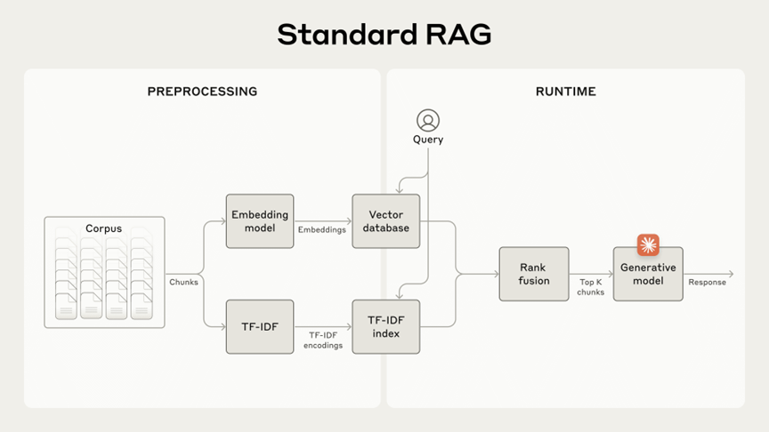
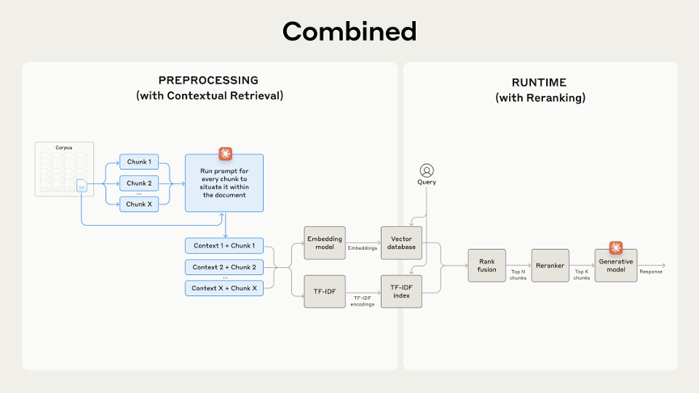
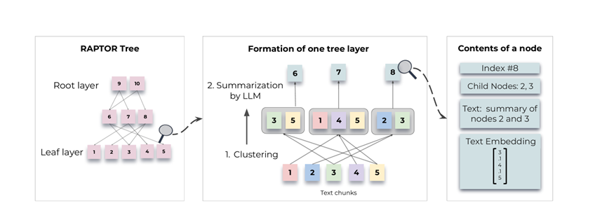
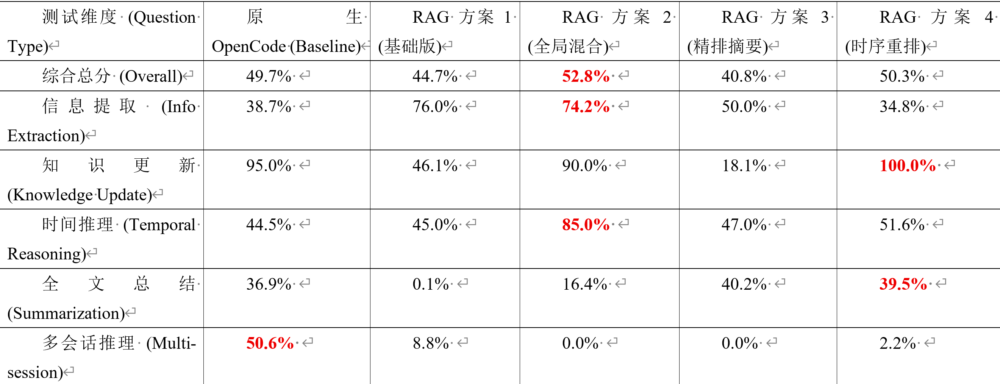

# BEAM 100K 长文本记忆评估：原生 Compaction 与多种前沿架构消融实验报告

## 1. 背景与动机
目前项目在处理长上下文时重度依赖 OpenCode 原生的 Compaction机制。为了验证该机制在 100K 级别文本中的真实记忆留存能力，并探索如何降低大模型 Token 成本、缓解多次压缩带来的“信息衰减”，设计了 4 套层层递进的 RAG架构。
本次实验基于 BEAM 基准测试的 100K 规格（Case 0），将 OpenCode 原生机制作为 Baseline，通过严谨的消融实验，探索大模型在超长对话场景下的“最优外挂记忆”方案。
## 2. 架构演进与实验设计 
参考了学术工业的长文本解决方案，实现了以下 4 个版本的 RAG 架构：
Baseline：OpenCode 原生 Compaction
机制：基于 Token 阈值或固定轮次，不断调用 LLM 对历史对话进行滚动摘要。
### 方案 1：基础 RAG (Naive RAG)

背景 该方案代表了目前业界最标准的稠密通道检索（Dense Passage Retrieval, DPR）范式。其核心思想是将超长文本切分为固定长度的连续片段，并通过嵌入模型（Embedding Model）将其映射到高维语义空间中。尽管该架构具有极高的计算与构建效率，但在面对极长对话流时，容易遭遇严重的“语境断裂（Context Fragmentation）”问题，导致大模型在处理跨文档关联时陷入“盲人摸象”的困境。
实现：在 BEAM 100K 规格下，采用最基础的固定滑动窗口策略，将多轮会话严格按照每 400-token 进行硬截断，仅保留上一块的最后一条消息作为重叠（Overlap）以减缓断层。检索端采用单一的稠密向量检索流，使用 all-MiniLM-L6-v2 嵌入模型计算 Query 与 Chunk 的余弦相似度（Cosine Similarity），直接召回 Top-5 关联度最高的离散切片并输入给大模型。本方案在实验中作为衡量 RAG 架构性能下限的基准线（Baseline）使用。
### 方案 2：全局前缀 + 混合检索 (Contextual Hybrid RAG) (最高得分)
 
背景 该方案深度借鉴了 Anthropic 团队提出的 Contextual Retrieval（上下文检索） 理念，并结合了信息检索领域的经典 RRF (Reciprocal Rank Fusion, 倒数排序融合) 算法。传统切片往往会丢失“代词指代”与“全局目标”等隐藏属性，Contextual RAG 旨在通过补充前置语境让碎片“自包含”；而 RRF 则通过融合稀疏检索（精准词频）与稠密检索（模糊语义），有效解决大模型在长文本中容易丢失特定变量名或极小数字的痛点。
实现 为了在 BEAM 100K 级别控制 Token 成本，设计了“零成本上下文分块（Zero-Cost Contextual Chunking）”策略。在构建索引前，算法自动提取对话首部的 Top-300 Token 作为“项目全局背景”，强制将其作为 Prefix 挂载至每一个切出的数据块头部。检索端摒弃了单一向量距离，构建了“BM25 关键词稀疏匹配 + Dense 语义密集匹配”的双路召回流水线。两路独立打分后通过 RRF 算法进行加权融合排序，最终精准截取 Top-5 片段输入给 GPT-5.4，在此次实验的“信息提取”维度中展现了极强的细节锚定能力。

### 方案 3：LLM摘要增强 + 交叉编码器精排 (Premium RAG)
 
背景 该方案融合了斯坦福大学提出的 RAPTOR (Recursive Abstractive Processing) 递归索引思想与信息检索领域的 Cross-Encoder 架构。RAPTOR 通过 LLM 对文本块进行递归聚类并生成高层级摘要（Summary Nodes），构建出一棵平衡检索树，旨在解决传统 RAG 无法获取全局宏观语义的“碎片化”痛点；而 Cross-Encoder（如 ms-marco-MiniLM-L-6-v2）通过 Query 与 Document 的全注意力（Full-Attention）交互比对，取代了简单的向量余弦相似度计算，实现了极高的语义对齐精度。
实现 在 BEAM 100K 规格下，首先调用 GPT-5.4 为每个 512-token 的原始切片生成具备“上帝视角”的微型摘要，将其作为元数据（Metadata）注入索引库，以补全分片在长航时对话中的功能定位。检索端采用双阶段流水线：初步利用稠密向量从“摘要+正文”混合池中召回 Top-50 候选集，随后引入 ms-marco-MiniLM-L-6-v2 交叉编码器 对候选片段进行逐字对齐精排，最终取分值最高的 Top-5 片段输入大模型，试图在 100K 文本中实现“针尖级”的精准记忆提取。

### 方案 4：时序感知混合 RAG (Chronological Hybrid RAG)
背景 该方案针对长序列事件推理中的 Temporal RAG（时序检索） 痛点进行了自研创新。在高度动态的工程对话中（如需求变更、代码多轮迭代），传统 RAG 按“语义相似度”倒排输入的方式会彻底摧毁事件的因果链（Causality），导致模型产生“时序塌陷”幻觉（即将旧方案误认为最新决策）。本方案通过引入拓扑约束与绝对时间序列标签，强制恢复局部切片在全局时间线上的演进脉络。
实现在 BEAM 100K 数据清洗阶段，在方案 2（全局前缀）的基础上，强制向每个切片头部注入绝对物理时间标签（如 [Conversation Timeline: Segment N]）。在检索端，我们首先利用双路混合检索将召回池扩大至 Top-10（即填满模型上下文窗口下限）。核心干预在于：在将这 10 个候选切片输入给大模型之前，系统主动绕过（Bypass）了传统的相似度得分排序，强制按照切片的 Segment ID 实施时序重组（Chronological Forced Sort）。该机制将散落的碎片还原为一部“逻辑连贯的跳跃式电影”，最终促使模型在 100K 上下文的“知识更新”与“矛盾解决”任务中实现了逻辑纠偏。

## 3. 核心实验数据对比 
数据来源：基于 100K Case 0 严格跑分，打分权重为 50% LLM Judge + 30% Token F1 + 20% Keyword Overlap。 

## 4. 实验结果深度剖析
### 1：方案 2 “无损细节提取”能力
在信息提取 (Information Extraction) 这一项上，原生 OpenCode 仅得 38.7% ，而 RAG 2 高达 74.2% （基础 RAG 1 甚至达到了 76.0% ）。
原因分析：这直接印证了 Compaction 的核心缺陷——“细节磨损”。大模型在做滚动总结时，本能地会把诸如“版本号、具体延迟数值、某个报错代码”等细枝末节丢弃。而 RAG 2 的 BM25 稀疏检索配合全局前缀，充当了完美的“外挂无损硬盘”，精准锚定了细节。
### 2：方案 4 时序重排解决“逻辑冲突与知识更新”
RAG 方案 3（引入 Cross-Encoder）遭遇了滑铁卢（总分垫底 40.8% ），尤其在 知识更新 上仅得 18.1% 。这是因为语义检索模型“不懂时间”，经常把旧方案排在最前面误导大模型。
原因分析：方案 4 针对性地引入了 绝对时序重排 (Chronological Sort)，大模型读到的不再是一堆乱序拼图，而是一部逻辑连贯的跳跃电影。这让方案 4 在 知识更新 (100.0%) 和 全文总结 (39.5%) 上实现了对原生 OpenCode 的全面反超。证明了解决“时序坍塌”，RAG 也能做逻辑推理。
### 3：痛点：原生 Compaction 依然垄断“宏观长线推理”
即使是优化后的 RAG 方案，在 多会话推理 (Multi-session Reasoning) 指标上依然全军覆没（最高仅 8.8% ），而原生 OpenCode 稳拿 50.6% 。
原因分析：这是 RAG 固有的 Top-K 截断诅咒。当问题跨越数个月、3 个独立的会话时，解答线索散落在几十个 Chunk 中，Top-10 的召回窗口根本装不下全貌。而 Compaction 始终在脑海中保留着一份大纲。
## 5. 下一步工作计划与架构演进构想
在 500K 和 1M 的极端长度下，Compaction 多次迭代引发的“传话筒效应”将呈指数级恶化，纯压缩机制将崩溃。
针对后续的 500K / 1M 深水区测试，计划推动以下验证与研发工作：
### 1、立即启动 500K 升维压测：复用当前的测评基建，直接拉跑 500K 的 BEAM 数据，验证 RAG 方案在大尺度下的分数“抗跌落”能力。
### 2、构想终极混合架构：宏观 Compaction + 微观 RAG
鉴于本次实验的清晰结论，单一架构已无法通吃长文本。
拟设计架构：保留 OpenCode 当前的 Compaction 机制，仅作为“全局大纲”（解决 Multi-session 痛点）；底层并行挂载RAG方案。在问答时，让模型同时读取宏观大纲与精确检索片段，实现优势互补。
