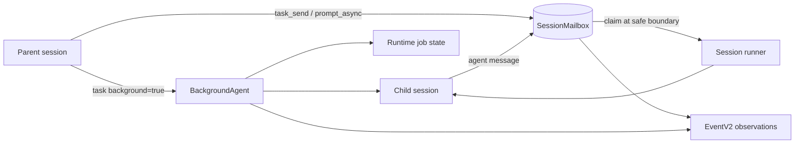

# Background Agents Mailbox Direction

## Goal

Replace the experimental background-subagent path with a mailbox-backed
background-agent subsystem that supports durable async messaging, explicit
cancellation, and later agent-to-agent communication.

This subsystem depends on the EventV2 hardening plan: EventV2 provides live and
replayable observations, while SQL/service state owns mailbox correctness.

## Current State

The current `background=true` task flow is useful as a prototype but should not
be promoted as-is:

```text
task background=true
  -> create or reuse child session
  -> BackgroundJob wraps one ops.prompt(childSession)
  -> completion forks a synthetic prompt back into the parent
```

Problems:

- `BackgroundJob` is an in-memory fiber registry, not a durable supervisor.
- The child task is coupled to one `ops.prompt(childSession)` call.
- Cancellation can mark runtime state without proving the child runner stopped.
- Current async prompt behavior acts like an implicit history queue: prompt text
  is persisted first, then an active run may see it later.
- There is no durable per-message state, acknowledgement, or delivery status.
- Synthetic completion injection can re-enter the parent prompt flow in
  surprising ways and is not the stable design.

## Decision

Retire the experimental path by introducing three first-class concepts:

1. `SessionMailbox` — SQL/service-backed FIFO for async prompt and agent
   messages.
2. `BackgroundAgent` — supervisor for parent/child session relationships.
3. EventV2 mailbox/background events — live observation and future replay/sync
   surface.

Queued mailbox messages are not user messages. They become user messages only
when a runner atomically claims/dequeues them and commits the corresponding
EventV2 transcript event.

## Target Architecture



## SessionMailbox

`SessionMailbox` is the durable FIFO queue for a target session. It is table- or
service-backed; EventV2 is not the queue.

Required behavior:

- preserve FIFO order per target session
- atomically claim one or more queued messages at runner boundaries
- prevent queued messages from leaking into an already-active model request
- support cancellation before claim
- record delivered, failed, and cancelled terminal states
- make repeated claim/dequeue attempts idempotent

Suggested states:

```text
queued -> processing -> delivered
                    \-> failed
queued -> cancelled
```

Suggested fields:

```ts
type SessionMailboxMessage = {
  id: string
  fromSessionID?: string
  toSessionID: string
  rootSessionID?: string
  kind: "user" | "inter_agent" | "control"
  delivery: "async" | "interrupt"
  state: "queued" | "processing" | "delivered" | "failed" | "cancelled"
  text: string
  metadata?: {
    taskID?: string
    jobID?: string
    threadID?: string
    replyTo?: string
    hopCount?: number
    ttl?: number
  }
  time_created: number
  time_processing?: number
  time_completed?: number
}
```

## EventV2 Integration

Mailbox/background events should be encoded for persisted/wire boundaries and
decoded on replay before listeners or projectors observe them. Use numeric
timestamps for emitted and stored event payloads.

Initial mailbox events:

```text
session.mailbox.enqueued
session.mailbox.processing
session.mailbox.delivered
session.mailbox.failed
session.mailbox.cancelled
```

Initial background events:

```text
session.background.started
session.background.cancelled
session.background.completed
session.background.failed
```

Classify mailbox and background lifecycle events as durable persisted events.
High-volume stream/progress updates from child runs should remain live-only
unless a later sync/replay design requires persistence.

Event definitions must be registered in stable order so SDK/OpenAPI generation
and schema snapshots include every published mailbox/background event.

## `prompt_async` Semantics

When a target session is busy, `prompt_async` should enqueue instead of writing a
prompt/user message immediately.

Flow:

1. create a mailbox row with delivery metadata
2. publish `session.mailbox.enqueued`
3. if delivery is `interrupt`, interrupt/cancel the active target run
4. wake or restart the target runner
5. runner claims the mailbox row at a safe boundary
6. runner commits the user-message EventV2 event using canonical `evt_*`
   transcript identity
7. mark the mailbox row delivered or failed

Non-interrupt async sends can wait for the target runner's next safe boundary.
Queued mailbox rows remain invisible to the active model turn until claimed.

## BackgroundAgent

`BackgroundAgent` owns the durable relationship between a parent session and a
background child session.

Responsibilities:

- start or reuse a child session
- start, wake, interrupt, or cancel the child runner
- track active run/job id separately from child session id
- route `task_send` and future agent messages through `SessionMailbox`
- publish background lifecycle events
- authorize parent/child operations
- clean up parent/child links and runtime job state

`BackgroundJob` can remain as a runtime-only primitive under this subsystem, but
it is not the durable source of truth.

Do not keep synthetic parent auto-prompt injection as the stable completion
mechanism. If parent auto-continue is needed later, design it explicitly as a
mailbox or workflow behavior with authorization and loop prevention.

## User-Facing Semantics

### `task_cancel`

Cancels an active background task by task id or child session id.

Expected behavior:

- target must be a running background task related to the caller
- cancellation stops runtime job state and the child session runner
- repeated cancellation is idempotent
- unrelated sessions are denied
- cancellation publishes background and mailbox cancellation events where
  applicable

### `task_send`

Sends a message to a running background agent through the mailbox.

Initial safe mode should be interrupt-send:

```text
task_send({ task_id, message, interrupt: true })
```

Behavior:

1. enqueue a mailbox message with sender metadata
2. interrupt/cancel the target run
3. wake or restart the target runner
4. target runner dequeues the message and processes it

Inter-agent messages should use an envelope similar to Mission Control:

```xml
<inter_agent_message from="ses_sender" message_id="mail_123">
...
</inter_agent_message>
```

Async non-interrupt `task_send` can be enabled after mailbox boundary
consumption is proven.

## Staged Replacement Plan

1. Complete EventV2 Phase 0 hardening: encode persisted/wire payloads, decode
   replay, numeric timestamp contract, and tolerate existing experimental rows.
2. Add `SessionMailbox` SQL/service model and FIFO claim semantics.
3. Add mailbox/background EventV2 definitions, registry imports, and SDK/OpenAPI
   schema snapshots.
4. Make the session runner consume mailbox messages at safe loop boundaries.
5. Change `prompt_async` busy-target behavior to enqueue and wake/interrupt.
6. Add `BackgroundAgent` supervision and migrate `task background=true` to it.
7. Add `task_cancel` and interrupt-only `task_send`.
8. Add async `task_send` once boundary consumption is proven.
9. Add agent-to-agent messaging with authorization and loop prevention.
10. Remove the old background-subagent experiment flag/path and any remaining
    synthetic parent completion injection.

## Projectors And Consumers

Projectors should be enabled one event family at a time after replay,
idempotency, and parity tests pass. Mailbox correctness must not depend solely
on projection while the EventV2 projector path is migrating.

`GlobalBus` remains a temporary compatibility fanout only. Migrate consumers to
direct EventV2 subscriptions and remove the bridge once the last legacy consumer
is gone.

## Validation Checklist

- mailbox FIFO ordering per target session
- atomic claim/dequeue with concurrent runners
- queued messages invisible to active model turns until claimed
- idempotent cancellation, dequeue, delivery, and failure handling
- `prompt_async` busy isolation, interrupt wakeup, idle wakeup, and no duplicate
  user-message events
- canonical `evt_*` user-message identity after dequeue
- `task_cancel` stops child runner and runtime job state
- `task_send` authorization, sender envelope, interrupt flow, and replayable
  mailbox events
- no stable synthetic parent auto-prompt injection
- EventV2 registry ordering and SDK/OpenAPI schema snapshots
- projector replay/idempotency/parity before enabling each mailbox/background
  projector family

## Non-goals

- Do not make the current synthetic parent completion path stable.
- Do not add parent auto-continue as part of the initial mailbox work.
- Do not allow arbitrary sibling messaging before authorization and loop
  prevention are designed.
- Do not make mailbox correctness depend solely on EventV2 projection.

## Open Questions

- Should mailbox messages eventually become fully event-sourced, or remain
  table-first with EventV2 notifications?
- Should `prompt_async` always be mailbox-backed, or only when the target is
  already busy?
- What is the first UI surface for pending mailbox messages: footer, task card,
  session list, or a separate inspector?
