# Architecture Risk Remediation Plan — opencode fork

- **Repo**: `Alter-Igor/opencode` (fork), upstream `anomalyco/opencode`
- **Base**: fork `dev` @ `7325cc317` — **50+ commits behind** `upstream/dev` @ `901c9e732`
- **Source**: architecture review + three-agent revalidation + upstream PR/issue sweep, 2026-07-18
- **Status**: proposal — pending user decision on upstream-vs-fork-only targeting (§10)

---

## 1. Goal & Requirements

**Goal restated**: eliminate or disposition every architecture risk found in the review — the V1/V2 duality, the correctness hazards, the metadata anomalies, and the doc/code mismatches — after re-validating each finding against reality (including upstream's active migration).

**Explicit requirements**

1. Revalidate each finding before fixing (several were already fixed upstream).
2. Fix what is cleanly fixable in the fork as reviewable, upstream-shaped PRs.
3. Do not duplicate or collide with in-flight upstream work.
4. Verify every change with the repo's own gates: `bun typecheck` + `bun test` **from package dirs** (never repo root), conventional commits, branch names ≤3 hyphenated words.

**Implicit requirements**

5. No divergence from upstream that the fork must carry forever (fork-permanent patches are a failure mode).
6. Anything touching the V2 migration surface needs upstream coordination first — it is actively developed (compaction barrier #35371, inbox generalization #36005, remote workspace seam #37437).

**Assumptions**

| # | Assumption | If wrong |
|---|-----------|----------|
| 1 | Fork exists to contribute upstream | Plan still works; PRs become fork-local merges instead (decision §10) |
| 2 | Upstream accepts small hygiene PRs | Trivial to abandon; no sunk cost beyond one branch each |
| 3 | Upstream's V2 migration continues on `dev` | Re-sync before each phase; parity matrix is date-stamped |
| 4 | The execution-guard hazard is real but latent (no first-party client uses V2 today, so V1+V2 concurrency can't currently be triggered by our own clients) | If already exploitable via sdk-next + TUI on the same session, raise severity to Critical |
| 5 | `bun typecheck`/`bun test` pass on synced `dev` before our changes | If broken at base, fix-forward is out of scope; report and wait |
| 6 | Upstream has an internal roadmap for V1 retirement that we cannot see | The parity-matrix tracking issue will surface it; treat their answer as authoritative |

**Clarifying question for user** (§10): upstream PRs, fork-local only, or hybrid?

GATE 1 PASSED: 6 requirements, 6 assumptions, VISION.md absent (no VISION.md in repo root — verified).

---

## 2. Revalidated Findings (evidence base)

Revalidation corrected three review errors and found one new hazard. Full evidence in session transcript; key file:line citations retained in §4 tasks.

| # | Finding | Verdict after revalidation |
|---|---------|---------------------------|
| F1 | Session duality | **Confirmed, sharper**: ALL first-party clients (TUI, app, slack, acp, `run` CLI) drive V1 (`/session/*` → `SessionPrompt.Service`). V2 `/api/session/*` live but consumed only by sdk-next (embedded). V2 blocked by stubs (`shell`/`skill`/`wait` — `packages/core/src/session.ts:387-424`) and missing endpoints (command/share/fork/todo/diff). TUI already carries a latent V2 store (`packages/tui/src/context/data.tsx:124-340`) — cutover scaffolding. |
| F2 | Shadow bridge | **Refuted — spec-fiction**. Only `Prompted` publishers: `packages/core/src/session/input.ts:55,225` (V2-only). `event-v2-bridge.ts` = location-stamper + GlobalBus forwarder, not a translator. `specs/v2/session.md:35` describes nonexistent code. |
| F3 | No cross-stack execution guard | **NEW — confirmed hazard**. V1 `SessionRunState` (`src/session/run-state.ts:35-105`) and V2 `SessionRunCoordinator` (`packages/core/src/session/run-coordinator.ts:24-104`) are mutually unaware. Both can execute the same session concurrently, interleaving durable events on one per-session aggregate seq (`packages/core/src/event.ts:205-367`). Owner-claim checks are replay-only (`event.ts:254,291,379`). Latent today (no client uses V2) — fires the moment any V2 client runs alongside V1. |
| F4 | V1 writes no `session_input` | **Confirmed** — 0 hits in `packages/opencode/src`; V2 inbox empty for V1-executed sessions. |
| F5 | LLM duality | **Confirmed + doc bug**: `OPENCODE_EXPERIMENTAL` umbrella does NOT enable native LLM (dedicated flag only — `src/effect/runtime-flags.ts:54`, test `test/effect/runtime-flags.test.ts:82-89`); `src/session/llm/AGENTS.md:88` is stale. Native = openai/anthropic/opencode API-key only (`native-runtime.ts:55-65`). V2 runner always native (`runner/llm.ts:232`). No AI-SDK retirement plan. |
| F6 | Plugin duality | **Corrected**: PluginV2 IS live/wired (`packages/core/src/location-services.ts:52-53`, external plugins load via V2). Two active plugin systems by design, not neglect. |
| F7 | SDK duality | **Confirmed**: legacy sdk consumed by 8+ packages; sdk-next by nothing but its own tests. |
| F8 | Metadata anomalies | **Confirmed + worse**: (a) `packages/opencode` imports core at runtime, declares it `devDependencies` only; (b) `packages/core` `bin.opencode` is **dangling** (`packages/core/bin/` does not exist) in a private package with no publish script; (c) near-duplicate `ServerAuth` (`packages/server/src/auth.ts` vs `packages/opencode/src/server/auth.ts`). |
| F9 | Fork staleness | **NEW**: fork `dev` 50+ commits behind; upstream already merged **V2 compact (#30986)** and **resume-after-restart (#36105)** and has open work on compaction status (#34919), embedded live tail (#34017), remote workspace seam (#37437), native provider packages (#33689), native parity doc (#34862). |

**External research**: skipped — internal refactoring against a living codebase; the codebase + upstream tracker are the knowledge sources.

GATE 2 PASSED: revalidation complete (3 agents, all file:line-cited), upstream sweep complete, governing rules = repo's own AGENTS.md files.

---

## 3. Options

### Option A: Fork-local remediation only
Fix everything in the fork, merge to fork `dev`, no upstream interaction.
**Pros**: fast, no coordination. **Cons**: fork carries permanent patches over an actively-moving migration; V2-surface fixes WILL collide with upstream (they merged compact while we planned); duality can't actually be "fixed" by us — it is upstream's migration. **Hidden risk**: every sync becomes a conflict-resolution tax.

### Option B: Upstream-first for everything
Every fix, including the parity matrix and strategic notes, goes upstream first; fork stays pristine mirror.
**Pros**: zero divergence; fixes land where the migration is owned. **Cons**: slowest; strategic docs may be rejected as roadmap-stepping; user may want some fixes regardless of upstream appetite. **Hidden risk**: upstream PR queue latency (open PRs like #33667 sit for months) leaves the hazards unmitigated in the meantime.

### Option C (RECOMMENDED): Hybrid — sync, hygiene upstream, guard design-first, convergence as coordination
Base-sync the fork; land hygiene fixes as small independent upstream PRs; do the execution guard **design-first** (issue/discussion before code) because it touches the same seam as upstream's #37437; treat V1→V2 convergence as a parity-matrix tracking issue, not code we write.
**Pros**: fixes what is cleanly ours to fix, coordinates what is theirs, no fork-permanent divergence, each PR small enough to abandon cheaply. **Cons**: requires upstream engagement; timeline not fully ours.

### Devil's advocate
- **Against A**: it converts a temporary migration state into a permanent fork maintenance burden — the worst outcome.
- **Against B**: purity costs mitigation time; F3's guard could wait a year in a review queue while sdk-next hardens (#34017) and starts actually triggering the hazard.
- **Against C**: "small hygiene PRs" may still be rejected as intentional (private packages, bundled binary); the parity matrix may duplicate an internal roadmap and be stale on arrival. **Accepted** — each PR is independently abandonable; the matrix is date-stamped and offered as a tracking artifact, not a mandate.
- **Skeptic's quote**: "You're planning to PR doc fixes and a package.json line to a project shipping 50 commits a week — the maintainers will fix F8 in passing before your PR is reviewed." *Valid — which is why P1 re-runs revalidation after sync and every task has a "skip if upstream fixed it" gate.*

### Recommendation
**Option C.** Primary reason: the risks split cleanly into "ours to fix" (hygiene, docs) vs "theirs to own" (V2 convergence, clustering-adjacent guard design) — C matches the remediation shape to the ownership shape. Conditions that would change it: user wants fork-only (→ A for P2/P3, drop P4 upstream issue); upstream unresponsive on the guard discussion after ~2 weeks (→ land guard in fork with a feature flag, revisit at next sync).

GATE 3 PASSED: 3 options, DA complete, recommendation justified.

---

## 4. Design

```mermaid
flowchart TD
  P1[Phase 1: base-sync + revalidate] --> P2[Phase 2: hygiene PRs A1-A5, independent]
  P1 --> P3[Phase 3: cross-stack execution guard - design-first]
  P1 --> P4[Phase 4: convergence coordination]
  P3 --> P5[Phase 5: strategic notes, doc-only]
  P4 --> P5
  P2 -.->|each: branch, typecheck, test, PR| UP[upstream PRs]
  P3 -.->|issue first, then PR| UP
  P4 -.->|parity matrix + tracking issue| UP
```

**System boundaries**: P2 touches only package metadata + docs (zero runtime risk). P3 touches `packages/core/src/session/run-coordinator.ts` + `packages/opencode/src/session/run-state.ts` + a shared arbiter in core (runtime — needs the design gate). P4/P5 touch only `specs/`.

**Error-handling strategy**: guard fails closed with `BusyError` on cross-stack conflict (same semantics as V1's existing busy path — no new error vocabulary).

**Edge cases**: (1) session created by V1, woken via sdk-next V2 — guard must detect across both registries; (2) V1 shell/exec sub-runs holding the busy slot; (3) process restart with a stale busy marker — registries are process-local by design, so restart clears both; no durable marker introduced.

GATE 4 PASSED: components 5 phases, 3 edge cases, boundaries explicit. Alterspective web-standard matrix N/A (upstream OSS repo; repo's own AGENTS.md governs: branch naming, conventional commits, per-package typecheck/test, Effect conventions).

---

## 5. Pre-mortem

**Failure mode 1 — base-sync breaks the fork.** Upstream `dev` moved 50+ commits incl. event-schema changes; fork's primary checkout has uncommitted `bun.lock` + `packages/opencode/package.json` changes. *Early warning*: typecheck/test failures at base. *Prevention*: sync in a dedicated worktree, full typecheck+test BEFORE any fix work; resolve the dirty primary checkout with the user first.

**Failure mode 2 — guard PR collides with upstream's remote-workspace seam (#37437).** Both touch session placement/ownership. *Early warning*: maintainer feedback on the design issue. *Prevention*: design-first (issue before code); shape the guard as the process-local subset of their seam, not a competing abstraction.

**Failure mode 3 — hygiene PRs rejected as intentional.** Private packages + bundled binary make the devDep/bin metadata harmless in practice. *Early warning*: review comment "won't fix". *Prevention*: ask in the PR body ("if intentional, close and I'll document instead"); each PR ≤30 min of work.

**Failure mode 4 — parity matrix stale on arrival.** V2 merges weekly. *Prevention*: date-stamp, scope to a point-in-time snapshot, propose it as a living doc under `specs/v2/`.

**Kill criteria**: (1) if revalidation-after-sync shows ≥60% of findings already fixed upstream → close plan as "adopt upstream, contribute only the guard"; (2) if upstream redirects the guard → follow their design, abandon ours.

GATE 5 PASSED: 4 failure modes, 2 kill criteria.

---

## 6. Tasks

### Phase 1 — Base-sync & revalidate (CAPABILITY-HUB)

- [ ] **Task 1.1**: Resolve dirty primary checkout (`bun.lock`, `packages/opencode/package.json`) with user; create sync worktree; merge `upstream/dev` into fork `dev`.
  - Deliverable: merged fork `dev` (or fork sync branch PR'd to fork dev)
  - Verification: `git merge-base --is-ancestor 901c9e732 dev` exits 0; `bun install` clean
- [ ] **Task 1.2**: Baseline gates on synced tree: `bun typecheck` from `packages/opencode`; `bun test` from `packages/core` and `packages/opencode`.
  - Deliverable: captured outputs
  - Verification: 0 type errors; tests pass (or base-failure reported, plan pauses)
- [ ] **Task 1.3**: Re-run the F1–F9 revalidation checklist against the synced tree (stubs, bridge, guard, devDep, bin, ServerAuth, flag doc).
  - Deliverable: updated findings table (FIXED-UPSTREAM / SURVIVES + file:line)
  - Verification: every finding dispositioned; ≥2 known-fixed confirmations expected (compact #30986, resume #36105)

### Phase 2 — Hygiene PRs (MOD-01-metadata, independent, parallelizable)

Each: own branch (≤3 words), conventional commit, `bun typecheck` from affected package(s) + relevant tests, PR body with evidence + "close if intentional" escape. **Skip gate**: if Task 1.3 shows upstream already fixed it, drop the task.

- [ ] **Task 2.1**: Move `@opencode-ai/core` devDep→dependencies in `packages/opencode/package.json`.
  - Verification: `bun install`; `bun typecheck` from `packages/opencode`; `packages/client` import-boundary tests pass
- [ ] **Task 2.2**: Remove dangling `bin.opencode` from `packages/core/package.json`.
  - Verification: `packages/core/bin/` absent confirmed; publish path (`packages/opencode/script/publish.ts`) unaffected; typecheck core
- [ ] **Task 2.3**: Fix `specs/v2/session.md:35` shadow-bridge claim (mark unimplemented + reference tracking issue, or implement — decided at Phase 4).
- [ ] **Task 2.4**: Fix `packages/opencode/src/session/llm/AGENTS.md:88` `OPENCODE_EXPERIMENTAL` umbrella claim → dedicated flag only (evidence: `runtime-flags.ts:54`, `runtime-flags.test.ts:82-89`).
- [ ] **Task 2.5** (optional, post-sync): Consolidate duplicate `ServerAuth` to one canonical implementation + re-export.
  - Verification: typecheck both packages; server auth behavior unchanged (manual `opencode serve` + 401/200 probe)

### Phase 3 — Cross-stack execution guard (MOD-02-guard, design-first, serial)

- [ ] **Task 3.1**: Design note: shared process-local per-session execution arbiter in core; both `SessionRunState.ensureRunning` and `SessionRunCoordinator` consult it; `BusyError` on conflict; open upstream issue/discussion BEFORE code. **→ issue opened 2026-07-18: anomalyco/opencode#37615; awaiting maintainer signal.**
  - Deliverable: design doc + issue URL
  - Verification: maintainer signal received (or 2-week timeout → fork-flagged implementation)
- [ ] **Task 3.2**: Implement arbiter + wire both stacks (est. 150–200 LOC).
  - Deliverable: code + unit tests simulating V1-active+V2-wake and V2-active+V1-prompt conflicts
  - Verification: `bun test` from `packages/core` and `packages/opencode`; `bun typecheck`; oxlint clean
- [ ] **Task 3.3**: PR upstream; iterate review.

### Phase 4 — Convergence coordination (MOD-03-convergence)

- [ ] **Task 4.1**: V1→V2 parity matrix (capability × stack × client, date-stamped) under `specs/v2/`. Rows: prompt, steer/queue, interrupt, compact, wait, shell, skill, command, share, fork, revert, todo, diff, events, permissions, questions; columns: V1 endpoint, V2 endpoint/status, V2 stub?, client usage.
  - Verification: every cell cites file:line; spot-checked by second agent
- [ ] **Task 4.2**: Upstream tracking issue proposing the matrix + stub roadmap; link from Task 2.3's doc fix.
- [ ] **Task 4.3** (optional, gated): implement smallest surviving stub (candidate `wait`) — only if upstream hasn't and design issue blesses it.

### Phase 5 — Strategic notes (doc-only, folded into 4.1)

- [ ] **Task 5.1**: Native-LLM default-path recommendation; sdk-next adoption note; TUI cutover note (latent store at `packages/tui/src/context/data.tsx:124-340`).

GATE 6 PASSED: 3 modules + hub, 14 tasks, every task has deliverable + verification.

---

## 7. Execution strategy

| Wave | Content | Agents | Reviews |
|------|---------|--------|---------|
| W1 | Phase 1 (serial — everything depends on it) | 1 build | self + captured gate outputs |
| W2 | Phase 2 tasks 2.1–2.5 (parallel; disjoint files) | up to 3 build | code review + repo-rules review per PR |
| W3 | Phase 3 (serial, design-heavy) | 1 build | design review (upstream) + code review, 3 rounds |
| W4 | Phase 4–5 (docs) | 1 build | accuracy review vs code citations |

Exit criteria per wave: typecheck 0 errors, tests pass (pasted), lint clean, PR opened or deliberately skipped with reason.

**Hosted adversarial review (skill requirement)**: attempted 3× against Synapse prod (`synapse-api.alterspective.com.au/v1/messages`, `mistral-small3.2:24b`) — **504 gateway timeouts on all attempts** (2nd/3rd with reduced prompt). Valid blocker: hosted service outage. Re-run before Phase 3 implementation.

---

## 8. Risks

| # | Risk | Category | L | I | Early warning | Mitigation | Contingency |
|---|------|----------|---|---|---------------|------------|-------------|
| 1 | Base-sync breaks build/tests | Technical | M | H | Task 1.2 failures | Fix nothing at base; report, pause plan | Wait for upstream fix or pin last-good SHA |
| 2 | Guard collides with #37437 seam | Dependency | M | M | Issue feedback | Design-first; subset-of-seam framing | Adopt upstream's design |
| 3 | Hygiene PRs rejected | Stakeholder | M | L | Review comments | Escape clause in PR body | Document intent instead; close |
| 4 | Parity matrix stale | Quality | H | L | Weekly V2 merges | Date-stamp; living-doc proposal | Re-snapshot quarterly |
| 5 | User's dirty checkout lost in sync | Schedule | L | H | Pre-sync `git status` | Task 1.1 resolves it first, with user | Stash + restore |

Categories: Technical, Dependency, Stakeholder, Quality, Schedule (5).

---

## 9. Success criteria

| # | Behavior | Verification |
|---|----------|--------------|
| 1 | Fork `dev` contains upstream `901c9e732+`; typecheck + tests green at base | Task 1.1/1.2 pasted outputs |
| 2 | Every F1–F9 finding dispositioned FIXED-UPSTREAM / SURVIVES / FIXED-BY-US | Task 1.3 table |
| 3 | Surviving hygiene findings each have an upstream PR or a documented skip | PR URLs |
| 4 | Cross-stack conflict impossible: V1-active+V2-wake (and inverse) → `BusyError`, covered by tests | Task 3.2 test output |
| 5 | Parity matrix published + tracking issue linked | File + issue URL |
| 6 | No fork-permanent divergence: every fork branch either PR'd upstream or deleted | `git branch` audit at close |

DoD: all pass + docs updated + ≥3 review rounds on any runtime-affecting PR + adversarial review re-attempted.

---

## 10. Work tracking — DECIDED (2026-07-18)

- **Targeting: hybrid (user-approved).** Fork issues track the plan; upstream issues/PRs track contributions.
- **Upstream design issue opened: https://github.com/anomalyco/opencode/issues/37615** (cross-stack execution guard, Task 3.1's issue gate — done ahead of schedule; design feedback now unblocks Phase 3).
- **Dirty primary checkout explained**: `bun.lock` + `packages/opencode/package.json` show as modified due to **line-ending noise only** (`git diff --numstat` empty; `core.autocrlf=true` on Windows). No content to preserve; no stash needed. Sync proceeds in a worktree without touching the primary checkout.
- **Upstream spot-check (2026-07-18, `upstream/dev@901c9e732`)**: the guard hazard, the `core` devDep anomaly, and the dangling `packages/core/bin` all **survive upstream** — Phases 2–3 remain needed even after base-sync.

### Task 1.1/1.2/1.3 results (2026-07-18, base-sync worktree @ `9f7b8d8b5`)

**Task 1.1 — sync**: `upstream/dev@901c9e732` merged (commit `9f7b8d8b5`); `bun install` clean (2412 installs, no changes). **Open**: landing `base-sync` → fork `dev` is a git mutation pending user confirmation.

**Task 1.2 — baseline gates**: typecheck **0 errors** both packages. Tests: `packages/core` 1068 pass / 1 fail (`cross-spawn spawner > captures stdout via .all when no stderr`); `packages/opencode` 3167 pass / 40 fail. **Every failure reproduces identically on pre-merge `dev@7325cc317`** — pre-existing Windows-platform baseline (symlink/EPERM, subprocess spawn, 5s-timeout clusters), zero merge regressions. Gates GREEN relative to baseline.

**Task 1.3 — F1–F9 revalidation against synced tree**:

| # | Disposition | Fresh evidence |
|---|-------------|----------------|
| F1 | **SURVIVES** | `shell`/`skill`/`compact`/`wait` still `OperationUnavailableError` stubs — `packages/core/src/session.ts:387-389, 390-392, 417-420, 421-424` |
| F2 | **SURVIVES** | `specs/v2/session.md` still claims "The V1-to-V2 shadow bridge publishes the same `Prompted` event for already-visible V1 prompts" |
| F3 | **SURVIVES** | zero cross-references between `packages/core/src/session/run-coordinator.ts` and `packages/opencode/src/session/run-state.ts`; V1 `assertNotBusy`/`BusyError` path unchanged |
| F4 | **SURVIVES** | 0 `session_input`/`SessionInput` hits in `packages/opencode/src` |
| F5 | **SURVIVES (both halves)** | `runtime-flags.ts:54` — `experimentalNativeLlm` is dedicated-flag only, NOT umbrella-wired; `llm/AGENTS.md` still falsely claims `OPENCODE_EXPERIMENTAL` umbrella opts in |
| F6 | Confirmed by-design (as corrected) | `PluginV2.node` + `PluginInternal.node` both live — `location-services.ts:52-53` |
| F7 | **SURVIVES** | `@opencode-ai/sdk-next` imported only by its own test + own source |
| F8 | **ALL 3 SURVIVE** | (a) `@opencode-ai/core` still devDep-only in `packages/opencode/package.json`; (b) `packages/core/package.json` `bin.opencode` → `./bin/opencode`, `packages/core/bin/` absent; (c) duplicate `ServerAuth` in `packages/server/src/auth.ts` + `packages/opencode/src/server/auth.ts`, now diverged (`Context.Service` vs `ConfigService.Service`) |
| F9 | **Plan assumption WRONG** | #30986 (`beae7290f3`) and #36105 (`6524dfc818`) are MERGED on GitHub but **NOT ancestors of `upstream/dev`** — they live on feature branches (`bounded-compaction`, `app-backend-v2`, …). The expected "2 known-fixed confirmations" did not materialize; compact/wait/shell/skill stubs all survive in the synced tree |

**Consequence**: no Phase 2 skip-gates trigger — Tasks 2.1–2.5 all remain needed. Phase 4 parity matrix gains a row-note: upstream's compact/resume work is landing via a stacked branch line (`bounded-compaction`), not `dev`.

### Task 1.1 LANDED + plan re-scoped (2026-07-18, user-delegated decision)

- **`dev` fast-forwarded to the verified sync merge** and pushed to fork: `0d7ab0c602..a5d2f812b8` (includes `9f7b8d8b5` merge + one chore commit). Pre-push hook ran the FULL 30-package typecheck — **30/30 green**.
- **Two Windows environment blockers fixed en route** (both pre-existing, NOT merge regressions): (1) turbo's strict env-mode stripped `NODIST_PREFIX`/`NODIST_X64`, breaking the Nodist node shim under the pre-push hook → fixed by `chore: pass nodist env vars through turbo for windows typecheck` (`a5d2f812b8`, `turbo.json` `globalPassThroughEnv`); (2) upstream symlinks materialize as text files on Windows (no symlink privilege) breaking `@opencode-ai/app` + `@opencode-ai/enterprise` typecheck on `src/custom-elements.d.ts` → fixed locally with hardlinks + `git update-index --skip-worktree` (local-only, zero committed divergence). Caveat: 60+ asset symlinks (favicons etc.) remain text-placeholders — fine for typecheck, will break local icon serving/builds until symlink privilege (Developer Mode) is enabled.
- **Re-scoping decision (critical-thinking review)**: the fork's purpose is running Alterspective's patched opencode (vision proxy) on current upstream — that value is now landed. Accordingly: **Phase 2 metadata PRs 2.1/2.2/2.5 DROPPED** as upstream PRs (~zero operational value, plan's own Risk 3 rejection likelihood); **2.3+2.4 batched into ONE upstream docs PR** (pending user's external-comms approval); **Phase 3 unchanged** — already optimally positioned, awaiting maintainer signal on #37615; **Phase 4 parity matrix DESCOPEd/postponed** — F9 showed upstream's real V2 frontier is off-`dev` (`bounded-compaction` line), so the matrix would be stale fastest exactly where it matters; revisit after #37615 response reveals the roadmap.
- **Cleanup**: `base-sync` worktree + branch removed (merged); `risk-plan` worktree retained (this document). `dev` = `a5d2f812b8`.

### FORK-LOCAL FINAL SCOPE (2026-07-18, user directive — supersedes the hybrid upstream targeting above)

**"Only work locally on our fork; fix what we need to fix so we can add our own value but still be able to pull from the community repo."** No upstream PRs. All remaining work is fork-local, small, and in low-churn files so `git merge upstream/dev` stays clean.

- **Verified our value survived the sync**: upstream touched neither `src/provider/vision-proxy.ts` nor `src/session/llm.ts` in the merged range (0 commits); call site intact at `llm.ts:334`; middleware flow statically verified (`transformParams` → `proxyUnsupportedImages` → `ProviderTransform.message`). Added the missing regression guard: `test/provider/vision-proxy.test.ts` (7 tests, all pass; protects the patch on every future sync).
- **F8(a)/F8(b) dispositioned NOT-NEEDED**: `script/publish.ts` bundles single-file executables (`bin` generated fresh, deps baked in at compile time) — the devDep placement and dangling `core/bin` have zero operational impact, even for our own publishes. Skipped per minimal-change.
- **Doc fixes landed locally** (instead of the upstream PR): F5 — `src/session/llm/AGENTS.md` now correctly states the umbrella flag does NOT enable native LLM; F2 — `specs/v2/session.md` shadow-bridge sentence now marked NOT-implemented with pointer to real code. Both are agent-facing correctness for our own sessions.
- **F3 execution guard**: not built. It is latent (no first-party or Alterspective client drives V2 today) and building it fork-locally would create a high-conflict patch exactly where upstream is actively migrating. Upstream issue #37615 remains as a signal flare; revisit only if we ever run V2 clients or upstream responds.
- **Fork-local ops notes** added to root `AGENTS.md` (sync procedure, NODIST pass-through, skip-worktree hardlinks, vision-proxy regression test pointer).
- **This document is now canonical on `dev`** (`specs/arch-remediation-plan.md`); the `risk-plan` worktree + branch were removed after this copy landed.

### Update Rules

## 11. Final self-check

Assumptions ≥5 ✓; requirements ≥3 ✓; options 3 with DA ✓; pre-mortem 4 modes ✓; risks 5 across 5 categories ✓; every task deliverable+verification ✓; adversarial review attempted, blocker recorded ✓; VISION.md absent (verified) ✓; external research skipped with justification ✓; Alterspective-internal standards (Langfuse/SignalR/analytics/work-tracking field schemas) N/A — upstream OSS repo, repo's own AGENTS.md governs ✓.

**Most uncertain about**: upstream maintainer appetite for the guard design (F3) — it is the highest-value finding and the one least in our control.

GATE 11 PASSED.

---

## 12. Summary

**Core insight**: the review's risks are mostly *upstream's migration in motion* — the fork's job is to (1) catch up, (2) fix the few things that are cleanly ours (metadata, docs), (3) contribute the one hazard upstream hasn't designed yet (cross-stack execution guard), and (4) coordinate rather than code on convergence.

**Plain-language outcome if implemented**: fork current with upstream; every review finding either confirmed-fixed, fixed by a small PR, or tracked with an owner; the latent "two engines driving one session" hazard closed with tests; no permanent fork patches.

**Needed from you**: (1) upstream PRs vs fork-only (§10); (2) how to handle your dirty primary checkout before sync; (3) go/no-go on opening the upstream guard-design issue.
